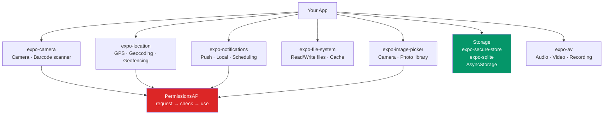

# React Native Device APIs

> [!abstract] TL;DR
> The Expo SDK wraps native device APIs in a consistent JavaScript interface. Every hardware feature follows the same permission pattern: request permission → check status → use the API. Key packages: `expo-camera` (camera + barcode), `expo-location` (GPS), `expo-notifications` (push + local), `expo-image-picker` (photo library), `expo-secure-store` (encrypted storage), `expo-sqlite` (local database), and `expo-av` (media playback). `AsyncStorage` handles simple key-value persistence. All permission-gated APIs require entries in `app.json` for iOS/Android review.

## Expo SDK Overview



## Permission Handling Pattern

All hardware APIs follow this pattern. Always request permissions before accessing the feature.

```typescript
import * as Location from 'expo-location';
import { useState, useEffect } from 'react';

function useLocationPermission() {
  const [status, setStatus] = useState<Location.PermissionStatus | null>(null);

  const requestPermission = async () => {
    // Request returns the current status after prompt
    const { status } = await Location.requestForegroundPermissionsAsync();
    setStatus(status);
    return status === 'granted';
  };

  useEffect(() => {
    // Check existing permission without prompting
    Location.getForegroundPermissionsAsync()
      .then(({ status }) => setStatus(status));
  }, []);

  return {
    granted: status === 'granted',
    denied: status === 'denied',
    requestPermission,
  };
}

// PermissionStatus values:
// 'granted'          — user allowed
// 'denied'           — user refused (can't re-prompt on iOS, send to Settings)
// 'undetermined'     — never asked
```

## expo-camera

```typescript
import { CameraView, CameraType, useCameraPermissions, BarcodeScanningResult } from 'expo-camera';
import { useState, useRef } from 'react';
import { Button, View, Text, StyleSheet } from 'react-native';

function CameraScreen() {
  const [facing, setFacing] = useState<CameraType>('back');
  const [permission, requestPermission] = useCameraPermissions();
  const cameraRef = useRef<CameraView>(null);

  if (!permission) return <View />;

  if (!permission.granted) {
    return (
      <View style={styles.centered}>
        <Text>Camera access required</Text>
        <Button title="Grant Permission" onPress={requestPermission} />
      </View>
    );
  }

  const takePicture = async () => {
    const photo = await cameraRef.current?.takePictureAsync({
      quality: 0.8,           // 0 to 1
      base64: false,          // include base64 string
      exif: false,
    });
    console.log(photo?.uri);  // file:// URI
  };

  const handleBarcode = (result: BarcodeScanningResult) => {
    console.log(result.type, result.data);  // 'qr', 'https://...'
  };

  return (
    <CameraView
      ref={cameraRef}
      style={styles.camera}
      facing={facing}
      onBarcodeScanned={handleBarcode}
      barcodeScannerSettings={{ barcodeTypes: ['qr', 'ean13'] }}
    >
      <Button title="Flip" onPress={() => setFacing(f => f === 'back' ? 'front' : 'back')} />
      <Button title="Take Photo" onPress={takePicture} />
    </CameraView>
  );
}

const styles = StyleSheet.create({
  camera: { flex: 1 },
  centered: { flex: 1, justifyContent: 'center', alignItems: 'center' },
});
```

## expo-location

```typescript
import * as Location from 'expo-location';

async function getCurrentLocation() {
  const { status } = await Location.requestForegroundPermissionsAsync();
  if (status !== 'granted') {
    throw new Error('Location permission denied');
  }

  // One-time location read
  const location = await Location.getCurrentPositionAsync({
    accuracy: Location.Accuracy.High,   // Balanced | High | Highest
  });

  const { latitude, longitude, altitude, speed } = location.coords;
  console.log(latitude, longitude);

  // Reverse geocoding — coords → address
  const [address] = await Location.reverseGeocodeAsync({ latitude, longitude });
  console.log(address.city, address.country);

  return location;
}

// Continuous location watching
async function watchLocation(callback: (loc: Location.LocationObject) => void) {
  const subscription = await Location.watchPositionAsync(
    { accuracy: Location.Accuracy.Balanced, distanceInterval: 10 },   // every 10m
    callback
  );
  // Stop watching
  return () => subscription.remove();
}
```

## expo-notifications

```typescript
import * as Notifications from 'expo-notifications';
import * as Device from 'expo-device';
import Constants from 'expo-constants';

// Configure how notifications appear when app is foregrounded
Notifications.setNotificationHandler({
  handleNotification: async () => ({
    shouldShowAlert: true,
    shouldPlaySound: true,
    shouldSetBadge: false,
  }),
});

// Register for push notifications — get Expo push token
async function registerForPushNotifications(): Promise<string | null> {
  if (!Device.isDevice) {
    console.log('Push notifications require a physical device');
    return null;
  }

  const { status: existingStatus } = await Notifications.getPermissionsAsync();
  let finalStatus = existingStatus;

  if (existingStatus !== 'granted') {
    const { status } = await Notifications.requestPermissionsAsync();
    finalStatus = status;
  }

  if (finalStatus !== 'granted') return null;

  const token = await Notifications.getExpoPushTokenAsync({
    projectId: Constants.expoConfig?.extra?.eas?.projectId,
  });
  return token.data;   // Send this to your backend
}

// Schedule a local notification
async function scheduleReminder() {
  await Notifications.scheduleNotificationAsync({
    content: {
      title: 'Daily reminder',
      body: 'Time to review your notes!',
      data: { screen: 'Notes' },      // payload for handling tap
    },
    trigger: {
      hour: 9,
      minute: 0,
      repeats: true,   // daily at 9am
    },
  });
}

// Handle notification tap (open screen)
Notifications.addNotificationResponseReceivedListener((response) => {
  const screen = response.notification.request.content.data.screen;
  router.push(`/${screen}`);
});
```

## expo-image-picker

```typescript
import * as ImagePicker from 'expo-image-picker';

async function pickImage(): Promise<string | null> {
  // Request permissions (iOS requires explicit request)
  const { status } = await ImagePicker.requestMediaLibraryPermissionsAsync();
  if (status !== 'granted') return null;

  const result = await ImagePicker.launchImageLibraryAsync({
    mediaTypes: ['images'],          // images | videos | livePhotos
    allowsEditing: true,
    aspect: [1, 1],                  // force square crop
    quality: 0.8,
  });

  if (!result.canceled) {
    return result.assets[0].uri;    // file:// URI
  }
  return null;
}

// Launch camera directly
async function takePhoto(): Promise<string | null> {
  const { status } = await ImagePicker.requestCameraPermissionsAsync();
  if (status !== 'granted') return null;

  const result = await ImagePicker.launchCameraAsync({
    mediaTypes: ['images'],
    quality: 0.9,
  });

  return result.canceled ? null : result.assets[0].uri;
}
```

## Storage Options

```typescript
import * as SecureStore from 'expo-secure-store';
import * as SQLite from 'expo-sqlite';
import AsyncStorage from '@react-native-async-storage/async-storage';

// --- AsyncStorage: simple key-value, unencrypted, string values ---
await AsyncStorage.setItem('userPrefs', JSON.stringify({ theme: 'dark' }));
const prefs = JSON.parse(await AsyncStorage.getItem('userPrefs') ?? '{}');

// --- expo-secure-store: encrypted key-value (Keychain/Keystore) ---
// Use for tokens, passwords, sensitive data
await SecureStore.setItemAsync('authToken', 'jwt-token-here');
const token = await SecureStore.getItemAsync('authToken');
await SecureStore.deleteItemAsync('authToken');  // on logout

// --- expo-sqlite: local relational database ---
const db = await SQLite.openDatabaseAsync('myapp.db');

// Create table
await db.execAsync(`
  CREATE TABLE IF NOT EXISTS notes (
    id INTEGER PRIMARY KEY AUTOINCREMENT,
    title TEXT NOT NULL,
    content TEXT,
    created_at DATETIME DEFAULT CURRENT_TIMESTAMP
  )
`);

// Insert
await db.runAsync(
  'INSERT INTO notes (title, content) VALUES (?, ?)',
  ['My Note', 'Content here']
);

// Query with typed results
const notes = await db.getAllAsync<{ id: number; title: string; content: string }>(
  'SELECT * FROM notes ORDER BY created_at DESC'
);

// Transaction for batch operations
await db.withTransactionAsync(async () => {
  await db.runAsync('DELETE FROM notes WHERE id = ?', [1]);
  await db.runAsync('UPDATE notes SET title = ? WHERE id = ?', ['Updated', 2]);
});
```

## expo-file-system

```typescript
import * as FileSystem from 'expo-file-system';

// Read a file
const content = await FileSystem.readAsStringAsync(
  FileSystem.documentDirectory + 'data.json'
);

// Write a file
await FileSystem.writeAsStringAsync(
  FileSystem.documentDirectory + 'data.json',
  JSON.stringify({ key: 'value' }),
  { encoding: FileSystem.EncodingType.UTF8 }
);

// Download a file
const downloadResult = await FileSystem.downloadAsync(
  'https://example.com/file.pdf',
  FileSystem.documentDirectory + 'file.pdf'
);
console.log(downloadResult.uri);  // local file:// URI

// File info
const info = await FileSystem.getInfoAsync(FileSystem.documentDirectory + 'data.json');
console.log(info.exists, info.size);
```

## Real-World Notes

- **`app.json` permissions are mandatory for App Store/Play Store** — `expo-location` needs `NSLocationWhenInUseUsageDescription` (iOS) and `ACCESS_FINE_LOCATION` (Android). Expo SDK adds these automatically if you configure them in `app.json` plugins.
- **Always show UI before requesting permissions** — explain why you need the permission before triggering the system prompt. Users who see the prompt without context deny it.
- **`expo-secure-store` max value size is 2KB on iOS** — for large encrypted data, use `expo-crypto` to encrypt then `expo-file-system` to store.
- **Push tokens are device + app specific** — they change when the app is reinstalled. Always re-register on app launch and update your backend.

## Common Pitfalls

- **Testing location/camera in a simulator** — Expo Go and iOS Simulator support location simulation, but camera requires a physical device.
- **Not handling `denied` permission state** — once a user denies a permission on iOS, you cannot re-prompt. Show a dialog directing them to Settings: `Linking.openSettings()`.
- **`AsyncStorage` is not encrypted** — never store tokens, passwords, or PII in `AsyncStorage`. Use `expo-secure-store` for sensitive data.
- **SQLite blocking the JS thread** — `expo-sqlite` v12+ is fully async. Avoid the old synchronous API (`db.transaction` callback pattern) which can cause frame drops.

## Review Questions

1. What is the permission request pattern in React Native? What happens if the user denies a permission on iOS?
2. What is the difference between `AsyncStorage` and `expo-secure-store`? When would you use each?
3. How do you register for push notifications with Expo? What is an Expo push token?
4. What are the two `FileSystem` base directories (`documentDirectory` vs `cacheDirectory`) and when should you use each?
5. Why should you show a permission rationale UI *before* calling `requestPermissionsAsync`?

## Sources

- Expo SDK docs — https://docs.expo.dev/versions/latest/
- expo-notifications — https://docs.expo.dev/push-notifications/overview/
- expo-sqlite — https://docs.expo.dev/versions/latest/sdk/sqlite/
- expo-secure-store — https://docs.expo.dev/versions/latest/sdk/securestore/

#ReactNative #React #Mobile #DeviceAPIs
