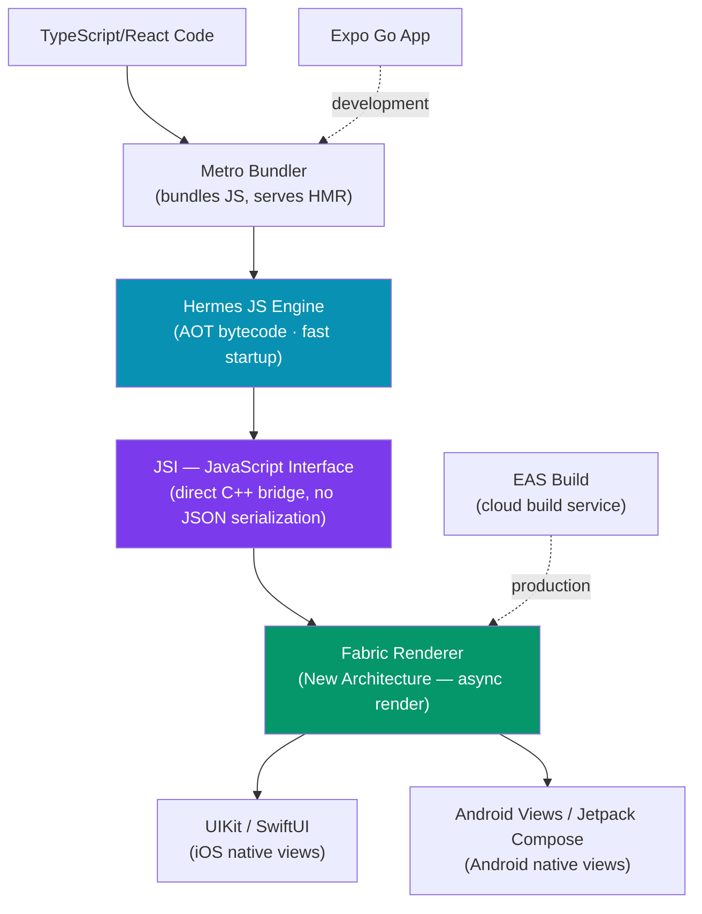

# React Native Fundamentals

> [!abstract] TL;DR
> React Native lets you write React components that compile to **real native iOS and Android views** — not a WebView. The JavaScript runs on the **Hermes** engine (with AOT bytecode compilation for faster startup), communicating with native UI via the New Architecture's **JSI** (JavaScript Interface). **Expo** is the recommended starting point: Expo Go for instant development preview, `npx create-expo-app` for scaffolding, and **EAS Build** for production cloud builds. Key difference from React web: no DOM — React Native maps components like `<View>` and `<Text>` to `UIView`/`android.widget.View` directly.

## How It Works



## Key Concepts

### Expo vs Bare React Native

| Aspect | Expo (Managed) | Bare React Native |
|--------|---------------|-------------------|
| Setup | `npx create-expo-app` — zero config | `npx react-native init` — manual iOS/Android |
| Native code | Expo SDK handles it | Full access to `ios/` and `android/` |
| When to use | Most apps — recommended starting point | Custom native modules, special native SDKs |
| Build | EAS Build (cloud) or Expo Go (dev) | Local Xcode / Android Studio or EAS |
| Eject | `npx expo prebuild` → bare workflow | N/A |

**Use Expo.** The old "Expo is limiting" concern applies only to very specialized native integrations. Expo SDK 50+ covers camera, GPS, notifications, SQLite, file system, sensors, and more. You can always eject if needed.

### Creating a Project

```bash
# Recommended: Expo with TypeScript template
npx create-expo-app MyApp --template blank-typescript

# Project structure
MyApp/
├── app/                  # Expo Router (file-based routing)
│   ├── _layout.tsx       # Root layout
│   └── index.tsx         # Home screen (maps to '/')
├── components/           # Shared components
├── assets/               # Images, fonts
├── app.json              # Expo config (name, version, icons, splash)
├── tsconfig.json
└── package.json

# Start dev server
npx expo start
# Scan QR code in Expo Go app, or press 'i' for iOS sim, 'a' for Android
```

### Metro Bundler

Metro is React Native's JavaScript bundler (analogous to Webpack/Vite). It:
- Resolves `import`/`require` and bundles the JS
- Serves the bundle over HTTP to the device/simulator
- Powers **Fast Refresh** — partial reloads that preserve component state (like HMR but for native)

```bash
# Fast Refresh is on by default
# Shake device (or Cmd+D on iOS sim, Cmd+M on Android) → Dev Menu → Toggle Fast Refresh
```

### Hermes JS Engine

Hermes is Meta's optimized JS engine for React Native (default since RN 0.70):
- **AOT bytecode compilation** — JS compiles to bytecode at build time (not JIT at runtime), dramatically reducing Time To Interactive
- Lower memory footprint vs V8/JavaScriptCore
- Full ES2022+ support with TypeScript via Metro's Babel transform

### Key Differences from React Web

| Concept | React Web | React Native |
|---------|----------|-------------|
| Container | `<div>` | `<View>` |
| Text | Any element | Must use `<Text>` |
| Styling | CSS strings/objects | `StyleSheet` API (Flexbox subset) |
| Routing | Browser URL | React Navigation / Expo Router |
| Storage | localStorage | AsyncStorage / expo-secure-store |
| HTTP | `fetch` / axios | `fetch` / axios (same API) |
| Images | `` | `<Image source={require('./img.png')} />` |

### Platform-Specific Code

```typescript
import { Platform, StyleSheet } from 'react-native';

// Runtime platform check
const isIOS = Platform.OS === 'ios';       // 'ios' | 'android' | 'web'
const isAndroid = Platform.OS === 'android';

// Platform.select — returns the matching value
const shadowStyle = Platform.select({
  ios: {
    shadowColor: '#000',
    shadowOffset: { width: 0, height: 2 },
    shadowOpacity: 0.25,
    shadowRadius: 4,
  },
  android: {
    elevation: 5,           // Android uses elevation, not box-shadow
  },
});

// File-based platform splits (Metro resolves automatically)
// Button.ios.tsx   — loaded on iOS
// Button.android.tsx — loaded on Android
// Button.tsx       — fallback for both / web
```

### React Native Debugger

```bash
# Expo DevTools in browser
npx expo start → press 'j' to open debugger

# React Native DevTools (new, built on Chrome DevTools)
# Shake device → "Open DevTools"

# Flipper (legacy but feature-rich)
# Download Flipper app → connect via USB or Wi-Fi

# LogBox — in-app error overlay with stack traces
# Replaces the old red screen; swipe to dismiss in development
```

## Real-World Notes

- **Always start with Expo** — even experienced teams use Expo Managed or Expo with prebuild. It handles code signing, OTA updates, and build pipelines out of the box.
- **Hermes is default; don't disable it** — it dramatically improves startup time on Android especially.
- **Fast Refresh ≠ Hot Reload** — Fast Refresh preserves component state across file saves. Full reload (`r` in terminal) resets all state.
- **New Architecture (Fabric + TurboModules)** — React Native 0.73+ enables the New Architecture by default. JSI replaces the old JSON bridge, enabling synchronous native calls.

## Common Pitfalls

- **Trying to use CSS or DOM APIs** — `document`, `window`, `getComputedStyle`, `classList` don't exist. Use `StyleSheet`, `Dimensions`, `Platform`.
- **Forgetting `<Text>` for all text** — any string rendered outside `<Text>` throws: `Text strings must be rendered within a <Text> component`.
- **Running Expo Go with native modules** — Expo Go is a pre-built app; it can't load custom native code. Use a development build (`npx expo run:ios`) for native modules.
- **Missing `await` on `PermissionsAndroid.request`** — permissions are async; synchronous access returns `never_ask_again` silently.

## Review Questions

1. What is the difference between Expo Managed workflow and Bare React Native? When would you choose each?
2. What is Hermes and what advantage does AOT bytecode compilation provide over JIT?
3. How does `Platform.select` differ from `Platform.OS`? Give a styling use case for each.
4. Why must all text in React Native be wrapped in a `<Text>` component?
5. What is Metro and how does Fast Refresh differ from a full reload?

## Sources

- React Native docs: Introduction — https://reactnative.dev/docs/getting-started
- Expo docs: Get started — https://docs.expo.dev/get-started/introduction/
- Hermes — https://hermesengine.dev/
- React Native New Architecture — https://reactnative.dev/docs/the-new-architecture/landing-page

#ReactNative #React #Mobile #Fundamentals
