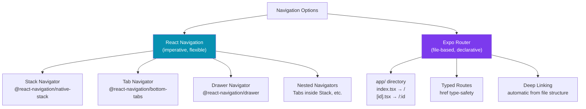

# React Native Navigation

> [!abstract] TL;DR
> React Native has no built-in router — navigation is a library choice. **React Navigation** is the de facto standard: it provides stack (push/pop), bottom tabs, and drawer navigators that you nest to build complex apps. **Expo Router** (Expo's file-based router, analogous to Next.js App Router) is the modern recommended choice for Expo projects — screens map to files in the `app/` directory, enabling deep links, typed routes, and native navigation patterns automatically.

## Navigation Architecture



## React Navigation Setup

```bash
npm install @react-navigation/native
npm install @react-navigation/native-stack @react-navigation/bottom-tabs
npx expo install react-native-screens react-native-safe-area-context
```

### Stack Navigator

```typescript
// app/_layout.tsx (or App.tsx for bare RN)
import { NavigationContainer } from '@react-navigation/native';
import { createNativeStackNavigator } from '@react-navigation/native-stack';

// Define param types for type safety
type RootStackParamList = {
  Home: undefined;
  Profile: { userId: string; username: string };
  Settings: undefined;
};

const Stack = createNativeStackNavigator<RootStackParamList>();

export default function App() {
  return (
    <NavigationContainer>
      <Stack.Navigator
        initialRouteName="Home"
        screenOptions={{
          headerStyle: { backgroundColor: '#6366f1' },
          headerTintColor: '#fff',
          headerTitleStyle: { fontWeight: '700' },
          animation: 'slide_from_right',   // iOS-style push
        }}
      >
        <Stack.Screen
          name="Home"
          component={HomeScreen}
          options={{ title: 'Home', headerShown: true }}
        />
        <Stack.Screen
          name="Profile"
          component={ProfileScreen}
          options={({ route }) => ({ title: route.params.username })}
        />
        <Stack.Screen
          name="Settings"
          component={SettingsScreen}
          options={{ presentation: 'modal' }}  // iOS modal sheet
        />
      </Stack.Navigator>
    </NavigationContainer>
  );
}
```

### Navigating Between Screens

```typescript
import { useNavigation, useRoute } from '@react-navigation/native';
import type { NativeStackNavigationProp } from '@react-navigation/native-stack';
import type { RouteProp } from '@react-navigation/native';

type HomeNavProp = NativeStackNavigationProp<RootStackParamList, 'Home'>;

function HomeScreen() {
  const navigation = useNavigation<HomeNavProp>();

  return (
    <View>
      <Pressable onPress={() => navigation.navigate('Profile', {
        userId: 'user-123',
        username: 'Alice',
      })}>
        <Text>Go to Profile</Text>
      </Pressable>

      <Pressable onPress={() => navigation.push('Profile', { userId: 'user-456', username: 'Bob' })}>
        <Text>Push another Profile</Text>   {/* push adds to stack even if already there */}
      </Pressable>

      <Pressable onPress={() => navigation.goBack()}>
        <Text>Back</Text>
      </Pressable>

      <Pressable onPress={() => navigation.reset({
        index: 0,
        routes: [{ name: 'Home' }],
      })}>
        <Text>Clear stack (e.g., after logout)</Text>
      </Pressable>
    </View>
  );
}

// Receiving params in ProfileScreen
type ProfileRouteProp = RouteProp<RootStackParamList, 'Profile'>;

function ProfileScreen() {
  const route = useRoute<ProfileRouteProp>();
  const { userId, username } = route.params;

  return <Text>Profile: {username} ({userId})</Text>;
}
```

### Bottom Tabs Navigator

```typescript
import { createBottomTabNavigator } from '@react-navigation/bottom-tabs';
import { Ionicons } from '@expo/vector-icons';

const Tab = createBottomTabNavigator();

function TabNavigator() {
  return (
    <Tab.Navigator
      screenOptions={({ route }) => ({
        headerShown: false,
        tabBarIcon: ({ focused, color, size }) => {
          let iconName: keyof typeof Ionicons.glyphMap;
          if (route.name === 'Feed') iconName = focused ? 'home' : 'home-outline';
          else if (route.name === 'Search') iconName = 'search';
          else iconName = 'person';

          return <Ionicons name={iconName} size={size} color={color} />;
        },
        tabBarActiveTintColor: '#6366f1',
        tabBarInactiveTintColor: '#9ca3af',
      })}
    >
      <Tab.Screen name="Feed" component={FeedScreen} />
      <Tab.Screen name="Search" component={SearchScreen} />
      <Tab.Screen
        name="Profile"
        component={ProfileScreen}
        options={{ tabBarBadge: 3 }}   // notification badge
      />
    </Tab.Navigator>
  );
}
```

### Nesting Navigators

```typescript
// Common pattern: Tabs inside a Stack (for modal screens above tabs)
function RootNavigator() {
  return (
    <Stack.Navigator screenOptions={{ headerShown: false }}>
      {/* Main app — tabs */}
      <Stack.Screen name="Main" component={TabNavigator} />
      {/* Modals — presented above tabs */}
      <Stack.Screen
        name="CreatePost"
        component={CreatePostScreen}
        options={{ presentation: 'fullScreenModal' }}
      />
    </Stack.Navigator>
  );
}
```

## Expo Router — File-Based Routing

Expo Router (the recommended approach for new Expo projects) turns the `app/` directory into your route structure — identical concept to Next.js App Router.

```bash
# New project with Expo Router (default in create-expo-app)
npx create-expo-app MyApp

# app/ directory maps to routes:
# app/index.tsx         → /
# app/profile.tsx       → /profile
# app/settings/index.tsx → /settings
# app/users/[id].tsx    → /users/:id
# app/(tabs)/index.tsx  → grouped route (tabs layout)
```

```typescript
// app/_layout.tsx — root layout (wraps all routes)
import { Stack } from 'expo-router';

export default function RootLayout() {
  return (
    <Stack>
      <Stack.Screen name="index" options={{ title: 'Home' }} />
      <Stack.Screen name="(tabs)" options={{ headerShown: false }} />
    </Stack>
  );
}

// app/(tabs)/_layout.tsx — tab group layout
import { Tabs } from 'expo-router';

export default function TabsLayout() {
  return (
    <Tabs screenOptions={{ tabBarActiveTintColor: '#6366f1' }}>
      <Tabs.Screen name="index" options={{ title: 'Feed', tabBarIcon: ... }} />
      <Tabs.Screen name="profile" options={{ title: 'Profile', tabBarIcon: ... }} />
    </Tabs>
  );
}

// app/users/[id].tsx — dynamic route
import { useLocalSearchParams, Link, router } from 'expo-router';

export default function UserScreen() {
  const { id } = useLocalSearchParams<{ id: string }>();

  return (
    <View>
      <Text>User: {id}</Text>

      {/* Link component — like Next.js <Link> */}
      <Link href="/profile">Go to Profile</Link>
      <Link href={`/users/${id}/posts`}>View Posts</Link>

      {/* Programmatic navigation */}
      <Pressable onPress={() => router.push('/settings')}>
        <Text>Settings</Text>
      </Pressable>
      <Pressable onPress={() => router.back()}>
        <Text>Back</Text>
      </Pressable>
      <Pressable onPress={() => router.replace('/login')}>
        <Text>Logout (replace history)</Text>
      </Pressable>
    </View>
  );
}
```

### Deep Linking

```typescript
// With Expo Router: deep links are automatic from the file structure
// expo-linking handles scheme://path → app/ route mapping

// app.json
{
  "expo": {
    "scheme": "myapp",     // myapp://users/123 → app/users/[id].tsx
    "web": { "bundler": "metro" }
  }
}

// With React Navigation: manual configuration
const linking = {
  prefixes: ['myapp://', 'https://myapp.com'],
  config: {
    screens: {
      Home: 'home',
      Profile: 'users/:userId',
      Settings: 'settings',
    },
  },
};

<NavigationContainer linking={linking}>
  ...
</NavigationContainer>
```

## Real-World Notes

- **Prefer Expo Router for new Expo projects** — it provides URL-based navigation, deep links, typed routes, and server-side rendering (Expo web) out of the box.
- **Use `replace` not `navigate` after auth** — `router.replace('/home')` after login prevents the user from going "back" to the login screen.
- **Header customization** — use `navigation.setOptions({ title: 'New Title' })` inside `useEffect` to set dynamic headers (e.g., after fetching the user's name).
- **Nested navigators and `useNavigation`** — `useNavigation` always returns the nearest parent navigator's navigation prop. Use `useRootNavigation` or `useRouter` (Expo Router) to navigate to sibling stacks.

## Common Pitfalls

- **Navigating before the navigator is ready** — if you call `navigation.navigate` on app launch (e.g., from a push notification handler) before `NavigationContainer` is mounted, it silently fails. Use the `ref` pattern with `navigationRef.isReady()`.
- **Forgetting `headerShown: false` on nested navigators** — a tab screen inside a stack gets double headers (stack header + tab screen header). Set `headerShown: false` on the stack screen.
- **Stale params after navigate** — params passed on `navigate` are merged (not replaced) if the screen is already in the stack. Use `push` to guarantee a fresh screen with new params.
- **Missing `react-native-gesture-handler` import** — React Navigation requires `import 'react-native-gesture-handler'` at the top of `App.tsx`/`index.tsx`. Missing it causes swipe-back gestures to fail on Android.

## Review Questions

1. What is the difference between `navigation.navigate` and `navigation.push`?
2. How does Expo Router's file-based routing differ from React Navigation's component-based configuration?
3. When would you use `navigation.reset` instead of `navigation.navigate`?
4. How do you pass type-safe parameters between screens in React Navigation?
5. What is deep linking in React Native and how does Expo Router simplify its configuration?

## Sources

- React Navigation docs — https://reactnavigation.org/docs/getting-started
- Expo Router docs — https://docs.expo.dev/router/introduction/
- React Navigation: Nesting navigators — https://reactnavigation.org/docs/nesting-navigators

#ReactNative #React #Mobile #Navigation
