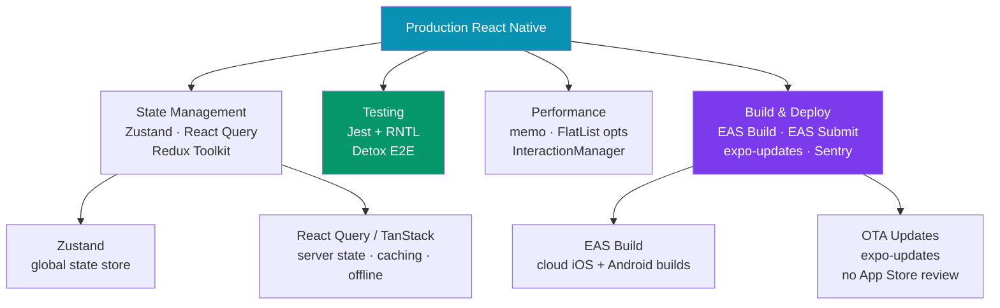

# React Native Production

> [!abstract] TL;DR
> Production React Native covers four pillars: **state management** (Zustand for local/global state, React Query for server state and offline caching), **testing** (Jest + React Native Testing Library for unit/integration, Detox for E2E), **performance** (FlatList optimization, `useCallback`/`memo`, `InteractionManager` for deferring heavy work), and **build/deploy** (**EAS Build** for cloud compilation, **EAS Submit** for app store uploads, `expo-updates` for OTA patches without store review, Sentry for crash reporting).

## Production Stack



## State Management

### Zustand — Global State

```typescript
import { create } from 'zustand';
import { persist, createJSONStorage } from 'zustand/middleware';
import AsyncStorage from '@react-native-async-storage/async-storage';

interface AuthState {
  user: { id: string; name: string } | null;
  token: string | null;
  setUser: (user: AuthState['user'], token: string) => void;
  logout: () => void;
}

// Persisted store — survives app restart
export const useAuthStore = create<AuthState>()(
  persist(
    (set) => ({
      user: null,
      token: null,
      setUser: (user, token) => set({ user, token }),
      logout: () => set({ user: null, token: null }),
    }),
    {
      name: 'auth-storage',
      storage: createJSONStorage(() => AsyncStorage),
    }
  )
);

// Usage in component
function ProfileScreen() {
  const { user, logout } = useAuthStore();
  return <Text>Hello, {user?.name}</Text>;
}
```

### React Query — Server State and Offline Caching

```typescript
import { QueryClient, QueryClientProvider, useQuery, useMutation, useQueryClient } from '@tanstack/react-query';
import { createAsyncStoragePersister } from '@tanstack/query-async-storage-persister';
import { PersistQueryClientProvider } from '@tanstack/react-query-persist-client';
import AsyncStorage from '@react-native-async-storage/async-storage';

const queryClient = new QueryClient({
  defaultOptions: {
    queries: {
      staleTime: 1000 * 60 * 5,       // 5 minutes before refetch
      gcTime: 1000 * 60 * 60 * 24,    // 24hr in-memory cache
      retry: 2,
      networkMode: 'offlineFirst',     // use cache when offline
    },
  },
});

// Offline persistence — cache survives app restart
const persister = createAsyncStoragePersister({ storage: AsyncStorage });

function App() {
  return (
    <PersistQueryClientProvider client={queryClient} persistOptions={{ persister }}>
      <Navigation />
    </PersistQueryClientProvider>
  );
}

// Fetch + cache user posts
function useUserPosts(userId: string) {
  return useQuery({
    queryKey: ['posts', userId],
    queryFn: () => api.getUserPosts(userId),
    enabled: !!userId,
  });
}

function PostList({ userId }: { userId: string }) {
  const { data, isLoading, error, refetch } = useUserPosts(userId);

  if (isLoading) return <ActivityIndicator />;
  if (error) return <Text>Error loading posts</Text>;

  return (
    <FlatList
      data={data}
      onRefresh={refetch}
      refreshing={isLoading}
      renderItem={({ item }) => <PostCard post={item} />}
    />
  );
}

// Mutations — optimistic updates
function useLikePost() {
  const queryClient = useQueryClient();

  return useMutation({
    mutationFn: (postId: string) => api.likePost(postId),
    onMutate: async (postId) => {
      // Optimistic update — immediately update UI
      await queryClient.cancelQueries({ queryKey: ['posts'] });
      const previous = queryClient.getQueryData(['posts']);
      queryClient.setQueryData(['posts'], (old: Post[]) =>
        old.map(p => p.id === postId ? { ...p, liked: true } : p)
      );
      return { previous };
    },
    onError: (_, __, context) => {
      // Rollback on error
      queryClient.setQueryData(['posts'], context?.previous);
    },
    onSettled: () => queryClient.invalidateQueries({ queryKey: ['posts'] }),
  });
}
```

## Testing

### Jest + React Native Testing Library

```typescript
// jest.config.js
module.exports = {
  preset: 'jest-expo',    // covers RN transforms, mocks native modules
  setupFilesAfterFramework: ['@testing-library/react-native/extend-expect'],
};

// components/__tests__/PostCard.test.tsx
import { render, screen, fireEvent, waitFor } from '@testing-library/react-native';
import { PostCard } from '../PostCard';

const mockPost = { id: '1', title: 'Test Post', liked: false, likeCount: 10 };

describe('PostCard', () => {
  it('renders post title', () => {
    render(<PostCard post={mockPost} onLike={jest.fn()} />);
    expect(screen.getByText('Test Post')).toBeTruthy();
  });

  it('calls onLike when heart button pressed', () => {
    const onLike = jest.fn();
    render(<PostCard post={mockPost} onLike={onLike} />);

    fireEvent.press(screen.getByTestId('like-button'));
    expect(onLike).toHaveBeenCalledWith('1');
  });

  it('shows loading state while liking', async () => {
    const onLike = jest.fn(() => new Promise(resolve => setTimeout(resolve, 100)));
    render(<PostCard post={mockPost} onLike={onLike} />);

    fireEvent.press(screen.getByTestId('like-button'));
    expect(screen.getByTestId('like-indicator')).toBeTruthy();

    await waitFor(() =>
      expect(screen.queryByTestId('like-indicator')).toBeNull()
    );
  });
});

// Mocking expo modules (automatically handled by jest-expo)
jest.mock('expo-location');
jest.mock('expo-camera');
```

### Detox — E2E Testing

```typescript
// .detoxrc.js
module.exports = {
  testRunner: { $0: 'jest', args: { config: 'e2e/jest.config.js' } },
  apps: {
    'ios.debug': { type: 'ios.app', binaryPath: 'ios/build/Debug-iphonesimulator/MyApp.app' },
  },
  devices: {
    simulator: { type: 'ios.simulator', device: { type: 'iPhone 15' } },
  },
  configurations: {
    'ios.sim.debug': { device: 'simulator', app: 'ios.debug' },
  },
};

// e2e/login.test.ts
import { device, element, by, expect as detoxExpect } from 'detox';

describe('Login Flow', () => {
  beforeAll(async () => {
    await device.launchApp({ newInstance: true });
  });

  it('should log in with valid credentials', async () => {
    await element(by.id('email-input')).typeText('user@example.com');
    await element(by.id('password-input')).typeText('password123');
    await element(by.id('login-button')).tap();
    await detoxExpect(element(by.id('home-screen'))).toBeVisible();
  });
});
```

## Performance Optimization

```typescript
import { memo, useCallback, useMemo, InteractionManager } from 'react';
import { FlatList, InteractionManager as IM } from 'react-native';

// 1. Memoize expensive components
const PostCard = memo(function PostCard({ post, onLike }: PostCardProps) {
  return <View>...</View>;
}, (prev, next) => prev.post.id === next.post.id && prev.post.liked === next.post.liked);

// 2. Stable callbacks — avoid re-rendering FlatList children
function Feed() {
  const handleLike = useCallback((postId: string) => {
    likePost(postId);
  }, []);  // stable reference — doesn't cause FlatList item re-renders

  // 3. Memoize derived data
  const sortedPosts = useMemo(
    () => posts.slice().sort((a, b) => b.createdAt - a.createdAt),
    [posts]
  );

  return (
    <FlatList
      data={sortedPosts}
      keyExtractor={item => item.id}
      renderItem={({ item }) => <PostCard post={item} onLike={handleLike} />}
      // 4. FlatList performance props
      windowSize={5}
      initialNumToRender={8}
      maxToRenderPerBatch={8}
      removeClippedSubviews={true}     // Android: unmount off-screen
      getItemLayout={(_, index) => ({  // skip measurement for fixed-height rows
        length: POST_HEIGHT,
        offset: POST_HEIGHT * index,
        index,
      })}
    />
  );
}

// 5. InteractionManager — defer heavy work until after navigation animations settle
function ExpensiveScreen() {
  const [data, setData] = useState<Item[]>([]);

  useEffect(() => {
    // Don't block navigation animation with heavy computation
    const task = InteractionManager.runAfterInteractions(() => {
      const processed = heavyDataProcessing(rawData);
      setData(processed);
    });

    return () => task.cancel();
  }, []);
}
```

## Build and Deploy with EAS

```bash
# Install EAS CLI
npm install -g eas-cli
eas login

# Configure project
eas build:configure    # creates eas.json

# eas.json configuration
{
  "cli": { "version": ">= 5.0.0" },
  "build": {
    "development": {
      "developmentClient": true,
      "distribution": "internal"
    },
    "preview": {
      "distribution": "internal",
      "ios": { "simulator": true }
    },
    "production": {
      "autoIncrement": true
    }
  },
  "submit": {
    "production": {
      "ios": { "appleId": "dev@example.com", "ascAppId": "123456789" },
      "android": { "serviceAccountKeyPath": "./google-play-key.json" }
    }
  }
}

# Build for iOS and Android (cloud — no Mac required for iOS!)
eas build --platform ios --profile production
eas build --platform android --profile production
eas build --platform all --profile production    # both at once

# Submit to App Store / Play Store
eas submit --platform ios
eas submit --platform android
```

### OTA Updates with expo-updates

```typescript
// app.json — enable updates
{
  "expo": {
    "updates": {
      "url": "https://u.expo.dev/your-project-id",
      "checkAutomatically": "ON_LOAD"
    },
    "runtimeVersion": { "policy": "appVersion" }
  }
}

// Manual update check in app
import * as Updates from 'expo-updates';

async function checkForUpdate() {
  if (__DEV__) return;    // OTA not available in development

  try {
    const update = await Updates.checkForUpdateAsync();
    if (update.isAvailable) {
      await Updates.fetchUpdateAsync();
      // Reload app to apply update
      await Updates.reloadAsync();
    }
  } catch (error) {
    console.error('Update check failed:', error);
  }
}

// Publish OTA update — no app store review needed!
# eas update --branch production --message "Fix login crash"
```

### Crash Reporting with Sentry

```typescript
import * as Sentry from '@sentry/react-native';

// Initialize in App.tsx
Sentry.init({
  dsn: 'https://your-dsn@sentry.io/project-id',
  environment: process.env.NODE_ENV,
  // Automatic Performance Monitoring
  tracesSampleRate: 0.1,
  enableNativeNagger: false,
});

export default Sentry.wrap(App);   // wraps root component for error boundary

// Manual error capture
try {
  await riskyOperation();
} catch (error) {
  Sentry.captureException(error, {
    extra: { userId: user.id, action: 'payment' },
  });
}

// Add context to crashes
Sentry.setUser({ id: user.id, email: user.email });
Sentry.addBreadcrumb({ message: 'User tapped checkout', category: 'ui.click' });
```

## Real-World Notes

- **EAS Build solves the "need a Mac to build iOS" problem** — EAS runs builds on Expo's cloud infrastructure. Push a commit, get signed `.ipa` and `.apk` files.
- **OTA updates are scoped to the same runtime version** — you can only OTA-update JavaScript and assets. Native code changes (new SDK versions, new native modules) still require a store release.
- **React Query's `networkMode: 'offlineFirst'`** — serves cached data immediately, then revalidates in the background. Essential for good mobile UX on spotty connections.
- **`memo` + `useCallback` are most impactful in FlatList** — without stable `renderItem` references, every `FlatList` re-render recycles all item components. Profile with Flipper before over-memoizing.

## Common Pitfalls

- **Anonymous functions as `renderItem`** — `renderItem={({ item }) => <Card item={item} />}` creates a new function reference every render, negating `FlatList`'s optimization. Extract to a stable component.
- **Building locally for iOS without Xcode** — bare React Native requires a Mac and Xcode. Use EAS Build as a workaround, or stay in Expo Managed workflow.
- **Pushing OTA updates to wrong release channel** — an OTA update sent to `production` branch immediately ships to all production users. Test on `preview` first.
- **Not setting `runtimeVersion`** — Expo won't allow OTA updates if JS bundle is incompatible with native code. Always configure `runtimeVersion` in `app.json` to prevent crashes.

## Review Questions

1. What is the difference between `useState`/Zustand and React Query? When do you use each?
2. What is `InteractionManager.runAfterInteractions` and when should you use it?
3. What does EAS Build provide over running `xcodebuild` locally? What can't EAS Build deploy?
4. What are OTA updates and when can you use them vs requiring a store release?
5. Why does wrapping `renderItem` callback in `useCallback` improve FlatList performance?

## Sources

- EAS Build docs — https://docs.expo.dev/build/introduction/
- expo-updates — https://docs.expo.dev/eas-update/introduction/
- React Query for React Native — https://tanstack.com/query/latest/docs/framework/react/react-native
- Sentry React Native — https://docs.sentry.io/platforms/react-native/
- Detox — https://wix.github.io/Detox/docs/introduction/getting-started

#ReactNative #React #Mobile #Production
