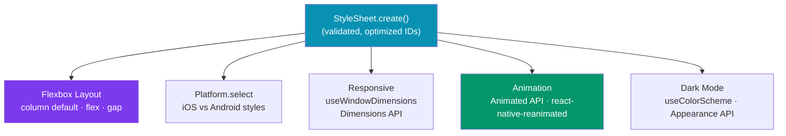

# React Native Styling and Layout

> [!abstract] TL;DR
> React Native uses `StyleSheet.create()` instead of CSS — styles are plain JavaScript objects validated at startup and optimized into native IDs. Flexbox is the primary layout model but defaults to **column** direction (unlike CSS's row). `Dimensions` and `useWindowDimensions` give screen size for responsive layouts. Platform-specific styles via `Platform.select`. The `Animated` API covers most animation needs; `react-native-reanimated` handles complex gesture-driven animations on the UI thread. Dark mode uses `useColorScheme`.

## Layout Model



## StyleSheet API

`StyleSheet.create` validates property names and values at startup (not runtime), converts the object to optimized native IDs, and provides type safety with TypeScript.

```typescript
import { StyleSheet, View, Text } from 'react-native';

// Always prefer StyleSheet.create over inline objects
// Inline: { backgroundColor: '#fff' } → new object every render
// StyleSheet: styles.container → same numeric ID every render
const styles = StyleSheet.create({
  container: {
    flex: 1,
    backgroundColor: '#f8fafc',
    padding: 16,
  },
  card: {
    backgroundColor: '#fff',
    borderRadius: 12,
    padding: 16,
    marginBottom: 12,
    // iOS shadow
    shadowColor: '#000',
    shadowOffset: { width: 0, height: 1 },
    shadowOpacity: 0.08,
    shadowRadius: 4,
    // Android shadow
    elevation: 2,
  },
  title: {
    fontSize: 20,
    fontWeight: '700',          // string, not number (React Native quirk)
    color: '#111827',
    letterSpacing: 0.3,
    lineHeight: 28,
  },
});

// Composing styles — latter wins on conflict (like Object.assign)
<Text style={[styles.title, { color: '#6366f1' }]} />

// Conditional styles
<View style={[styles.card, isSelected && styles.cardSelected]} />
```

### Differences from CSS

| CSS | React Native | Notes |
|-----|-------------|-------|
| `display: flex` | Always flex | No block/inline/grid |
| `flex-direction: row` | `flexDirection: 'column'` | Default is column! |
| `font-size: 16px` | `fontSize: 16` | Numbers, not strings |
| `background-color` | `backgroundColor` | camelCase |
| `box-shadow` | `shadow*` (iOS) + `elevation` (Android) | Two separate systems |
| `margin: 8px 16px` | `marginVertical: 8, marginHorizontal: 16` | No shorthand |
| `border-radius` | `borderRadius` | Same name |
| `overflow: hidden` | `overflow: 'hidden'` | Clips children |

## Flexbox in React Native

```typescript
import { View, Text, StyleSheet } from 'react-native';

// Main difference: flexDirection defaults to 'column', not 'row'
function LayoutDemo() {
  return (
    // COLUMN layout (default)
    <View style={styles.column}>
      <View style={[styles.box, { flex: 1 }]} />   {/* takes 1/3 of height */}
      <View style={[styles.box, { flex: 2 }]} />   {/* takes 2/3 of height */}
    </View>
  );
}

const styles = StyleSheet.create({
  column: {
    flex: 1,
    flexDirection: 'column',   // default — children stack vertically
    // flexDirection: 'row'    — children stack horizontally
    justifyContent: 'space-between',  // main axis (vertical in column)
    alignItems: 'stretch',            // cross axis (horizontal in column)
    gap: 8,                           // gap between children (RN 0.71+)
  },
  // Row with centered items
  row: {
    flexDirection: 'row',
    alignItems: 'center',        // vertically center in a row
    justifyContent: 'flex-start',
  },
  // Absolute positioning
  overlay: {
    position: 'absolute',
    top: 0,
    left: 0,
    right: 0,
    bottom: 0,
    justifyContent: 'center',
    alignItems: 'center',
  },
  box: { backgroundColor: '#6366f1' },
});
```

## Responsive Layouts

```typescript
import { useWindowDimensions, Dimensions, StyleSheet } from 'react-native';

// useWindowDimensions — reactive, updates on orientation change
function ResponsiveGrid() {
  const { width, height } = useWindowDimensions();
  const isTablet = width >= 768;
  const numColumns = isTablet ? 3 : 2;
  const itemWidth = (width - 48) / numColumns;   // 48 = padding + gaps

  return (
    <FlatList
      data={items}
      numColumns={numColumns}
      key={numColumns}    // re-mount FlatList when columns change (required!)
      renderItem={({ item }) => (
        <View style={[styles.item, { width: itemWidth }]}>
          <Text>{item.title}</Text>
        </View>
      )}
    />
  );
}

// Dimensions.get — one-time snapshot (doesn't update on rotation)
const { width: SCREEN_WIDTH, height: SCREEN_HEIGHT } = Dimensions.get('screen');
const { width: WINDOW_WIDTH } = Dimensions.get('window');
// 'window' = app content area (excludes status bar on Android)
// 'screen' = full device screen

const styles = StyleSheet.create({
  item: { padding: 8, margin: 4 },
});
```

## Platform-Specific Styles

```typescript
import { Platform, StyleSheet } from 'react-native';

const styles = StyleSheet.create({
  input: {
    height: 48,
    borderWidth: 1,
    borderColor: '#e5e7eb',
    borderRadius: 8,
    paddingHorizontal: 12,
    // Platform-specific within StyleSheet
    ...Platform.select({
      ios: {
        shadowColor: '#6366f1',
        shadowOffset: { width: 0, height: 0 },
        shadowOpacity: 0.2,
        shadowRadius: 4,
      },
      android: {
        elevation: 2,
      },
    }),
  },
  // StatusBar height varies
  statusBarOffset: {
    paddingTop: Platform.OS === 'android' ? 24 : 0,  // iOS handles via SafeAreaView
  },
});
```

## Custom Fonts with expo-font

```typescript
import { useFonts } from 'expo-font';
import * as SplashScreen from 'expo-splash-screen';
import { useEffect } from 'react';

SplashScreen.preventAutoHideAsync();

export default function App() {
  const [fontsLoaded, fontError] = useFonts({
    'Inter-Regular': require('./assets/fonts/Inter-Regular.ttf'),
    'Inter-Bold': require('./assets/fonts/Inter-Bold.ttf'),
  });

  useEffect(() => {
    if (fontsLoaded || fontError) {
      SplashScreen.hideAsync();
    }
  }, [fontsLoaded, fontError]);

  if (!fontsLoaded && !fontError) return null;

  return <MyApp />;
}

// Then use in styles:
const styles = StyleSheet.create({
  text: { fontFamily: 'Inter-Regular', fontSize: 16 },
  heading: { fontFamily: 'Inter-Bold', fontSize: 24 },
});
```

## Dark Mode

```typescript
import { useColorScheme, StyleSheet } from 'react-native';

function ThemedCard() {
  const colorScheme = useColorScheme();  // 'light' | 'dark' | null
  const isDark = colorScheme === 'dark';

  return (
    <View style={[styles.card, isDark && styles.cardDark]}>
      <Text style={[styles.text, isDark && styles.textDark]}>
        Content
      </Text>
    </View>
  );
}

// Better pattern: theme object
const Colors = {
  light: { background: '#ffffff', text: '#111827', card: '#f9fafb' },
  dark:  { background: '#0f172a', text: '#f1f5f9', card: '#1e293b' },
};

function useTheme() {
  const scheme = useColorScheme() ?? 'light';
  return Colors[scheme];
}

const styles = StyleSheet.create({
  card: { backgroundColor: '#fff', padding: 16, borderRadius: 8 },
  cardDark: { backgroundColor: '#1e293b' },
  text: { color: '#111827' },
  textDark: { color: '#f1f5f9' },
});
```

## Animated API

```typescript
import { useRef, useEffect } from 'react';
import { Animated, Pressable, StyleSheet } from 'react-native';

// Fade in on mount
function FadeInView({ children }: { children: React.ReactNode }) {
  const fadeAnim = useRef(new Animated.Value(0)).current;

  useEffect(() => {
    Animated.timing(fadeAnim, {
      toValue: 1,
      duration: 400,
      useNativeDriver: true,   // IMPORTANT: runs on UI thread, not JS thread
    }).start();
  }, []);

  return (
    <Animated.View style={[styles.container, { opacity: fadeAnim }]}>
      {children}
    </Animated.View>
  );
}

// Spring animation
function BouncyButton() {
  const scale = useRef(new Animated.Value(1)).current;

  const onPressIn = () =>
    Animated.spring(scale, { toValue: 0.93, useNativeDriver: true }).start();

  const onPressOut = () =>
    Animated.spring(scale, { toValue: 1, friction: 3, useNativeDriver: true }).start();

  return (
    <Pressable onPressIn={onPressIn} onPressOut={onPressOut}>
      <Animated.View style={[styles.button, { transform: [{ scale }] }]}>
        {/* content */}
      </Animated.View>
    </Pressable>
  );
}

// react-native-reanimated — for complex gesture-driven animations
// useSharedValue, useAnimatedStyle, withSpring, withTiming
// Runs 100% on UI thread — no JS bridge jank on complex animations

const styles = StyleSheet.create({
  container: { flex: 1 },
  button: { backgroundColor: '#6366f1', padding: 16, borderRadius: 8 },
});
```

## Real-World Notes

- **Always set `useNativeDriver: true`** in `Animated.timing/spring` when animating `opacity` or `transform`. This runs the animation on the native UI thread, decoupled from the JS thread.
- **`flex: 1` means "take all remaining space"** — the top-level screen container always needs `flex: 1` or it collapses to zero height.
- **No CSS media queries** — use `useWindowDimensions` and `Platform.select` instead.
- **`react-native-reanimated` for anything gesture-driven** — pinch-to-zoom, swipe-to-dismiss, drag-and-drop. The Animated API can jank when the JS thread is busy; Reanimated runs animations entirely on the UI thread.

## Common Pitfalls

- **Forgetting `flexDirection: 'column'` is the default** — beginners expect CSS behavior (row) and wonder why elements stack vertically. In React Native, `flexDirection: 'row'` must be explicit for horizontal layouts.
- **Not using `useNativeDriver`** — animating `backgroundColor` is not supported by native driver (only `opacity` and `transform`). Use `react-native-reanimated` for color animations.
- **Inline style objects in render** — `style={{ padding: 16 }}` creates a new object on every render, preventing memoization. Use `StyleSheet.create` or `useMemo`.
- **Hardcoded pixel values for layout** — use flex and percentage widths instead of fixed pixels; they don't scale across device sizes.

## Review Questions

1. What is the default `flexDirection` in React Native? How does this differ from CSS?
2. What is the difference between `Dimensions.get` and `useWindowDimensions`? When should you use each?
3. Why should you set `useNativeDriver: true` in animations? What properties support it?
4. How do you implement dark mode in React Native? What hook do you use?
5. Why does React Native have separate shadow properties for iOS vs `elevation` for Android?

## Sources

- React Native docs: StyleSheet — https://reactnative.dev/docs/stylesheet
- React Native docs: Layout props — https://reactnative.dev/docs/layout-props
- React Native docs: Animations — https://reactnative.dev/docs/animations
- react-native-reanimated — https://docs.swmansion.com/react-native-reanimated/

#ReactNative #React #Mobile #Styling
