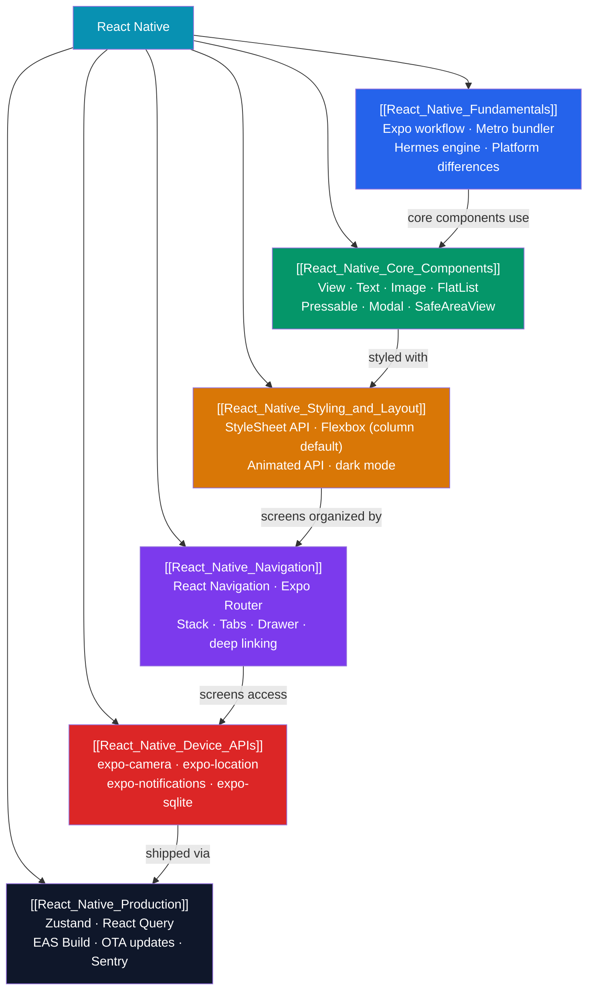

# React Native — Map of Content

> [!abstract] What This Section Covers
> Meta's cross-platform mobile framework that lets you write React components compiled to **real native iOS and Android views** — not a WebView. Unlike Flutter (which owns its rendering engine), React Native maps components to the platform's actual native controls (UIKit, Android Views), giving you platform-native look and feel. This section covers: the Expo-first development workflow, core components and the no-CSS styling system, navigation with React Navigation and Expo Router, device hardware APIs via the Expo SDK, and production concerns — state management, testing, performance, and EAS Build/Submit for app store deployment.

## Concept Map

## Learning Path

1. [[React_Native_Fundamentals]] — What React Native is, how Expo and EAS fit in, key differences from React web (no DOM, no CSS), and the Metro + Hermes pipeline.
2. [[React_Native_Core_Components]] — The building blocks: `View`, `Text`, `Image`, `TextInput`, `FlatList`, `Pressable`, `Modal`, and `SafeAreaView` with TypeScript examples.
3. [[React_Native_Styling_and_Layout]] — `StyleSheet.create`, Flexbox (column default!), responsive layouts with `useWindowDimensions`, dark mode, custom fonts, and the `Animated` API.
4. [[React_Native_Navigation]] — React Navigation (stack, tabs, drawer, nested navigators) and Expo Router (file-based routing, `Link`, typed routes, deep linking).
5. [[React_Native_Device_APIs]] — Expo SDK: camera, location, push notifications, image picker, secure storage, SQLite, and the permission request pattern.
6. [[React_Native_Production]] — Zustand + React Query for state, Jest + RNTL + Detox for testing, FlatList optimization, EAS Build/Submit, OTA updates, and Sentry.

## All Notes at a Glance

| Note | Difficulty | What You'll Learn |
|------|------------|-------------------|
| [[React_Native_Fundamentals]] | Intermediate | Expo vs bare RN, Metro, Hermes, Platform API, project structure |
| [[React_Native_Core_Components]] | Intermediate | View, Text, Image, FlatList vs ScrollView, Pressable, Modal |
| [[React_Native_Styling_and_Layout]] | Intermediate | StyleSheet, Flexbox (column default), dark mode, Animated API |
| [[React_Native_Navigation]] | Intermediate | React Navigation, Expo Router, stack/tabs, deep linking |
| [[React_Native_Device_APIs]] | Intermediate | expo-camera, location, notifications, SQLite, SecureStore |
| [[React_Native_Production]] | Advanced | Zustand, React Query, EAS Build, OTA updates, testing, Sentry |

## Key Questions This Section Answers

- How does React Native compile React components to real native views (not WebView)?
- What is the difference between Expo Managed workflow and bare React Native?
- Why is `flexDirection: 'column'` the default in React Native but `row` in CSS?
- How do you navigate between screens without a browser URL bar?
- How do you access the camera, GPS, and push notifications without writing Swift/Kotlin?
- What is EAS Build and how does it let you build iOS apps without a Mac?
- What are OTA updates and when do they require a full App Store release?

## React Native vs Flutter

| Aspect | React Native | Flutter |
|--------|-------------|---------|
| Language | TypeScript / JavaScript | Dart |
| Rendering | Uses native widgets (UIKit/Android Views) | Owns its renderer (Impeller/Skia) |
| Cross-platform parity | Platform-native look and feel | Pixel-identical on all platforms |
| Learning curve | Low if you know React | Medium (learn Dart + new widget model) |
| Ecosystem | npm + React ecosystem | pub.dev + Dart ecosystem |
| Performance | Excellent with New Architecture (JSI) | Excellent (AOT + Impeller) |
| Best for | React teams going mobile | Greenfield apps, pixel-perfect UI |

## Related Sections

- [[_MOC_WebDev_Master|↑ Web Dev Master MOC]]
- [[_MOC_React|← React]] (React fundamentals — hooks, state, components all transfer directly)
- [[_MOC_TypeScript|← TypeScript]] (TypeScript is the recommended language for React Native)
- [[_MOC_Flutter|← Flutter]] (alternative mobile framework — compare rendering approaches)

#MOC #WebDevelopment #ReactNative
