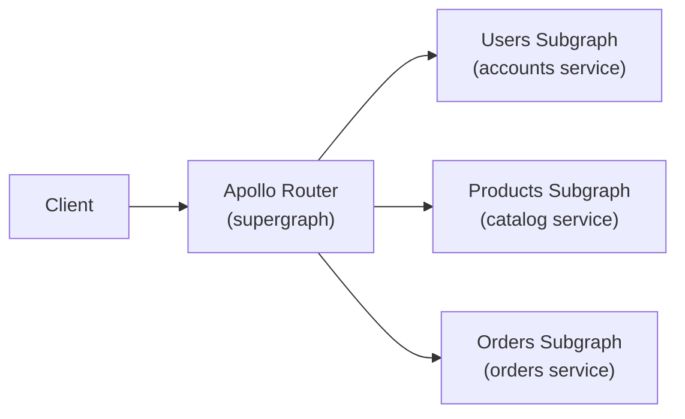

# GraphQL Advanced

> [!abstract] TL;DR
> Production GraphQL requires protecting against abusive queries (complexity, depth, rate limiting), using persisted queries for security and performance, scaling with Apollo Federation (subgraph + router), and conforming to the Relay spec for portable pagination and global IDs. Code-first schema generation and MSW-based testing round out the production toolkit.

## Persisted Queries

A standard GraphQL request sends the full query string on every request. Persisted queries replace the string with a **hash**:

```
# Standard request
POST /graphql
{ "query": "query GetUser($id: ID!) { user(id: $id) { name email } }", "variables": { "id": "1" } }

# Persisted query request (client sends hash only)
POST /graphql
{ "extensions": { "persistedQuery": { "version": 1, "sha256Hash": "ecf4..." } }, "variables": { "id": "1" } }
```

Benefits:
- **Security**: the server only executes registered query hashes. Arbitrary query strings are rejected. Attackers cannot craft malicious queries.
- **Performance**: smaller request body (hash vs full string), CDN/network caching by hash.
- **Automatic Persisted Queries (APQ)** in Apollo Client: client sends hash first; if server returns `PersistedQueryNotFound`, client re-sends with full query string. Server registers and responds. Next request uses hash only.

```typescript
import { createPersistedQueryLink } from '@apollo/client/link/persisted-queries';
import { sha256 } from 'crypto-hash';

const link = createPersistedQueryLink({ sha256 }).concat(httpLink);
```

## Query Complexity Analysis

Deeply nested queries can trigger exponential resolver execution:

```graphql
# Potentially O(n^k) resolvers
{ users { friends { friends { friends { name } } } } }
```

Use `graphql-query-complexity` to assign cost to fields and reject queries exceeding a budget:

```typescript
import {
  fieldExtensionsEstimator,
  simpleEstimator,
  getComplexity,
} from 'graphql-query-complexity';

const server = new ApolloServer({
  typeDefs,
  resolvers,
  plugins: [{
    async requestDidStart() {
      return {
        async didResolveOperation({ request, document, schema }) {
          const complexity = getComplexity({
            schema,
            operationName: request.operationName,
            query: document,
            variables: request.variables,
            estimators: [
              fieldExtensionsEstimator(),
              simpleEstimator({ defaultComplexity: 1 }),
            ],
          });
          if (complexity > 100) {
            throw new GraphQLError(
              `Query too complex (${complexity}). Max is 100.`,
              { extensions: { code: 'QUERY_TOO_COMPLEX' } }
            );
          }
        },
      };
    },
  }],
});
```

Assign per-field complexity in SDL via extensions:

```typescript
type Query {
  users: [User]   # complexity 10 via fieldExtensionsEstimator
}
```

## Depth Limiting

Independent of complexity, deeply nested queries are a DoS vector. Reject queries exceeding a maximum depth:

```typescript
import depthLimit from 'graphql-depth-limit';

const server = new ApolloServer({
  typeDefs,
  resolvers,
  validationRules: [depthLimit(7)],  // max 7 levels deep
});
```

## Rate Limiting by Query Cost

Use query cost as the unit for rate limiting rather than request count. A request with cost 1 and a request with cost 100 should consume different rate-limit budgets. Pair this with a Redis-backed token bucket per user/API key.

## Apollo Federation v2

Federation splits a large GraphQL API across multiple independently deployed **subgraphs**, each owning a domain slice. A **router** (Apollo Router or `@apollo/gateway`) composes them into a single **supergraph** at runtime.



### Subgraph Schema

```graphql
# users-subgraph — owns the User type
extend schema @link(url: "https://specs.apollo.dev/federation/v2.0", import: ["@key"])

type User @key(fields: "id") {
  id: ID!
  name: String!
  email: String!
}

type Query {
  me: User
}
```

```graphql
# orders-subgraph — references User from users-subgraph
extend schema @link(url: "https://specs.apollo.dev/federation/v2.0", import: ["@key", "@external"])

type User @key(fields: "id") {
  id: ID! @external      # owned by users-subgraph; we just reference it
  orders: [Order!]!      # added by this subgraph
}

type Order @key(fields: "id") {
  id: ID!
  total: Float!
  placedAt: String!
}
```

### Entity Resolvers (`__resolveReference`)

```typescript
// orders-subgraph resolvers
const resolvers = {
  User: {
    __resolveReference: async ({ id }, { db }) =>
      db.orders.findAllByUserId(id).then(orders => ({ id, orders })),
  },
};
```

The router calls `__resolveReference` when it needs to join data across subgraphs using the `@key` field.

### Federation Directives

| Directive | Purpose |
|-----------|---------|
| `@key(fields:)` | Marks entity primary key for cross-subgraph joins |
| `@external` | Field is defined in another subgraph |
| `@requires` | Declare fields from other subgraphs this resolver needs |
| `@provides` | Declare fields this subgraph can resolve instead of the owner |
| `@shareable` | Allow multiple subgraphs to resolve the same field |
| `@override(from:)` | Take ownership of a field from another subgraph |

## Relay Specification

The **Relay spec** defines conventions that make client-side cursor pagination and cache normalization portable across any GraphQL client.

### Global Object Identification

Every entity must implement the `Node` interface with a globally unique `id` (opaque, base64-encoded `Type:dbId`):

```graphql
interface Node {
  id: ID!
}

type Query {
  node(id: ID!): Node      # fetch any entity by its global ID
  nodes(ids: [ID!]!): [Node]!
}
```

```typescript
// Encode / decode a global ID
const encode = (type: string, dbId: string) =>
  Buffer.from(`${type}:${dbId}`).toString('base64');

const decode = (globalId: string) => {
  const [type, dbId] = Buffer.from(globalId, 'base64').toString().split(':');
  return { type, dbId };
};
```

### Connections (Cursor-Based Pagination)

The Relay **Connection** spec defines a standard pagination shape:

```graphql
type UserConnection {
  edges: [UserEdge]
  pageInfo: PageInfo!
  totalCount: Int!
}

type UserEdge {
  node: User!
  cursor: String!     # opaque position in the list
}

type PageInfo {
  hasNextPage: Boolean!
  hasPreviousPage: Boolean!
  startCursor: String
  endCursor: String
}

type Query {
  users(first: Int, after: String, last: Int, before: String): UserConnection!
}
```

Query example:

```graphql
query {
  users(first: 10, after: "cursor_abc") {
    edges {
      node { id name }
      cursor
    }
    pageInfo { hasNextPage endCursor }
  }
}
```

Why cursor pagination over offset? Offsets break when items are inserted or deleted mid-page. Cursors are stable — they encode position, not row number.

## Code-First Schema Generation

### TypeGraphQL

```typescript
import { ObjectType, Field, ID, Resolver, Query, Arg } from 'type-graphql';

@ObjectType()
class User {
  @Field(() => ID)  id: string;
  @Field()          name: string;
  @Field()          email: string;
}

@Resolver(User)
class UserResolver {
  @Query(() => User, { nullable: true })
  async user(@Arg('id') id: string): Promise<User | null> {
    return db.users.findById(id);
  }
}
```

### Pothos

```typescript
import SchemaBuilder from '@pothos/core';

const builder = new SchemaBuilder({});

builder.objectType('User', {
  fields: t => ({
    id: t.id({ resolve: u => u.id }),
    name: t.string({ resolve: u => u.name }),
  }),
});

builder.queryType({
  fields: t => ({
    user: t.field({
      type: 'User',
      nullable: true,
      args: { id: t.arg.id({ required: true }) },
      resolve: (_, { id }) => db.users.findById(id),
    }),
  }),
});

const schema = builder.toSchema();
```

Both tools generate SDL from TypeScript, eliminating schema/resolver type drift.

## GraphQL Testing

### MSW + `graphql` Handler

Mock Service Worker intercepts network requests at the browser/Node level — no server needed:

```typescript
// mocks/handlers.ts
import { graphql, HttpResponse } from 'msw';

export const handlers = [
  graphql.query('GetUsers', () =>
    HttpResponse.json({
      data: {
        users: [{ id: '1', name: 'Alice', email: 'alice@example.com' }],
      },
    })
  ),
  graphql.mutation('CreateUser', ({ variables }) =>
    HttpResponse.json({
      data: {
        createUser: { id: '2', ...variables },
      },
    })
  ),
];
```

```typescript
// setup.ts (Vitest / Jest)
import { setupServer } from 'msw/node';
import { handlers } from './handlers';

const server = setupServer(...handlers);
beforeAll(() => server.listen());
afterEach(() => server.resetHandlers());
afterAll(() => server.close());
```

### `@graphql-tools/mock`

For unit-testing resolvers in isolation without HTTP:

```typescript
import { addMocksToSchema, createMockStore } from '@graphql-tools/mock';
import { makeExecutableSchema } from '@graphql-tools/schema';
import { graphql } from 'graphql';

const schema = addMocksToSchema({ schema: makeExecutableSchema({ typeDefs }) });

const result = await graphql({
  schema,
  source: `{ users { id name } }`,
});
// result.data.users is populated with mock data
```

## Common Pitfalls

- **No query complexity limits** — a single malicious query can exhaust server resources. Always set depth and complexity limits before going public.
- **Global DataLoader singletons in federation** — each subgraph must manage its own per-request loaders; sharing across subgraphs introduces cache poisoning.
- **Non-opaque global IDs** — exposing `userId:123` as a plain string lets clients decode and guess IDs. Always base64-encode.
- **Offset pagination at scale** — `LIMIT 20 OFFSET 1000` performs a full table scan up to offset 1000. Switch to cursor pagination early.
- **APQ without a backend registry** — APQ still sends the full query on cache miss. A server-side registry (Apollo Studio) locks down which queries are allowed.

## Review Questions

1. How do Automatic Persisted Queries (APQ) improve security compared to standard GraphQL requests?
2. What is the unit of rate limiting in query-cost-based rate limiting, and why is request count insufficient?
3. In Apollo Federation, what does `@key(fields: "id")` declare, and what must the subgraph's resolver implement?
4. Why does the Relay spec use cursor-based pagination instead of offset-based pagination?
5. What is the global ID format in the Relay spec, and why is it base64-encoded?
6. What is the difference between TypeGraphQL and Pothos as code-first schema tools?

#GraphQL #API
