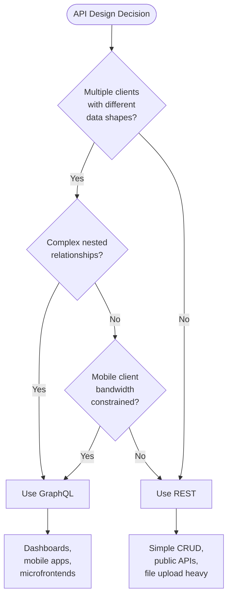

# GraphQL Fundamentals

> [!abstract] TL;DR
> GraphQL is a **query language for APIs** (not a database) and a runtime for fulfilling those queries. Clients describe exactly what data they want in a single request; the server returns precisely that shape. It replaces a forest of REST endpoints with a single strongly-typed endpoint and a self-documenting schema.

## What GraphQL Is (and Is Not)

GraphQL was created by Facebook in 2012 and open-sourced in 2015. It is:

- A **query language** — clients write declarative queries describing what fields they need.
- A **runtime** — the server validates queries against a schema and resolves each field.
- **Transport-agnostic** — most commonly served over HTTP POST, but can run over WebSockets or any other transport.

GraphQL is **not**:

- A database query language (it is not SQL).
- A storage engine or ORM.
- Tied to any specific language — the [GraphQL spec](https://spec.graphql.org/) has implementations in JavaScript, Python, Java, Go, Ruby, Rust, and more.

## GraphQL vs REST

| Concern | REST | GraphQL |
|---------|------|---------|
| Endpoints | Many (`/users`, `/posts`, `/comments`) | Single (`/graphql`) |
| Over-fetching | Common — endpoint returns all fields | Eliminated — client selects fields |
| Under-fetching | Common — N+1 requests for related data | Solved — nested queries in one request |
| Typing | Informal (OpenAPI optional) | Schema-first, strongly typed by design |
| Documentation | External (Swagger/OpenAPI) | Introspective — schema is the docs |
| Versioning | URL versioning (`/v2/`) or headers | Schema evolution via `@deprecated` |
| Caching | HTTP cache works naturally | Requires persisted queries or CDN config |
| File uploads | Multipart straightforward | Requires `graphql-multipart-request-spec` |

**Over-fetching example:** REST's `GET /users/1` returns `{ id, name, email, address, createdAt, role, … }` even when you only need `name`.

**Under-fetching example:** To show a user's name plus their last 3 posts' titles, REST needs two requests: `GET /users/1` then `GET /users/1/posts`. GraphQL resolves both in one query.

## The GraphQL Specification and SDL

The **GraphQL Specification** (published at spec.graphql.org) defines the language grammar, type system, validation rules, and execution semantics. Any conforming server must behave identically regardless of language.

The **Schema Definition Language (SDL)** is the human-readable syntax for defining a GraphQL schema:

```graphql
# Object type
type User {
  id: ID!
  name: String!
  email: String!
  posts: [Post!]!
}

# Root types
type Query {
  user(id: ID!): User
  users: [User!]!
}

type Mutation {
  createUser(name: String!, email: String!): User!
}
```

## Scalar Types

Built-in scalars map to primitive leaf values:

| Scalar | Description | JS serialization |
|--------|-------------|-----------------|
| `Int` | 32-bit signed integer | `number` |
| `Float` | Double-precision float | `number` |
| `String` | UTF-8 string | `string` |
| `Boolean` | true / false | `boolean` |
| `ID` | Opaque unique identifier (serialized as string) | `string` |

Custom scalars extend the set: `Date`, `DateTime`, `URL`, `JSON`, `EmailAddress`. See [[GraphQL_Schema_and_Types]].

## The Three Operations

```graphql
# 1. Query — read data (idempotent)
query GetUser($id: ID!) {
  user(id: $id) {
    name
    email
  }
}

# 2. Mutation — write data (side-effecting)
mutation CreateUser($name: String!, $email: String!) {
  createUser(name: $name, email: $email) {
    id
    name
  }
}

# 3. Subscription — real-time event stream over WebSocket
subscription OnNewMessage($chatId: ID!) {
  messageAdded(chatId: $chatId) {
    id
    text
    author { name }
  }
}
```

## `__typename` and Introspection

`__typename` is a meta-field available on every object type that returns the runtime type name as a string. Apollo Client uses it automatically for cache normalization.

```graphql
{
  search(text: "an") {
    __typename   # "Human" or "Droid"
    ... on Human { name homePlanet }
    ... on Droid { name primaryFunction }
  }
}
```

**Introspection** lets clients query the schema itself at runtime. The `__schema` and `__type` meta-fields are always available:

```graphql
# List all types in the schema
{
  __schema {
    types { name kind }
  }
}

# Inspect a specific type
{
  __type(name: "User") {
    fields { name type { name } }
  }
}
```

GraphQL tools like GraphiQL and Apollo Sandbox use introspection to power autocomplete and documentation. **Disable introspection in production** if your schema should not be publicly discoverable.

## GraphQL Playground and GraphiQL IDE

| Tool | Description |
|------|-------------|
| **GraphiQL** | The original browser-based IDE. Bundled into many servers. |
| **Apollo Sandbox** | Apollo's hosted version with schema diffing, operation history, and team sharing. |
| **GraphQL Playground** | Older standalone IDE (largely superseded by Sandbox). |
| **Altair** | Desktop/browser client with advanced features (subscriptions, environments). |
| **Insomnia / Postman** | General API clients with GraphQL support. |

All tools rely on introspection for autocomplete and documentation panels.

## When to Use GraphQL vs REST



**Prefer REST when:**
- Simple CRUD with predictable shapes.
- Public API consumed by unknown clients (REST + OpenAPI is well-understood).
- Heavy file upload/download.
- You need aggressive HTTP caching at the CDN level.
- Team has no GraphQL experience and velocity matters now.

**Prefer GraphQL when:**
- Multiple client platforms (web, iOS, Android, embedded) need different data shapes.
- Complex object graphs with many relationships (social feeds, dashboards, search).
- Mobile clients where bandwidth and round-trips are expensive.
- Rapid frontend iteration — teams can add fields without touching the server.
- You want a single, self-documenting API contract.

## Common Pitfalls

- **Introspection in production** — exposes your entire data model to attackers; disable or restrict it.
- **Ignoring the N+1 problem** — naive resolver implementations fire one DB query per parent row. Always use [[GraphQL_Resolvers#DataLoader Pattern|DataLoader]].
- **Treating GraphQL like REST** — creating one resolver per REST endpoint instead of thinking in graphs loses most of the benefit.
- **No pagination** — returning unbounded lists is a denial-of-service vector. Use cursor-based pagination (Relay connections) from day one.
- **Over-exposing the data model** — the schema is a product API, not a direct DB mirror. Shield internal fields.

## Review Questions

1. What does "over-fetching" mean, and how does GraphQL eliminate it?
2. Why is GraphQL called a query language for APIs rather than a database query language?
3. What are the three root operation types, and which one is idempotent?
4. Name two situations where REST is a better choice than GraphQL.
5. What is introspection, and why should it be disabled in production?
6. What does `__typename` return, and why does Apollo Client rely on it?

#GraphQL #API
