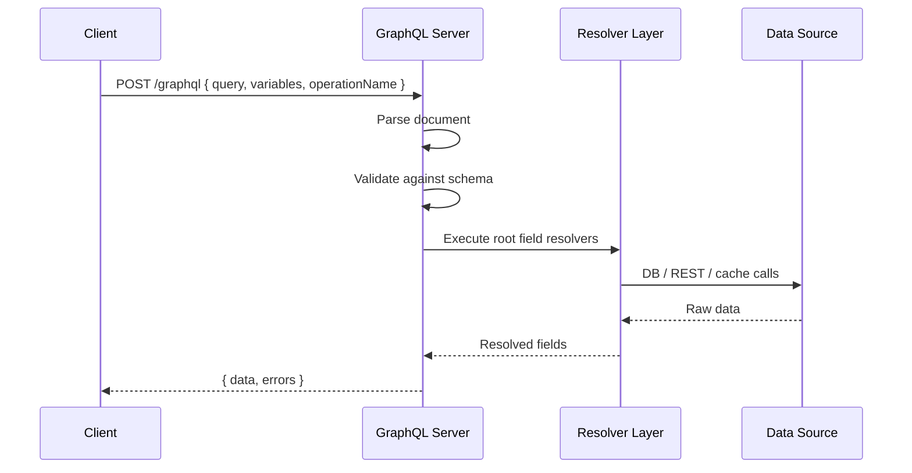

# GraphQL Queries and Mutations

> [!abstract] TL;DR
> GraphQL operations are declarative documents sent to a single endpoint. Queries read data, mutations write it, and subscriptions stream real-time events. Variables keep query strings static and safe. Fragments eliminate duplication. Named operations improve logging and debugging. Never string-interpolate variables — always use the variables object.

## Query Syntax

A minimal query asks for fields on the root `Query` type:

```graphql
{
  users {
    id
    name
    email
  }
}
```

This shorthand (anonymous, `query` keyword omitted) works for simple cases but is a bad habit in production — always use the long form.

### Fields and Nested Fields

GraphQL queries mirror the shape of the data returned:

```graphql
query {
  user(id: "1") {
    name
    email
    posts {
      title
      publishedAt
      comments {
        text
        author { name }
      }
    }
  }
}
```

The response JSON has the exact same structure as the query.

### Aliases

When fetching the same field with different arguments, use aliases to avoid key collisions:

```graphql
query {
  alice: user(id: "1") { name email }
  bob:   user(id: "2") { name email }
}
```

Response:
```json
{ "alice": { "name": "Alice", "email": "…" },
  "bob":   { "name": "Bob",   "email": "…" } }
```

### Arguments

Any field in the schema can accept arguments:

```graphql
query {
  posts(status: PUBLISHED, limit: 10, offset: 20) {
    id
    title
  }
}
```

### Named Queries and `operationName`

Always name your operations. The name appears in server logs, error messages, and tracing tools:

```graphql
query GetUserProfile {
  me {
    id
    name
    avatar
  }
}
```

When a document contains multiple operations, the client must specify `operationName` in the request body:

```json
{
  "query": "query A { … } query B { … }",
  "operationName": "A"
}
```

## Variables

**Never string-interpolate user input into a query string.** Use typed variables instead — they are parsed separately, not as part of the GraphQL document, preventing injection.

```graphql
# Query document (static string — safe to cache, log, and persist)
query GetPost($id: ID!, $includeComments: Boolean = false) {
  post(id: $id) {
    title
    body
    comments @include(if: $includeComments) {
      text
    }
  }
}
```

Variables sent alongside the document (typically as JSON):

```json
{
  "id": "abc123",
  "includeComments": true
}
```

Variable rules:
- Prefixed with `$` in the query, referenced as `$name`.
- Type must match the schema type at the point of use.
- Default values (`= false`) make the variable optional.
- Variables are always declared in the operation signature — not inside fragments.

## Fragments

Fragments are reusable field selections, defined once and spread into multiple queries.

### Named Fragments

```graphql
fragment UserCard on User {
  id
  name
  avatarUrl
  joinedAt
}

query GetTeam {
  team(id: "eng") {
    members {
      ...UserCard
      role
    }
  }
}

query GetAuthor($postId: ID!) {
  post(id: $postId) {
    author { ...UserCard }
  }
}
```

### Inline Fragments

Used to access type-specific fields on interfaces or unions — no explicit `__typename` needed, but adding it aids client-side type narrowing:

```graphql
query Search($query: String!) {
  search(query: $query) {
    __typename
    ... on User    { name email }
    ... on Post    { title publishedAt }
    ... on Comment { text author { name } }
  }
}
```

## Mutations

Mutations are declared with the `mutation` keyword and cause side effects on the server (create, update, delete). By convention they **return the modified object** so the client can update its cache without a refetch.

```graphql
mutation CreatePost($input: CreatePostInput!) {
  createPost(input: $input) {
    id
    title
    publishedAt
    author { name }
  }
}
```

Variables:
```json
{
  "input": {
    "title": "Learning GraphQL",
    "body": "Today I learned about mutations…",
    "authorId": "user_1"
  }
}
```

### Multiple Fields in a Mutation

A single mutation document can include multiple mutation fields. They execute **serially** (not in parallel), in order, to preserve data integrity:

```graphql
mutation BatchUpdate {
  updateProfile(name: "Alice Smith") { id name }
  updateEmail(email: "alice@example.com") { id email }
}
```

### Returning Deleted Objects

For delete mutations, return the deleted item's ID (at minimum) so the client can evict it from the cache:

```graphql
mutation DeletePost($id: ID!) {
  deletePost(id: $id) {
    id   # Return the ID for cache eviction
  }
}
```

## Subscriptions

Subscriptions open a persistent connection (typically WebSocket) and push events from server to client.

```graphql
subscription OnMessageAdded($chatId: ID!) {
  messageAdded(chatId: $chatId) {
    id
    text
    createdAt
    author { name avatarUrl }
  }
}
```

The client receives a new payload every time the server publishes a `messageAdded` event for the specified `chatId`. Subscriptions use the `graphql-ws` protocol over WebSocket. See [[Apollo_Server_and_Client]] for `useSubscription` in React.

## `@defer` and `@stream` — Incremental Delivery

These are experimental directives (Stage 3 in the GraphQL spec) that enable streaming responses over HTTP, eliminating waterfall round-trips for slow fields.

### `@defer`

Marks a fragment as non-critical. The server sends the primary response immediately, then streams the deferred fragment when ready:

```graphql
query GetDashboard {
  criticalData { id title }
  ... @defer {
    expensiveAnalytics { views clicks revenue }
  }
}
```

### `@stream`

Streams list items one at a time as they become available:

```graphql
query GetFeed {
  posts @stream {
    id title
  }
}
```

Both directives require server support (Apollo Server 4 + `@apollo/server` with `experimentalIncrementalDelivery`) and a client that handles multipart chunked HTTP responses.

## Operation Flow Diagram



## Common Pitfalls

- **String-interpolating variables** — creates injection vulnerabilities and breaks query caching. Always use `$variables`.
- **Anonymous operations** — makes logs useless. Name every operation.
- **Mutations that do not return the mutated object** — forces an extra refetch. Return enough data for the client to update its cache.
- **Multiple serial mutation fields without intent** — the serial guarantee is only for top-level mutation fields. Nested resolvers are still parallel.
- **Overusing inline fragments** — when a fragment is used in more than one place, promote it to a named fragment for DRY queries.

## Review Questions

1. What is the difference between a named fragment and an inline fragment?
2. Why should you never string-interpolate user input into a query string?
3. How do aliases prevent key collisions in a single query?
4. What guarantee does GraphQL make about execution order for multiple top-level mutation fields?
5. What problem do `@defer` and `@stream` solve, and what transport do they use?
6. What is `operationName` used for?

#GraphQL #API
