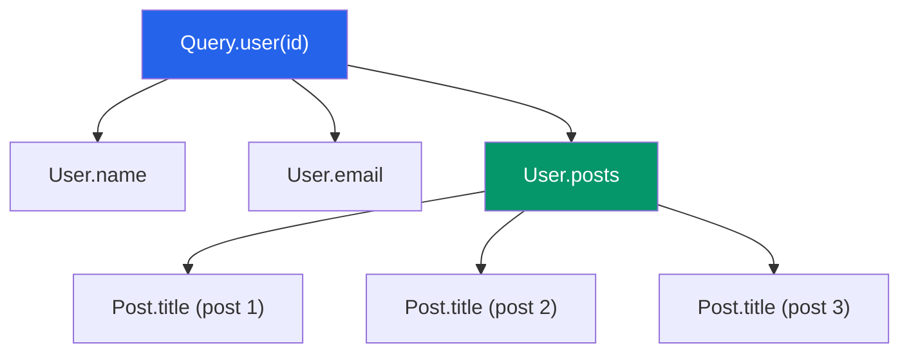

# GraphQL Resolvers

> [!abstract] TL;DR
> A resolver is a function that fulfills a single field in a GraphQL query. Each field in the schema can have its own resolver; unresolved fields fall back to a default that reads the property from the parent object. The N+1 problem — a new DB query fired per parent — is solved by DataLoader, which batches all same-tick keys into one request.

## Resolver Function Signature

Every resolver receives four arguments:

```typescript
type Resolver<TParent, TArgs, TContext, TReturn> = (
  parent:  TParent,   // resolved value of the parent field
  args:    TArgs,     // arguments declared in the schema for this field
  context: TContext,  // shared across all resolvers in a request
  info:    GraphQLResolveInfo  // schema, path, operation AST
) => TReturn | Promise<TReturn>;
```

| Parameter | Role | Example |
|-----------|------|---------|
| `parent` | Return value of the parent resolver (root fields get the `rootValue`) | `{ id: "1", name: "Alice" }` (from User resolver) |
| `args` | Field arguments from the query | `{ id: "abc123" }` for `user(id: "abc123")` |
| `context` | Request-scoped bag: auth token, DB client, DataLoader instances | `{ db, currentUser, loaders }` |
| `info` | Metadata: field name, return type, fragment info, schema object | Used for query analysis, field projection |

## Resolver Chain Execution

GraphQL executes resolvers top-down. Each field's resolver runs after its parent resolves. Sibling fields run **in parallel** (via `Promise.all`-style concurrent execution). Only top-level mutation fields are serial.



`name`, `email`, and `posts` all resolve in parallel. But `Post.title` resolvers only start after `User.posts` resolves.

## Resolver Maps in Apollo Server

```typescript
import { ApolloServer } from '@apollo/server';

const typeDefs = `#graphql
  type User { id: ID! name: String! posts: [Post!]! }
  type Post { id: ID! title: String! author: User! }
  type Query { user(id: ID!): User users: [User!]! }
`;

const resolvers = {
  Query: {
    user: (_, { id }, { db }) => db.users.findById(id),
    users: (_, __, { db }) => db.users.findAll(),
  },
  User: {
    posts: (parent, _, { loaders }) =>
      loaders.postsByUserId.load(parent.id),  // DataLoader!
  },
  Post: {
    author: (parent, _, { loaders }) =>
      loaders.userById.load(parent.authorId),
  },
};
```

## Default Field Resolvers

If a type field has no explicit resolver, GraphQL uses the **default resolver**: it reads the property with the same name from the parent object.

```typescript
// This explicit resolver is redundant — the default does the same thing:
User: {
  name: (parent) => parent.name,  // ← unnecessary
}

// The default resolver is effectively:
const defaultFieldResolver = (parent, args, context, info) =>
  parent[info.fieldName];
```

Only override the default when you need to transform data, rename a property, or trigger a side effect.

## `context` — Injecting Shared Resources

Context is created **once per request** and injected into every resolver. Use it for:

- **Auth**: current user, decoded JWT, permissions.
- **Database**: connection or query builder instance.
- **DataLoader instances**: batch loaders (must be created per request — see below).
- **Logging**: request ID, tracer span.

```typescript
const server = new ApolloServer({ typeDefs, resolvers });

// Express integration
app.use('/graphql', expressMiddleware(server, {
  context: async ({ req }) => {
    const token = req.headers.authorization?.replace('Bearer ', '');
    const currentUser = token ? await verifyJWT(token) : null;
    return {
      db,
      currentUser,
      loaders: createLoaders(db),  // fresh DataLoader per request
    };
  },
}));
```

## The N+1 Problem

The most common GraphQL performance trap. Imagine fetching 10 users and their posts:

```graphql
query {
  users {          # 1 query: SELECT * FROM users   → 10 rows
    name
    posts { title }  # 10 queries: SELECT * FROM posts WHERE user_id = ?
  }
}
# Total: 11 queries for 10 users
# For 100 users: 101 queries
```

Each `User.posts` resolver fires independently, with no awareness of its siblings. The naive implementation issues one DB query per parent row.

## DataLoader Pattern

Facebook's `dataloader` library solves N+1 by **batching** all keys collected within a single event-loop tick into one call, and **caching** results within the same request.

```typescript
import DataLoader from 'dataloader';

// batchLoadFn receives an array of keys and must return
// a same-length array of values (or Errors) in the same order.
const postsByUserIdLoader = new DataLoader<string, Post[]>(
  async (userIds: readonly string[]) => {
    const posts = await db.posts.findAll({
      where: { userId: { [Op.in]: userIds } },
    });
    // Group by userId, preserving order
    return userIds.map(id => posts.filter(p => p.userId === id));
  }
);

// Usage in resolver — .load() is called 10 times synchronously
// DataLoader collects all 10 IDs into one batch
User: {
  posts: (parent, _, { loaders }) =>
    loaders.postsByUserId.load(parent.id),
}
```

Result: 10 `load()` calls → **1** batched DB query. For 100 users: still 1 query.

### DataLoader Rules

1. **Create loaders per request** (in the context factory), never as module-level singletons. The per-request cache prevents data leaking between users.
2. **Return a same-length, same-order array** from `batchLoadFn`. DataLoader maps index → key.
3. **Return an `Error` instance** in the array position for a failed individual key — do not throw.
4. **Disable caching** (`{ cache: false }`) if you need fresh data after a mutation in the same request.

```typescript
// Pattern: create all loaders in one factory
function createLoaders(db: DB) {
  return {
    userById: new DataLoader<string, User>(ids =>
      db.users.findByIds([...ids])),
    postsByUserId: new DataLoader<string, Post[]>(ids =>
      batchPostsByUserId(db, [...ids])),
  };
}
```

## Error Handling in Resolvers

### Throw vs Return Error in Data

GraphQL supports two error patterns:

**1. Throw for unexpected / system errors** (resolver fails entirely):

```typescript
Query: {
  user: async (_, { id }, { db }) => {
    const user = await db.users.findById(id);
    if (!user) throw new GraphQLError('User not found', {
      extensions: { code: 'NOT_FOUND' },
    });
    return user;
  },
},
```

The error surfaces in the top-level `errors` array; the field becomes `null` in the data.

**2. Union result types for expected failures** (domain errors modeled in the schema):

```graphql
union CreateUserResult = User | ValidationError | DuplicateEmailError

type Mutation {
  createUser(input: CreateUserInput!): CreateUserResult!
}
```

```typescript
Mutation: {
  createUser: async (_, { input }, { db }) => {
    const exists = await db.users.findByEmail(input.email);
    if (exists) return { __typename: 'DuplicateEmailError', email: input.email };
    return db.users.create(input);  // returns User — __typename inferred
  },
},
```

This approach puts errors in `data` (not `errors`) and makes error cases explicit in the schema — preferred for user-facing validation.

## Common Pitfalls

- **Module-level DataLoader** — cached data from one user's request leaks into another. Always instantiate in the context factory.
- **Forgetting to return a Promise** — async resolvers must be `async` or explicitly return a promise; forgotten `await` silently returns `undefined`.
- **Using `info` for authorization** — `info` is complex; use `context.currentUser` for auth logic.
- **Deep resolver nesting with no DataLoader** — exponential query growth at each nested level.
- **Returning `null` silently for missing data** — if the field is non-null (`!`), a null return bubbles up and nullifies the parent, which can wipe out large portions of the response.

## Review Questions

1. What are the four parameters of a resolver function, and what does each provide?
2. What is the default field resolver behavior in GraphQL?
3. Explain the N+1 problem with a concrete example (e.g., fetching 50 users and their posts).
4. Why must DataLoader instances be created per-request, not as module-level singletons?
5. What constraint must the `batchLoadFn` array satisfy (length and order)?
6. When is it better to use a union result type for errors vs throwing a `GraphQLError`?

#GraphQL #API
