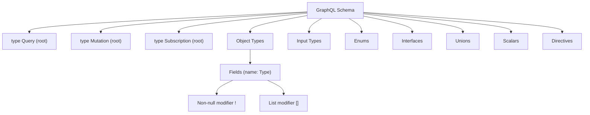

# GraphQL Schema and Types

> [!abstract] TL;DR
> The GraphQL type system is the contract between client and server. The SDL lets you define Object types, Input types, Enums, Interfaces, Unions, and custom Scalars. Strong typing enables compile-time validation, tooling autocomplete, and self-documented APIs without additional documentation effort.

## Type System Overview



## Object Types

The fundamental building block. Each field has a name and a return type.

```graphql
type User {
  id: ID!           # Non-null ID
  name: String!     # Non-null String
  email: String!
  age: Int          # Nullable Int
  posts: [Post!]!   # Non-null list of non-null Posts
  role: Role!       # Enum field
}
```

### Non-null (`!`) and Lists (`[]`)

| Type | Meaning |
|------|---------|
| `String` | Nullable string — can be `null` or a string |
| `String!` | Non-null string — always a string, never `null` |
| `[String]` | Nullable list — can be `null`, or a list that may contain `null` |
| `[String!]` | Nullable list of non-null strings |
| `[String!]!` | Non-null list of non-null strings |

> Rule of thumb: default to non-null (`!`) on everything unless your domain genuinely requires absence. Nullable fields in GraphQL propagate nulls upward through the response, which can swallow errors silently.

## Input Types

Input types are used exclusively as **mutation (or query) arguments**. They cannot be used as output types. They look like object types but use the `input` keyword.

```graphql
input CreateUserInput {
  name: String!
  email: String!
  role: Role = USER   # Default value
}

type Mutation {
  createUser(input: CreateUserInput!): User!
  updateUser(id: ID!, input: UpdateUserInput!): User!
}
```

Why a separate `input` keyword? Object types may have circular references and computed fields that make no sense as inputs. Input types enforce a clean, serializable argument shape.

## Enums

Enums restrict a field to a fixed set of string values, validated at the schema level.

```graphql
enum Role {
  ADMIN
  USER
  MODERATOR
}

enum OrderStatus {
  PENDING
  PROCESSING
  SHIPPED
  DELIVERED
  CANCELLED
}
```

Enum values are serialized as strings over the wire. On the server side, you can map them to internal constants.

## Interfaces

An interface declares a set of fields that any implementing type must include. Useful when multiple types share common structure and you want to return a polymorphic type.

```graphql
interface Node {
  id: ID!
}

interface Timestamped {
  createdAt: String!
  updatedAt: String!
}

type User implements Node & Timestamped {
  id: ID!
  createdAt: String!
  updatedAt: String!
  name: String!
  email: String!
}

type Post implements Node & Timestamped {
  id: ID!
  createdAt: String!
  updatedAt: String!
  title: String!
  body: String!
}

type Query {
  node(id: ID!): Node   # Returns any type implementing Node
}
```

Clients use inline fragments to access type-specific fields:

```graphql
query {
  node(id: "abc") {
    id
    ... on User { name email }
    ... on Post { title body }
  }
}
```

## Union Types

A union says a field can return **one of several object types**, but unlike interfaces, the types share no required fields.

```graphql
union SearchResult = User | Post | Comment

type Query {
  search(query: String!): [SearchResult!]!
}
```

Because there are no guaranteed shared fields, clients must always use inline fragments to access data:

```graphql
query {
  search(query: "graphql") {
    __typename
    ... on User    { name email }
    ... on Post    { title body }
    ... on Comment { text author { name } }
  }
}
```

**Interface vs Union:**
- Use an **interface** when types share meaningful common fields (e.g., all implement `id`, `createdAt`).
- Use a **union** when types are logically related but structurally unrelated.

## Scalars: Built-in and Custom

Built-in scalars: `Int`, `Float`, `String`, `Boolean`, `ID`.

Custom scalars add domain-specific validation and serialization:

```graphql
scalar Date       # ISO 8601 date string
scalar DateTime   # ISO 8601 datetime
scalar URL        # Validated URL string
scalar JSON       # Arbitrary JSON blob
scalar EmailAddress
scalar UUID
```

Custom scalars in Apollo Server (JavaScript):

```typescript
import { GraphQLScalarType, Kind } from 'graphql';

const DateScalar = new GraphQLScalarType({
  name: 'Date',
  description: 'Date custom scalar (ISO 8601)',
  serialize(value: Date) {
    return value.toISOString().split('T')[0]; // outbound: Date → string
  },
  parseValue(value: string) {
    return new Date(value); // inbound from variable: string → Date
  },
  parseLiteral(ast) {
    if (ast.kind === Kind.STRING) return new Date(ast.value);
    return null;
  },
});
```

The `graphql-scalars` library provides battle-tested implementations for 30+ common custom scalars.

## Directives

Directives annotate schema elements or query fields with metadata and behavior.

### Built-in Schema Directives

```graphql
type User {
  legacyField: String @deprecated(reason: "Use newField instead")
  newField: String!
}
```

### Built-in Query Directives

```graphql
query GetUser($id: ID!, $withPosts: Boolean!, $skipEmail: Boolean!) {
  user(id: $id) {
    name
    email @skip(if: $skipEmail)         # omit field when condition is true
    posts @include(if: $withPosts) {    # include field when condition is true
      title
    }
  }
}
```

### Custom Directives

```graphql
directive @auth(requires: Role = USER) on FIELD_DEFINITION | OBJECT

type Query {
  adminDashboard: Dashboard @auth(requires: ADMIN)
  profile: User @auth
}
```

Custom directive execution is implemented in the server (e.g., `mapSchema` + `SchemaDirectiveVisitor` in Apollo). Common uses: authorization, rate limiting, caching hints, input transformation.

## Schema Design Principles

### Think in Graphs, Not Endpoints

Design your schema around your **business domain graph**, not your REST endpoints or database tables.

```
# REST thinking (bad)                # Graph thinking (good)
GET /users                           type Query {
GET /users/:id/posts                   users: [User!]!
POST /users/:id/posts                  user(id: ID!): User
                                     }
                                     type User {
                                       posts: [Post!]!
                                     }
```

### Schema-First vs Code-First

| Approach | Description | Tools |
|----------|-------------|-------|
| **Schema-first** | Write SDL files first; generate resolvers from them | Apollo Server, graphql-tools |
| **Code-first** | Write resolvers/classes; SDL is auto-generated | TypeGraphQL, Pothos, Nexus |

Schema-first: SDL is the single source of truth and is easily shared with frontend teams. Code-first: type safety between schema and resolvers enforced at compile time (TypeScript types generated from your resolver code).

### Schema Stitching and Federation (Overview)

**Schema stitching** (legacy) merges multiple schemas in a gateway layer. Has been largely superseded by **Apollo Federation**.

**Apollo Federation** (v2): each backend service publishes its own **subgraph** schema. An **Apollo Router** (or `@apollo/gateway`) merges them into a **supergraph** at runtime. See [[GraphQL_Advanced]] for the full federation section.

## Common Pitfalls

- **Everything nullable by default** — leads to null propagation bugs at runtime. Prefer `!` and deal with exceptions at the resolver level.
- **Input types reused as output types** — SDL disallows this; plan your types accordingly from the start.
- **Deeply nested interfaces** — can confuse generated types in code-first frameworks; flatten where possible.
- **Overly generic `JSON` scalars** — escape hatch for untyped data but destroys type safety for clients.
- **Leaking internal IDs** — `ID` fields are opaque to clients; never assume format. Use global IDs (base64 `Type:dbId`) for federation compatibility.

## Review Questions

1. What is the difference between `String`, `String!`, `[String]`, and `[String!]!`?
2. Why does GraphQL have a separate `input` keyword instead of reusing `type`?
3. When would you use an `interface` vs a `union`?
4. How does a custom scalar differ from a built-in scalar in terms of implementation?
5. What does the `@deprecated` directive communicate to clients?
6. Contrast schema-first and code-first schema design approaches.

#GraphQL #API
