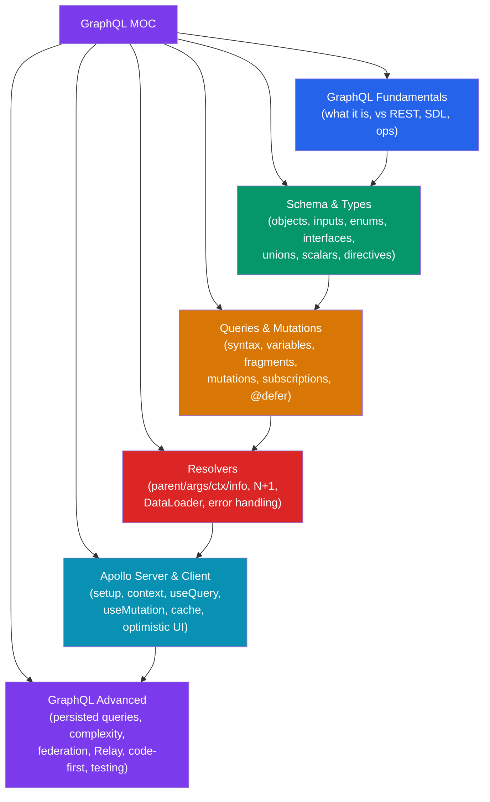

# GraphQL — Map of Content

> [!abstract] About This Section
> A production-focused deep-dive into GraphQL: from the query language fundamentals and SDL type system, through resolver chains and the DataLoader batch-loading pattern, to Apollo Server/Client integration, and advanced topics including federation, persisted queries, and the Relay specification. **6 notes** covering the complete GraphQL lifecycle for full-stack engineers.

## Section Architecture

## Notes at a Glance

| # | Note | Topics | Difficulty |
|---|------|--------|------------|
| 1 | [[GraphQL_Fundamentals]] | What GraphQL is, vs REST, SDL, scalar types, 3 operations, introspection, when to use | Intermediate |
| 2 | [[GraphQL_Schema_and_Types]] | Object types, non-null/lists, Input types, Enums, Interfaces, Unions, custom Scalars, Directives | Intermediate |
| 3 | [[GraphQL_Queries_and_Mutations]] | Query syntax, aliases, variables, fragments, named queries, mutations, subscriptions, `@defer`/`@stream` | Intermediate |
| 4 | [[GraphQL_Resolvers]] | Resolver signature, chain execution, context, N+1 problem, DataLoader pattern, error handling | Intermediate |
| 5 | [[Apollo_Server_and_Client]] | Apollo Server setup, Express, plugins, mocking; Apollo Client `useQuery`/`useMutation`/`useSubscription`, cache, optimistic UI | Intermediate |
| 6 | [[GraphQL_Advanced]] | Persisted queries, complexity/depth limits, Apollo Federation, Relay spec, code-first (TypeGraphQL/Pothos), MSW testing | Advanced |

## Learning Path

### Path A — Backend Engineer (Node.js)

Focus: schema design, resolver implementation, server configuration, federation.

1. [[GraphQL_Fundamentals]] — understand the paradigm and when to choose GraphQL
2. [[GraphQL_Schema_and_Types]] — design a production-grade SDL schema
3. [[GraphQL_Resolvers]] — implement resolver chains; master DataLoader
4. [[Apollo_Server_and_Client]] — set up Apollo Server with Express and context
5. [[GraphQL_Advanced]] — complexity limits, federation, persisted queries

### Path B — Frontend Engineer (React)

Focus: consuming a GraphQL API efficiently from React.

1. [[GraphQL_Fundamentals]] — understand queries, mutations, subscriptions
2. [[GraphQL_Queries_and_Mutations]] — write real query and mutation documents
3. [[Apollo_Server_and_Client]] — `useQuery`, `useMutation`, cache management, optimistic UI
4. [[GraphQL_Advanced]] — Relay pagination, persisted queries, MSW testing

### Path C — Full Curriculum (linear)

[[GraphQL_Fundamentals]] → [[GraphQL_Schema_and_Types]] → [[GraphQL_Queries_and_Mutations]] → [[GraphQL_Resolvers]] → [[Apollo_Server_and_Client]] → [[GraphQL_Advanced]]

## Key Concepts Quick Reference

| Concept | Note | One-liner |
|---------|------|-----------|
| Over-fetching / under-fetching | [[GraphQL_Fundamentals]] | Client gets exactly the fields it asks for — no more, no less |
| SDL | [[GraphQL_Schema_and_Types]] | Human-readable schema definition language |
| Non-null `!` | [[GraphQL_Schema_and_Types]] | Field will never be null — propagates up on error |
| Named fragment | [[GraphQL_Queries_and_Mutations]] | Reusable field selection spread into multiple operations |
| Variables | [[GraphQL_Queries_and_Mutations]] | Typed parameters passed alongside query — never string-interpolate |
| `parent` arg | [[GraphQL_Resolvers]] | Resolved value of the parent field in the resolver chain |
| N+1 problem | [[GraphQL_Resolvers]] | Naive resolvers fire one DB query per parent row |
| DataLoader | [[GraphQL_Resolvers]] | Batch-and-cache pattern that collapses N queries into 1 per tick |
| `context` | [[GraphQL_Resolvers]] | Per-request bag shared across all resolvers (auth, DB, loaders) |
| `InMemoryCache` | [[Apollo_Server_and_Client]] | Apollo Client's normalized cache keyed by `__typename + id` |
| Optimistic UI | [[Apollo_Server_and_Client]] | Show predicted result immediately; rollback on mutation failure |
| Persisted queries | [[GraphQL_Advanced]] | Send query hash instead of string — blocks arbitrary queries |
| Federation `@key` | [[GraphQL_Advanced]] | Marks entity primary key enabling cross-subgraph joins |
| Relay Connection | [[GraphQL_Advanced]] | Cursor-based pagination spec: edges / node / cursor / PageInfo |

## Cross-Vault Links

- **System Design vault** — [[_MOC_SystemDesign_Master]] for API gateway patterns, caching strategies, and distributed system design that federation builds on.
- **Node.js section** — [[_MOC_NodeJS]] for Express, async patterns, and the event loop underlying Apollo Server.
- **React section** — [[_MOC_React]] for hooks, state management, and component patterns that `useQuery`/`useMutation` integrate with.
- **TypeScript section** — [[_MOC_TypeScript]] for the type safety that code-first GraphQL tools (TypeGraphQL, Pothos) depend on.

#MOC #GraphQL #API #WebDevelopment
