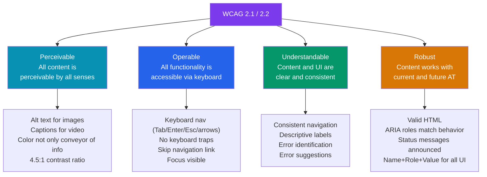

# Accessibility Standards

> [!abstract] TL;DR
> **WCAG 2.1/2.2** (Web Content Accessibility Guidelines) defines accessibility requirements on four principles: **Perceivable, Operable, Understandable, Robust** (POUR). Target conformance level **AA**. Key requirements: 4.5:1 color contrast for normal text, 3:1 for large, full keyboard navigability, visible focus indicators, alt text for images, proper form labels, and descriptive error messages. **ARIA** (Accessible Rich Internet Applications) fills semantic gaps that HTML can't express — but semantic HTML always comes first. Use `axe-core` for automated testing and `@testing-library`'s `getByRole` for accessible query patterns.

## Intuition — analogy FIRST

Accessibility is like designing a building with multiple entrances. The front door (visual mouse interface) is for most users. But there's also a ramp (keyboard navigation), a tactile guide strip (screen reader flow), and high-contrast signage (WCAG contrast ratios). A building that only has stairs isn't inaccessible by malice — the designer just forgot some users. Web accessibility is the same: most failures are oversights, not intent.

A screen reader reads your page linearly, relying entirely on semantic structure. If you build a button out of a `<div>`, the screen reader doesn't know it's interactive. A `<button>` element communicates "this is interactive, pressable, it has a focus state, it responds to Enter/Space" — for free.

---

## How It Works



---

## Key Concepts / Details

### WCAG Conformance Levels

| Level | Description | Examples |
|-------|-------------|---------|
| **A** | Minimum — removes fundamental barriers | Alt text, no keyboard traps, page language |
| **AA** | Standard — broad accessibility | 4.5:1 contrast, visible focus, resize to 200%, error identification |
| **AAA** | Enhanced — highest | 7:1 contrast, sign language for video, no timing requirements |

Target: **AA**. AAA is aspirational and often impractical for all content.

### Color Contrast Requirements (WCAG 1.4.3, 1.4.11)

```
Normal text (< 18pt / 14pt bold):   4.5:1 contrast ratio
Large text (>= 18pt / 14pt bold):   3.0:1 contrast ratio
UI components (borders, icons):     3.0:1 against adjacent color
Focus indicators:                   3.0:1 against background (WCAG 2.2)

Examples:
  White (#fff) on blue-600 (#2563EB) = 5.74:1  ✓ AA
  White (#fff) on blue-400 (#60A5FA) = 2.50:1  ✗ FAIL
  Gray-500 (#6B7280) on white (#fff) = 4.48:1  ✗ FAIL (barely)
  Gray-600 (#4B5563) on white (#fff) = 5.90:1  ✓ AA

Tools:
  WebAIM Contrast Checker: https://webaim.org/resources/contrastchecker/
  Figma plugin: Colour Contrast Analyser
  npm: color-contrast-checker
```

### Keyboard Navigation Requirements

```
Every interactive element must be:
  1. Focusable (in natural DOM order or via tabIndex)
  2. Visible when focused (focus indicator — ring, outline)
  3. Operable with keyboard (Enter = activate button/link, Space = toggle checkbox)
  4. Not a keyboard trap (can always Tab OUT of a component)

Key patterns:
  Tab / Shift+Tab: move between focusable elements
  Enter:           activate button, follow link
  Space:           toggle checkbox, activate button (not links)
  Arrow keys:      navigate within a widget (radio group, tabs, listbox, menu)
  Escape:          close modal, dropdown, tooltip
  Home/End:        first/last item in listbox/grid

// Skip navigation link — appears on Tab, skips to main content
<a href="#main-content" className="skip-link">Skip to main content</a>

// CSS for skip link (hidden but accessible)
.skip-link {
  position: absolute;
  top: -40px;  /* off-screen */
  left: 0;
  background: #000;
  color: #fff;
  padding: 8px;
  z-index: 100;
}
.skip-link:focus {
  top: 0;  /* appears when focused via keyboard */
}
```

### Semantic HTML First

```html
<!-- DO: use semantic elements — accessibility built in -->
<button type="button" onclick="submit()">Submit</button>
<input type="checkbox" id="terms" name="terms">
<label for="terms">I agree to the terms</label>
<nav aria-label="Main navigation">
  <ul>
    <li><a href="/">Home</a></li>
  </ul>
</nav>
<main id="main-content">...</main>

<!-- DON'T: ARIA div-soup — requires manual everything -->
<div role="button" tabindex="0" onclick="submit()"
     onkeydown="handleKey(event)">Submit</div>
<!-- now you must: add tabIndex, handle Enter/Space keydown,
     manage focus, manage aria-pressed, aria-disabled... -->

<!-- Semantic HTML gives you for free:
  - Role (button, link, checkbox, heading)
  - State (checked, disabled, expanded)
  - Keyboard behavior (Tab, Enter, Space, arrows)
  - Screen reader announcement
-->
```

### ARIA: When and How

```html
<!-- Rule: use ARIA only when semantic HTML can't express the role/state -->

<!-- 1. Landmark roles (when semantic elements can't be used) -->
<div role="navigation" aria-label="Breadcrumb">...</div>

<!-- 2. Widget roles for custom components -->
<ul role="listbox" aria-label="Choose country" tabindex="0">
  <li role="option" aria-selected="true" id="opt-us">United States</li>
  <li role="option" aria-selected="false" id="opt-uk">United Kingdom</li>
</ul>

<!-- 3. States and properties -->
<button aria-expanded="false" aria-controls="dropdown-menu">Menu</button>
<div id="dropdown-menu" role="menu" hidden>...</div>

<input aria-invalid="true" aria-describedby="email-error" />
<div id="email-error" role="alert">Please enter a valid email address.</div>

<!-- 4. Live regions — announce dynamic content changes -->
<div role="status" aria-live="polite">Form saved successfully</div>
<div role="alert" aria-live="assertive">Error: network request failed</div>

<!-- 5. Labels when visible label isn't possible -->
<button aria-label="Close dialog"><X /></button>

 <!-- decorative: empty alt -->

<!-- ARIA rules:
  1. No ARIA > bad ARIA (empty state is better than wrong state)
  2. Don't override semantic HTML (don't add role="button" to a <button>)
  3. All interactive ARIA widgets need keyboard support
  4. Visible UI state must match ARIA state (aria-expanded matches visible)
-->
```

### Automated Testing with axe-core

```typescript
// Storybook — a11y addon runs axe on every story
// .storybook/main.ts
import type { StorybookConfig } from '@storybook/react-vite'
const config: StorybookConfig = {
  addons: ['@storybook/addon-a11y'],
}

// Jest/Vitest — jest-axe
import { axe, toHaveNoViolations } from 'jest-axe'
expect.extend(toHaveNoViolations)

test('Button has no accessibility violations', async () => {
  const { container } = render(<Button>Click me</Button>)
  const results = await axe(container)
  expect(results).toHaveNoViolations()
})

// Playwright — axe-playwright
import AxeBuilder from '@axe-core/playwright'

test('Page has no accessibility violations', async ({ page }) => {
  await page.goto('/')
  const results = await new AxeBuilder({ page }).analyze()
  expect(results.violations).toEqual([])
})

// What axe-core catches automatically (~57% of WCAG issues):
// - Missing alt text
// - Insufficient color contrast (estimated)
// - Missing form labels
// - Missing landmark regions
// - Invalid ARIA usage
// - Keyboard focus issues (some)
// What it CANNOT catch (requires manual / user testing):
// - Logical reading order
// - Clear language / cognitive accessibility
// - Adequate focus indicators (visual judgment)
// - Screen reader verbosity (announcement quality)
```

### Testing Library: Accessible Queries

```typescript
import { render, screen } from '@testing-library/react'
import userEvent from '@testing-library/user-event'

// PREFER accessible queries (in priority order):
// 1. getByRole — matches by ARIA role + accessible name
const button = screen.getByRole('button', { name: /save changes/i })
const input = screen.getByRole('textbox', { name: /email address/i })
const checkbox = screen.getByRole('checkbox', { name: /agree to terms/i })
const nav = screen.getByRole('navigation', { name: /main/i })

// 2. getByLabelText — input paired with <label>
const email = screen.getByLabelText(/email/i)

// 3. getByPlaceholderText — fallback when no label
// 4. getByText — for visible text content
// 5. getByTestId — last resort, not accessible

// Why getByRole is best:
// - Tests what screen readers announce
// - Fails if you remove a label (catches regression)
// - Implementation-agnostic (works if you change from <button> to <Button>)

// Interaction
await userEvent.click(button)
await userEvent.type(input, 'user@example.com')
await userEvent.keyboard('{Enter}')
```

### Screen Reader Testing

```
Screen readers to test:
  VoiceOver (macOS/iOS): built-in, Cmd+F5 to toggle
  NVDA (Windows): free — https://www.nvaccess.org/
  JAWS (Windows): commercial, most common in enterprise
  TalkBack (Android): built-in

Key VoiceOver commands:
  VO = Ctrl + Option
  VO + A: read all
  VO + Right/Left: next/previous element
  VO + U: Web Rotor (landmarks, headings, links)
  Tab: move between interactive elements

Test checklist:
  □ Every image has meaningful alt text
  □ Form fields have labels announced on focus
  □ Error messages are announced (role="alert" or aria-live)
  □ Modal traps focus and announces its purpose
  □ Dynamic content updates are announced (aria-live regions)
  □ Custom widgets (combobox, tabs, datepicker) follow ARIA APG patterns
  □ Page title is unique and descriptive
  □ Skip navigation works
```

---

## Real-World Notes

- **WCAG 2.2 (2023)** added SC 2.4.11/12/13 for focus appearance requirements — focus indicators must meet minimum size and contrast. Design tokens should include `--ring-color` and `--ring-width`.
- **Color alone** (SC 1.4.1) — never use color as the ONLY way to convey information. Error state needs an icon or text label, not just a red border.
- **axe-core catches ~57% of WCAG issues** (Deque research). It is a floor, not a ceiling. Manual screen reader testing and user testing with people with disabilities is required for full coverage.
- **`role="alert"` vs `aria-live="polite"`** — use `alert` for urgent, disruptive announcements (errors). Use `polite` for non-disruptive updates (form saved, counter updated). Assertive (alert) interrupts; polite waits.

---

## Common Pitfalls

- **Placeholder as label** — `placeholder="Email address"` disappears on typing. Always use a visible `<label>`. Placeholder can supplement but never replace.
- **`onClick` without `onKeyDown`** — custom div-buttons respond to click but not Enter/Space. Use `<button>` or add keyboard handler.
- **`display: none` content still in DOM** — hidden content with `visibility: hidden` or `display: none` is correctly hidden from screen readers. But `opacity: 0` + `pointer-events: none` alone is NOT — still announced.
- **Focus trapping in modals** — modals must trap Tab within them. When closed, focus returns to the trigger element. Libraries: `focus-trap-react`, Radix Dialog.
- **`aria-label` on non-interactive elements** — `aria-label` is only useful on interactive or landmark elements. Adding it to a decorative `<div>` does nothing useful.

---

## Related Concepts

- [[_MOC_Design_System|↑ Section MOC]]
- [[Component_Library]] — Every component must implement these standards
- [[Storybook_and_Testing]] — a11y addon, axe integration in Storybook
- [[HTML5_Semantics]] — Semantic HTML provides accessibility for free

---

## Review Questions

1. What are the four POUR principles of WCAG? Give one concrete requirement for each.
2. What is the contrast ratio requirement for normal text at AA level? For large text?
3. What is the first rule of ARIA? Why should semantic HTML always come before ARIA?
4. What does `axe-core` catch automatically and what does it miss?
5. Why is `getByRole` the preferred Testing Library query strategy from an accessibility perspective?

---

## Sources

- WCAG 2.2 — https://www.w3.org/TR/WCAG22/
- WebAIM: Introduction to Web Accessibility — https://webaim.org/intro/
- ARIA Authoring Practices Guide — https://www.w3.org/WAI/ARIA/apg/
- Deque axe-core — https://www.deque.com/axe/
- Testing Library: Queries — https://testing-library.com/docs/queries/about

#web-development #accessibility #wcag #aria #axe-core #screen-reader #pour
