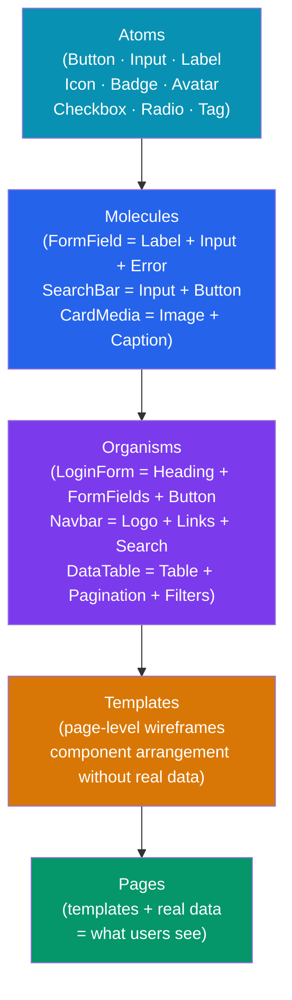

# Component Library

> [!abstract] TL;DR
> A component library is the coded layer of a design system — reusable UI elements with a documented props API, slots/children for composition, multiple visual variants, all interactive states, and full accessibility. Components are organized by complexity using **Atomic Design** (atoms → molecules → organisms). In React, `CVA` (class-variance-authority) handles variant logic cleanly; `cn` merges class names; `forwardRef` exposes the DOM node. In Vue, `defineProps`, `defineEmits`, and `<slot>` provide the same contract. **Storybook** is the canonical tool for living documentation and visual regression testing.

## Intuition — analogy FIRST

A component library is like a **LEGO catalog**. Each brick (atom) has a precise specification: dimensions, connection points (props), and color variants. Bricks combine into sub-assemblies (molecules: a form field = label + input + error message). Sub-assemblies combine into sets (organisms: a login card = heading + form fields + button + social links). The catalog documents every brick so builders don't redesign them — they compose them.

---

## How It Works



---

## Key Concepts / Details

### Component Anatomy

```typescript
// Every component in a design system needs:
// 1. Props API — all configuration surfaces
// 2. Slots/children — composable content areas
// 3. Variants — visual alternatives (size, intent, style)
// 4. States — default, hover, focus, active, disabled, loading, error
// 5. Accessibility — role, aria attributes, keyboard nav
// 6. Ref forwarding — expose DOM node for consumers

interface ButtonProps {
  // Variants
  variant?: 'primary' | 'secondary' | 'ghost' | 'danger'
  size?: 'sm' | 'md' | 'lg'
  // States
  disabled?: boolean
  loading?: boolean
  // Content
  children: React.ReactNode
  leftIcon?: React.ReactNode
  rightIcon?: React.ReactNode
  // DOM
  type?: 'button' | 'submit' | 'reset'
  onClick?: (e: React.MouseEvent<HTMLButtonElement>) => void
  // Escape hatch
  className?: string
  'aria-label'?: string
}
```

### React: CVA + cn Pattern

```typescript
// class-variance-authority handles variant → className mapping
import { cva, type VariantProps } from 'class-variance-authority'
import { clsx } from 'clsx'
import { twMerge } from 'tailwind-merge'

// cn: merge Tailwind classes without conflicts
export function cn(...inputs: ClassValue[]) {
  return twMerge(clsx(inputs))
}

// Define variant → class mapping with CVA
const buttonVariants = cva(
  // Base classes (always applied)
  'inline-flex items-center justify-center gap-2 rounded-md font-medium transition-colors focus-visible:outline-none focus-visible:ring-2 focus-visible:ring-ring disabled:pointer-events-none disabled:opacity-50',
  {
    variants: {
      variant: {
        primary: 'bg-[--color-interactive-primary] text-white hover:bg-[--color-interactive-primary-hover]',
        secondary: 'border border-[--color-border-default] bg-transparent hover:bg-[--color-surface-subtle]',
        ghost: 'hover:bg-[--color-surface-subtle] hover:text-[--color-text-default]',
        danger: 'bg-[--color-feedback-error] text-white hover:opacity-90',
      },
      size: {
        sm: 'h-8 px-3 text-sm',
        md: 'h-10 px-4 text-sm',
        lg: 'h-12 px-6 text-base',
      },
    },
    defaultVariants: {
      variant: 'primary',
      size: 'md',
    },
  }
)

// Component with forwardRef for DOM access
interface ButtonProps
  extends React.ButtonHTMLAttributes<HTMLButtonElement>,
    VariantProps<typeof buttonVariants> {
  loading?: boolean
  leftIcon?: React.ReactNode
}

export const Button = React.forwardRef<HTMLButtonElement, ButtonProps>(
  ({ className, variant, size, loading, disabled, leftIcon, children, ...props }, ref) => {
    return (
      <button
        ref={ref}
        className={cn(buttonVariants({ variant, size }), className)}
        disabled={disabled || loading}
        aria-busy={loading}
        {...props}
      >
        {loading ? <Spinner size="sm" aria-hidden /> : leftIcon}
        {children}
      </button>
    )
  }
)
Button.displayName = 'Button'

// Usage
<Button variant="primary" size="lg">Save Changes</Button>
<Button variant="danger" loading>Deleting...</Button>
<Button variant="ghost" leftIcon={<EditIcon />}>Edit</Button>
```

### Vue: defineProps + Slots + emit

```vue
<!-- Button.vue -->
<template>
  <button
    :class="buttonClasses"
    :disabled="disabled || loading"
    :aria-busy="loading"
    v-bind="$attrs"
  >
    <Spinner v-if="loading" size="sm" aria-hidden />
    <slot name="left-icon" v-else />
    <slot />
    <slot name="right-icon" />
  </button>
</template>

<script setup lang="ts">
import { computed } from 'vue'
import { cva } from 'class-variance-authority'

const buttonVariants = cva('inline-flex items-center gap-2 rounded-md font-medium transition-colors', {
  variants: {
    variant: {
      primary: 'bg-[--color-interactive-primary] text-white',
      secondary: 'border border-[--color-border-default]',
    },
    size: { sm: 'h-8 px-3 text-sm', md: 'h-10 px-4', lg: 'h-12 px-6' },
  },
  defaultVariants: { variant: 'primary', size: 'md' },
})

const props = withDefaults(defineProps<{
  variant?: 'primary' | 'secondary' | 'ghost' | 'danger'
  size?: 'sm' | 'md' | 'lg'
  disabled?: boolean
  loading?: boolean
}>(), { variant: 'primary', size: 'md' })

const emit = defineEmits<{ click: [e: MouseEvent] }>()

const buttonClasses = computed(() =>
  buttonVariants({ variant: props.variant, size: props.size })
)
</script>
```

### Theming and Customization Patterns

```typescript
// Pattern 1: CSS token override (preferred for branded instances)
// Consumer overrides tokens in their own CSS
.my-app {
  --color-interactive-primary: #7c3aed; /* purple brand */
  --radius-md: 2px; /* sharper corners */
}

// Pattern 2: className escape hatch
// Consumer passes extra classes via className prop
<Button className="my-override-class">Custom</Button>

// Pattern 3: asChild / Slot pattern (Radix UI / shadcn pattern)
// Render as a different element while keeping behavior
import { Slot } from '@radix-ui/react-slot'

const Button = forwardRef<HTMLButtonElement, ButtonProps & { asChild?: boolean }>(
  ({ asChild, ...props }, ref) => {
    const Comp = asChild ? Slot : 'button'  // render as <a> if asChild + child is <a>
    return <Comp ref={ref} {...props} />
  }
)

// Usage: render button styles on an anchor tag
<Button asChild>
  <a href="/dashboard">Go to Dashboard</a>
</Button>

// Pattern 4: Compound components (context-based sub-components)
<Select>
  <Select.Trigger />
  <Select.Content>
    <Select.Item value="a">Option A</Select.Item>
    <Select.Item value="b">Option B</Select.Item>
  </Select.Content>
</Select>
```

### Storybook Documentation

```typescript
// Button.stories.tsx (CSF3 format)
import type { Meta, StoryObj } from '@storybook/react'
import { Button } from './Button'

const meta: Meta<typeof Button> = {
  component: Button,
  title: 'Components/Button',
  tags: ['autodocs'],  // auto-generate docs page from JSDoc + PropTypes
  argTypes: {
    variant: {
      control: 'select',
      options: ['primary', 'secondary', 'ghost', 'danger'],
      description: 'Visual style variant of the button',
    },
    size: { control: 'radio', options: ['sm', 'md', 'lg'] },
    loading: { control: 'boolean' },
    disabled: { control: 'boolean' },
  },
  parameters: {
    layout: 'centered',
  },
}
export default meta

type Story = StoryObj<typeof Button>

export const Primary: Story = {
  args: { children: 'Save Changes', variant: 'primary', size: 'md' },
}

export const AllVariants: Story = {
  render: () => (
    <div className="flex gap-4">
      <Button variant="primary">Primary</Button>
      <Button variant="secondary">Secondary</Button>
      <Button variant="ghost">Ghost</Button>
      <Button variant="danger">Danger</Button>
    </div>
  ),
}

export const Loading: Story = {
  args: { children: 'Saving...', loading: true, variant: 'primary' },
}

// Interaction test with play function
export const ClickTest: Story = {
  args: { children: 'Click me' },
  play: async ({ canvasElement }) => {
    const { getByRole, userEvent, expect } = await import('@storybook/test')
    const canvas = within(canvasElement)
    const button = canvas.getByRole('button')
    await userEvent.click(button)
    // assertions via expect()
  },
}
```

---

## Real-World Notes

- **shadcn/ui** uses exactly the CVA + cn + forwardRef + Radix UI pattern described above. Understanding it means you understand shadcn internals.
- **`Slot` / `asChild` pattern** (Radix UI) is the modern way to avoid the "wrapper div problem" — consumers can choose the rendered element without breaking behavior.
- **Compound components** (Select, Tabs, Accordion) use React Context to share state between parent and child components. The API is more discoverable than a monolithic props list.
- **Polymorphic components** with full TypeScript safety require conditional types — `as="a"` giving you anchor props, `as="button"` giving you button props. This is advanced; `asChild` is simpler.
- **Tree-shaking components**: use named exports, not default exports. `import { Button } from '@ds/components'` tree-shakes; `import DS from '@ds/components'; DS.Button` does not.

---

## Common Pitfalls

- **God component** — one `<Text>` with 40 props is harder to use than `<Heading>`, `<Body>`, `<Caption>`. Prefer specific components over a bloated generic one.
- **Forgetting `displayName`** — React DevTools shows "ForwardRef" for anonymous forwardRef components. Always set `ComponentName.displayName = 'ComponentName'`.
- **State leaking through `...props`** — spreading all props onto the DOM element passes `loading={true}` to a `<button>`, causing React DOM warnings. Strip non-DOM props before spreading.
- **No design token usage** — hardcoding `className="bg-blue-500"` inside library components makes them unthemeable. Reference tokens via CSS variables.

---

## Related Concepts

- [[_MOC_Design_System|↑ Section MOC]]
- [[Design_System_Overview]] — Design system vs component library distinction
- [[Design_Tokens]] — Token layer that components consume
- [[Storybook_and_Testing]] — Full Storybook setup, stories, visual regression
- [[Accessibility_Standards]] — Every component must meet WCAG AA

---

## Review Questions

1. What are the five levels of Atomic Design and how do they map to a component library?
2. What does CVA (class-variance-authority) do? Why is it preferable to a long `if/else` variant map?
3. What is the `asChild` / `Slot` pattern and what problem does it solve?
4. Why should `forwardRef` be used when building library components? What does it expose?
5. What is a compound component pattern? Give a real example (Select, Tabs, Accordion).

---

## Sources

- Brad Frost: Atomic Design — https://atomicdesign.bradfrost.com/chapter-2/
- class-variance-authority — https://cva.style/
- Radix UI Slot — https://www.radix-ui.com/primitives/docs/utilities/slot
- shadcn/ui — https://ui.shadcn.com/docs

#web-development #component-library #atomic-design #cva #react #vue #storybook
