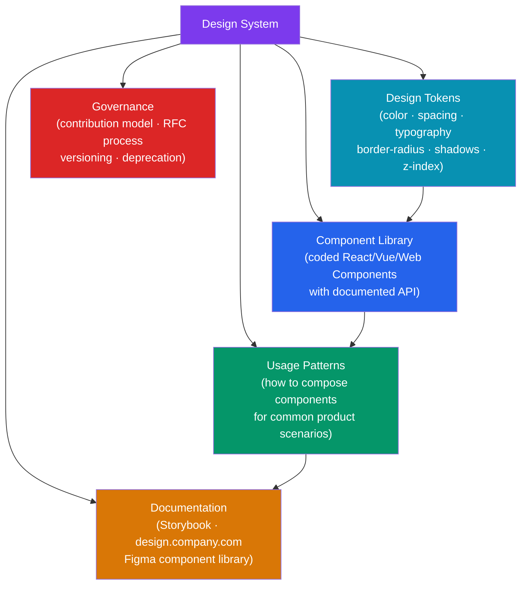

# Design System Overview

> [!abstract] TL;DR
> A design system is the **shared language between design and engineering** — a single source of truth composed of design tokens (raw values), a component library (coded UI elements), usage patterns (how components combine), and documentation. It is NOT just a component library or style guide: it is a living product with governance, versioning, contribution models, and a dedicated team. Famous examples include Material Design (Google), Apple HIG, Ant Design, Atlassian Design System, IBM Carbon, and Shopify Polaris.

## Intuition — analogy FIRST

A design system is like a city's building code plus a catalog of pre-certified architectural modules. Individual architects (engineers) can design any building (feature) they want, but they must use certified materials (tokens) and approved structural units (components). The result: every building in the city is safe, accessible, and coherent — and construction is faster because no one designs a door from scratch.

Without a design system, every team invents their own "door" — slightly different dimensions, different colors, different accessibility compliance. Users feel lost moving between buildings. Audits become impossible.

---

## How It Works



---

## Key Concepts / Details

### Design System vs Component Library vs Style Guide

| Artifact | What it contains | Who maintains it | Living product? |
|----------|-----------------|-----------------|----------------|
| **Style Guide** | Brand colors, fonts, tone of voice | Brand/Marketing | Rarely updated |
| **Component Library** | Coded UI components + props API | Engineering | Yes |
| **Design System** | Tokens + Components + Patterns + Docs + Governance | Dedicated DS team | Yes — versioned |

A component library is a subset of a design system. A style guide is the brand layer. A design system ties them together with governance and tooling.

### Famous Design Systems

| System | Company | Framework | Notable For |
|--------|---------|-----------|-------------|
| **Material Design** | Google | React/Web Components/Flutter | Comprehensive motion & elevation system |
| **Apple HIG** | Apple | SwiftUI/UIKit | Platform-native feel, strict guidelines |
| **Ant Design** | Alibaba | React | Enterprise-grade data-dense components |
| **Atlassian Design System** | Atlassian | React | Tokens-first, excellent accessibility docs |
| **IBM Carbon** | IBM | React/Angular/Vue/Svelte | Strict WCAG AA, international scale |
| **Shopify Polaris** | Shopify | React | Admin UI, merchant-focused patterns |

### Design System Team Structure

```
DS Team models:

1. Centralized — dedicated team owns and ships the system
   Pros: strong consistency, clear ownership
   Cons: bottleneck, may not know product context

2. Federated — each product team contributes, central team governs
   Pros: higher velocity, domain expertise
   Cons: consistency risk without strong reviews

3. Embedded — DS engineers sit within product teams (no central team)
   Pros: fast, product-aligned
   Cons: diverges quickly, hard to maintain

Most orgs graduate: Solitary (1 person) → Federated → Centralized as headcount grows.
```

### When to Build vs Adopt

```
Adopt an existing DS (MUI, Ant Design, Mantine, shadcn/ui) when:
- Small team (< 5 engineers), early-stage product
- Brand flexibility is acceptable
- Customization via theming is sufficient
- Speed to market > brand differentiation

Build your own when:
- Strong brand identity that off-the-shelf systems cannot express
- Scale justifies investment (> 30 engineers, multiple product surfaces)
- Unique interaction patterns (maps, data viz, financial charts)
- Accessibility requirements beyond what OSS systems provide
- Platform diversity (web + mobile + TV + watch)
```

### Design System Maturity Model

```
Level 0 — No system
  Each feature uses ad-hoc styles. No shared components.
  Symptoms: visual inconsistency, accessibility regressions, slow velocity.

Level 1 — Style Guide
  Color palette, typography scale, and spacing documented in Figma.
  No coded components. Designers reference it; engineers don't.

Level 2 — Component Library
  Coded components in a shared npm package.
  No design tokens. Components have hard-coded values.

Level 3 — Design System
  Tokens → Components → Patterns + Storybook documentation.
  Single source of truth for design and engineering.

Level 4 — Living Product
  Full governance: RFC process, semantic versioning, codemod migrations,
  adoption metrics, contribution from product teams, roadmap.
  Accessibility is automated and audited. Dark mode supported via tokens.
```

### Governance and Contribution Model

```
Governance levers:

1. RFC (Request for Comments) process
   - Anyone can propose a new component/token/pattern
   - Design + Engineering review committee
   - Acceptance criteria: used in 3+ places, no existing component solves it

2. Semantic Versioning
   - MAJOR: breaking change (prop removed, token renamed)
   - MINOR: new component or new prop (backward-compatible)
   - PATCH: bug fix, accessibility fix, doc improvement

3. Deprecation policy
   - Deprecated components/tokens get a deprecation notice for 2 MINOR versions
   - Codemods provided for breaking changes

4. Office hours / Design crits
   - Weekly open hours for product teams to get DS support
   - Design crit for new component proposals

5. Adoption metrics
   - Track which teams use which components (import analysis / GitHub scanning)
   - Adoption % is a DS team OKR
```

---

## Real-World Notes

- **shadcn/ui** changed the design system conversation: instead of an npm package you import from, it's a collection of copy-paste components you own. Each component is in your repo — no version lock-in, full customization. Trade-off: no automatic updates.
- **Figma variables** (2023+) replace many token plugin workflows — define modes (light/dark/brand) directly in Figma and sync to code via the Tokens Studio plugin or the Figma REST API.
- **The biggest design system failure mode** is not technical — it's organizational. Systems die when the DS team doesn't have product team buy-in or when the system adds friction rather than reducing it.
- **Design tokens without a transformer** (like Style Dictionary) create drift. Designers update Figma; engineers use old values. Automate the sync.

---

## Common Pitfalls

- **Building components before tokens** — hardcoded hex values in components create a maintenance nightmare. Tokens first, always.
- **Over-engineering early** — a 200-component library for a 10-person team is a liability. Start with 10 core components and grow organically.
- **No consumer feedback loop** — if product teams can't contribute or don't feel heard, they fork. Build governance before they do.
- **Documentation lag** — undocumented components don't get adopted. Write docs as part of the definition of done for every component.
- **Treating the DS as a one-time project** — a design system is a product. It needs a roadmap, releases, and ongoing investment.

---

## Related Concepts

- [[_MOC_Design_System|↑ Section MOC]]
- [[Design_Tokens]] — The lowest-level primitives: color, spacing, typography
- [[Component_Library]] — Building and documenting components with React/Vue
- [[Accessibility_Standards]] — WCAG 2.1/2.2 requirements every component must meet
- [[Storybook_and_Testing]] — The tooling layer: docs, visual regression, interaction tests

---

## Review Questions

1. What is the difference between a style guide, a component library, and a design system?
2. At what organizational scale does building a design system make sense over adopting one?
3. What are the four levels of the design system maturity model?
4. What is a governance RFC process and why does it matter?
5. What is shadcn/ui's model and how does it differ from a traditional npm component library?

---

## Sources

- Brad Frost: Atomic Design — https://atomicdesign.bradfrost.com/
- Nathan Curtis: Designing Design Systems — https://medium.com/eightshapes-llc
- Shopify Polaris — https://polaris.shopify.com/
- Atlassian Design System — https://atlassian.design/

#web-development #design-system #design-tokens #component-library #governance
