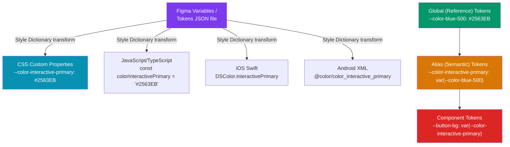

# Design Tokens

> [!abstract] TL;DR
> Design tokens are the **lowest-level primitive of a design system** — named key-value pairs for every raw design decision: colors, type scales, spacing, border radii, shadows, breakpoints, z-index, animation durations. They exist in a tier system (global → alias → component) and are named semantically (`--color-interactive-primary`) rather than literally (`--color-blue-500`). The W3C Design Token Community Group defines a JSON format. **Style Dictionary** transforms that JSON into CSS custom properties, JS/TS constants, iOS Swift, Android XML, and more — making one token source serve all platforms.

## Intuition — analogy FIRST

Design tokens are like a recipe's **pantry list** separated from the cooking steps. The color `#2563EB` is a pantry ingredient. "Interactive primary" is the semantic role. The recipe (component) says "use interactive-primary" — not "use #2563EB". When you rebrand, you change the pantry list, and every recipe updates automatically — without touching a single component.

Reference tokens are the pantry items. Alias tokens are the named roles. Component tokens are the specific overrides.

---

## How It Works



---

## Key Concepts / Details

### Token Categories

```css
/* COLOR PALETTE */
--color-blue-50: #eff6ff;
--color-blue-100: #dbeafe;
--color-blue-500: #2563eb;   /* reference token */
--color-blue-900: #1e3a8a;

/* SEMANTIC COLOR (alias → reference) */
--color-interactive-primary: var(--color-blue-500);
--color-interactive-primary-hover: var(--color-blue-600);
--color-surface-default: var(--color-white);
--color-surface-subtle: var(--color-gray-50);
--color-text-default: var(--color-gray-900);
--color-text-muted: var(--color-gray-500);
--color-text-inverse: var(--color-white);
--color-feedback-error: var(--color-red-600);
--color-feedback-success: var(--color-green-600);
--color-feedback-warning: var(--color-amber-500);

/* TYPOGRAPHY SCALE */
--font-size-xs: 0.75rem;   /* 12px */
--font-size-sm: 0.875rem;  /* 14px */
--font-size-base: 1rem;    /* 16px */
--font-size-lg: 1.125rem;  /* 18px */
--font-size-xl: 1.25rem;   /* 20px */
--font-size-2xl: 1.5rem;   /* 24px */
--font-size-3xl: 1.875rem; /* 30px */
--font-size-4xl: 2.25rem;  /* 36px */

--font-weight-regular: 400;
--font-weight-medium: 500;
--font-weight-semibold: 600;
--font-weight-bold: 700;

--line-height-tight: 1.25;
--line-height-normal: 1.5;
--line-height-relaxed: 1.75;

/* SPACING SCALE (4px base) */
--space-1: 0.25rem;  /* 4px */
--space-2: 0.5rem;   /* 8px */
--space-3: 0.75rem;  /* 12px */
--space-4: 1rem;     /* 16px */
--space-6: 1.5rem;   /* 24px */
--space-8: 2rem;     /* 32px */
--space-12: 3rem;    /* 48px */
--space-16: 4rem;    /* 64px */

/* BORDER RADIUS */
--radius-none: 0;
--radius-sm: 0.125rem;  /* 2px */
--radius-md: 0.375rem;  /* 6px */
--radius-lg: 0.5rem;    /* 8px */
--radius-xl: 0.75rem;   /* 12px */
--radius-full: 9999px;  /* pill */

/* SHADOWS */
--shadow-sm: 0 1px 2px 0 rgb(0 0 0 / 0.05);
--shadow-md: 0 4px 6px -1px rgb(0 0 0 / 0.1), 0 2px 4px -2px rgb(0 0 0 / 0.1);
--shadow-lg: 0 10px 15px -3px rgb(0 0 0 / 0.1), 0 4px 6px -4px rgb(0 0 0 / 0.1);
--shadow-xl: 0 20px 25px -5px rgb(0 0 0 / 0.1), 0 8px 10px -6px rgb(0 0 0 / 0.1);

/* BREAKPOINTS (use in JS/TS, not as CSS vars — CSS vars don't work in media queries) */
--breakpoint-sm: 640px;
--breakpoint-md: 768px;
--breakpoint-lg: 1024px;
--breakpoint-xl: 1280px;
--breakpoint-2xl: 1536px;

/* Z-INDEX SCALE */
--z-base: 0;
--z-dropdown: 100;
--z-sticky: 200;
--z-overlay: 300;
--z-modal: 400;
--z-popover: 500;
--z-toast: 600;
--z-tooltip: 700;

/* ANIMATION */
--duration-fast: 100ms;
--duration-normal: 200ms;
--duration-slow: 300ms;
--easing-default: cubic-bezier(0.4, 0, 0.2, 1);  /* ease-in-out */
--easing-in: cubic-bezier(0.4, 0, 1, 1);
--easing-out: cubic-bezier(0, 0, 0.2, 1);
--easing-spring: cubic-bezier(0.34, 1.56, 0.64, 1);
```

### Semantic vs Reference Token Naming

```
REFERENCE (global) tokens — describe the value
  --color-blue-500        (literal description of the value)
  --font-size-16          
  --space-4

ALIAS (semantic) tokens — describe the PURPOSE
  --color-interactive-primary    (what is this color FOR?)
  --color-text-muted             (role: muted text)
  --color-feedback-error         (role: error state)

COMPONENT tokens — scoped overrides
  --button-bg-primary            (component: button, role: primary background)
  --button-border-radius         (component: button, role: border radius)
  --input-border-color           (component: input, role: border color)

Why semantic names win:
  If you change your brand blue from #2563EB to #1D4ED8,
  you change ONE reference token. All alias tokens that point to
  --color-blue-500 update automatically — without touching component code.
```

### W3C Design Token Community Group (DTCG) Format

```json
{
  "$schema": "https://design-tokens.org/schema.json",
  "color": {
    "blue": {
      "500": {
        "$value": "#2563eb",
        "$type": "color",
        "$description": "Core blue at medium brightness"
      }
    },
    "interactive": {
      "primary": {
        "$value": "{color.blue.500}",
        "$type": "color",
        "$description": "Primary interactive element color"
      }
    }
  },
  "spacing": {
    "4": {
      "$value": "1rem",
      "$type": "dimension"
    }
  },
  "fontWeight": {
    "bold": {
      "$value": 700,
      "$type": "fontWeight"
    }
  }
}
```

Token types in DTCG: `color`, `dimension`, `fontFamily`, `fontWeight`, `duration`, `cubicBezier`, `number`, `strokeStyle`, `border`, `transition`, `shadow`, `gradient`, `typography`.

### Style Dictionary

```javascript
// style-dictionary.config.js
import StyleDictionary from 'style-dictionary'

export default {
  source: ['tokens/**/*.json'],
  platforms: {
    css: {
      transformGroup: 'css',
      prefix: 'ds',
      buildPath: 'dist/css/',
      files: [{
        destination: 'variables.css',
        format: 'css/variables',
        options: {
          selector: ':root',
          outputReferences: true,  // emit var() references, not resolved values
        }
      }]
    },
    js: {
      transformGroup: 'js',
      buildPath: 'dist/js/',
      files: [{
        destination: 'tokens.js',
        format: 'javascript/es6'
      }, {
        destination: 'tokens.d.ts',
        format: 'typescript/es6-declarations'
      }]
    },
    ios: {
      transformGroup: 'ios-swift',
      buildPath: 'dist/ios/',
      files: [{
        destination: 'DSTokens.swift',
        format: 'ios-swift/class.swift',
        className: 'DSTokens'
      }]
    }
  }
}

// Run: npx style-dictionary build --config style-dictionary.config.js
// Output:
// dist/css/variables.css       — CSS custom properties
// dist/js/tokens.js            — ES6 exports
// dist/js/tokens.d.ts          — TypeScript declarations
// dist/ios/DSTokens.swift      — Swift class
```

### Dark Mode with Token Switching

```css
/* Light mode (default) — set alias tokens to light values */
:root {
  --color-surface-default: var(--color-white);        /* #ffffff */
  --color-text-default: var(--color-gray-900);        /* #111827 */
  --color-interactive-primary: var(--color-blue-600); /* #2563eb */
}

/* Dark mode — swap alias tokens only, never reference tokens */
[data-theme="dark"] {
  --color-surface-default: var(--color-gray-950);     /* #030712 */
  --color-text-default: var(--color-gray-50);         /* #f9fafb */
  --color-interactive-primary: var(--color-blue-400); /* #60a5fa */
}

/* OS preference fallback */
@media (prefers-color-scheme: dark) {
  :root:not([data-theme="light"]) {
    --color-surface-default: var(--color-gray-950);
    --color-text-default: var(--color-gray-50);
  }
}

/* Components don't change — they reference alias tokens */
.button-primary {
  background-color: var(--color-interactive-primary); /* updates in dark mode automatically */
  color: var(--color-text-inverse);
}
```

### Token Versioning and Migration

```bash
# Semantic versioning for token packages
# MAJOR: token renamed or removed (breaking)
#   --color-brand-primary RENAMED to --color-interactive-primary
# MINOR: new token added (additive)
# PATCH: value updated (blue-500 value corrected)

# Migration: provide a codemod for renames
# using jscodeshift or PostCSS custom plugin
npx @ds/codemods transform --from="--color-brand-primary" --to="--color-interactive-primary" src/

# Tokens changelog entry (MAJOR bump)
## [3.0.0] — 2026-07-29
### Breaking Changes
- Renamed `--color-brand-primary` → `--color-interactive-primary`
- Removed `--font-size-huge` (use `--font-size-4xl`)
### Migration
Run: npx @yourds/codemods@3 src/
```

---

## Real-World Notes

- **Tailwind CSS is a token system** — its `tailwind.config.js` `theme` section is essentially your global token layer. `extend.colors.brand.500` is a reference token. Semantic tokens require CSS variables on top.
- **Figma Variables (2023)** replaced much of the Figma Tokens plugin. You can define modes (light/dark/brand-A/brand-B) and export via the REST API or Tokens Studio plugin to your token JSON.
- **`outputReferences: true` in Style Dictionary** emits `var(--color-blue-500)` in CSS instead of the resolved `#2563eb` — this is crucial for dark mode to work via CSS variable switching.
- **Component tokens are controversial** — some teams find them over-engineered. Use them only for components that genuinely need per-context overrides (e.g., a badge inside a table vs. a badge as standalone).

---

## Common Pitfalls

- **Mixing reference and semantic tokens in components** — components should only reference alias tokens. Using `var(--color-blue-500)` directly in a button breaks dark mode.
- **Too many token tiers** — global → alias is usually sufficient. Adding a component tier for every component creates hundreds of near-duplicate tokens.
- **Token names that describe value, not purpose** — `--color-light-blue` breaks when you rebrand. Always name by role.
- **No automated token sync** — manually copying Figma values to CSS leads to drift. Automate with the Figma API or a Figma plugin export step in CI.

---

## Related Concepts

- [[_MOC_Design_System|↑ Section MOC]]
- [[Design_System_Overview]] — Design system concepts: maturity model, governance
- [[Component_Library]] — Using tokens inside React/Vue component code
- [[CSS_Variables_Custom_Properties]] — The CSS layer that powers runtime token switching

---

## Review Questions

1. What is the difference between a reference token and an alias (semantic) token? Give an example of each.
2. Why does dark mode work with alias tokens but NOT if you hardcode reference token values into components?
3. What does Style Dictionary do? What inputs does it take and what outputs does it produce?
4. What is the W3C Design Token Community Group format and why does it matter for tooling?
5. What is the naming convention difference between `--color-blue-500` and `--color-interactive-primary`?

---

## Sources

- Style Dictionary docs — https://styledictionary.com/
- W3C Design Tokens format — https://design-tokens.github.io/community-group/format/
- Figma Variables — https://help.figma.com/hc/en-us/articles/15339657135383
- Theo (alternative to Style Dictionary) — https://github.com/salesforce-ux/theo

#web-development #design-tokens #css-variables #style-dictionary #dark-mode
