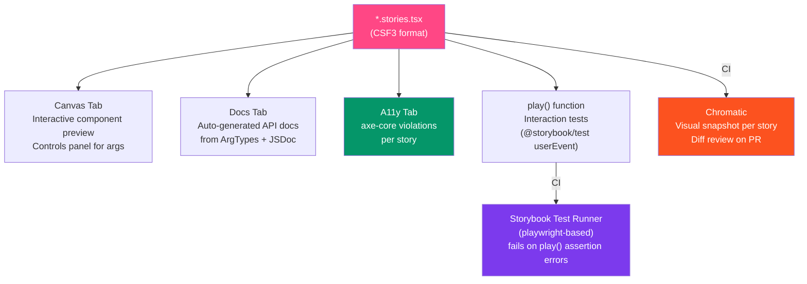

# Storybook and Testing

> [!abstract] TL;DR
> **Storybook** is the industry-standard tool for developing, documenting, and testing UI components in isolation — separate from the main application. Stories are written in **CSF3** (Component Story Format 3): a `Meta` export defining the component and an `export const StoryName: Story` per variant. `args` drive controls in the UI. The `play` function writes interaction tests using `@storybook/test` (`userEvent`, `expect`). **Chromatic** captures a visual snapshot per story and flags pixel diffs for review. The `a11y` addon runs `axe-core` on every story. Storybook can be built as a static site and published to Chromatic, Vercel, or GitHub Pages as living documentation.

## Intuition — analogy FIRST

Storybook is like a **component showroom** separate from the store floor. Each story is a room in the showroom displaying one component in one state (Primary Button, Loading Button, Disabled Button). Product managers, designers, and engineers can browse the showroom without touching the live application. QA runs automated tests against the showroom states, and Chromatic watches the showroom 24/7 — if a button's shadow shifts by 1px after a dependency update, it files a diff review.

---

## How It Works



---

## Key Concepts / Details

### Setup: Storybook 8 with Vite

```bash
# Initialize Storybook in a new/existing project
npx storybook@latest init
# Detects framework (React, Vue, Angular, etc.) and configures automatically

# Manual install (React + Vite)
npm install --save-dev \
  storybook \
  @storybook/react-vite \
  @storybook/addon-essentials \
  @storybook/addon-a11y \
  @storybook/test

# .storybook/main.ts — Storybook configuration
import type { StorybookConfig } from '@storybook/react-vite'

const config: StorybookConfig = {
  stories: ['../src/**/*.stories.@(ts|tsx)'],
  addons: [
    '@storybook/addon-essentials',  // controls, actions, docs, viewport, backgrounds
    '@storybook/addon-a11y',        // axe-core accessibility testing
    '@storybook/addon-interactions', // play function visualization
  ],
  framework: {
    name: '@storybook/react-vite',
    options: {},
  },
  docs: {
    autodocs: 'tag',  // generate docs for stories tagged with 'autodocs'
  },
}
export default config

# .storybook/preview.ts — global decorators, parameters
import type { Preview } from '@storybook/react'
import '../src/styles/tokens.css'  // load design tokens globally

const preview: Preview = {
  parameters: {
    backgrounds: {
      default: 'light',
      values: [
        { name: 'light', value: '#ffffff' },
        { name: 'dark', value: '#030712' },
      ],
    },
    a11y: {
      config: {
        rules: [{ id: 'color-contrast', enabled: true }],
      },
    },
  },
  decorators: [
    (Story) => (
      <div style={{ padding: '1rem' }}>
        <Story />
      </div>
    ),
  ],
}
export default preview
```

### CSF3: Component Story Format

```typescript
// Button.stories.tsx
import type { Meta, StoryObj } from '@storybook/react'
import { within, userEvent, expect } from '@storybook/test'
import { Button } from './Button'

// Meta: component-level configuration
const meta = {
  component: Button,
  title: 'Components/Atoms/Button',  // sidebar navigation path
  tags: ['autodocs'],                // auto-generate docs page
  parameters: {
    layout: 'centered',
    docs: {
      description: {
        component: 'Primary interaction component. Use `primary` for the main call to action.',
      },
    },
  },
  // ArgTypes: control UI + docs
  argTypes: {
    variant: {
      control: 'select',
      options: ['primary', 'secondary', 'ghost', 'danger'],
      description: 'Visual style variant',
      table: { defaultValue: { summary: 'primary' } },
    },
    size: {
      control: 'radio',
      options: ['sm', 'md', 'lg'],
      description: 'Size of the button',
    },
    loading: { control: 'boolean', description: 'Shows spinner, disables interaction' },
    disabled: { control: 'boolean' },
    children: { control: 'text' },
  },
  // Default args applied to ALL stories in this file
  args: {
    children: 'Button',
    variant: 'primary',
    size: 'md',
  },
} satisfies Meta<typeof Button>

export default meta
type Story = StoryObj<typeof meta>

// Named exports = stories
export const Primary: Story = {}  // inherits default args

export const Secondary: Story = {
  args: { variant: 'secondary' },
}

export const Loading: Story = {
  args: { loading: true, children: 'Saving...' },
}

export const AllSizes: Story = {
  render: () => (
    <div style={{ display: 'flex', gap: '8px', alignItems: 'center' }}>
      <Button size="sm">Small</Button>
      <Button size="md">Medium</Button>
      <Button size="lg">Large</Button>
    </div>
  ),
}

export const LongLabel: Story = {
  args: { children: 'This is a very long label to test text overflow behavior' },
  parameters: {
    docs: { description: { story: 'Test how the button handles long text.' } },
  },
}
```

### Decorators for Context Providers

```typescript
// Wrapping stories in providers (theme, router, Redux, i18n)

// .storybook/preview.ts — global decorator
import { MemoryRouter } from 'react-router-dom'
import { QueryClient, QueryClientProvider } from '@tanstack/react-query'

const queryClient = new QueryClient()

const preview: Preview = {
  decorators: [
    (Story) => (
      <QueryClientProvider client={queryClient}>
        <MemoryRouter>
          <Story />
        </MemoryRouter>
      </QueryClientProvider>
    ),
  ],
}

// Story-level decorator (overrides / adds to global)
export const WithTheme: Story = {
  decorators: [
    (Story) => (
      <div data-theme="dark" style={{ background: '#030712', padding: '1rem' }}>
        <Story />
      </div>
    ),
  ],
}
```

### play Function: Interaction Tests

```typescript
// The play function runs after the story renders
// Uses @storybook/test (re-exports @testing-library + vitest expect)
import { within, userEvent, expect, fn, waitFor } from '@storybook/test'

export const FormSubmit: Story = {
  args: {
    onSubmit: fn(),  // spy function — tracked in Interactions panel
  },
  play: async ({ canvasElement, args }) => {
    const canvas = within(canvasElement)

    // Find elements by accessible role
    const emailInput = canvas.getByRole('textbox', { name: /email/i })
    const submitButton = canvas.getByRole('button', { name: /submit/i })

    // Interact
    await userEvent.type(emailInput, 'user@example.com', { delay: 50 })
    await userEvent.click(submitButton)

    // Assert
    await waitFor(() => {
      expect(args.onSubmit).toHaveBeenCalledWith(
        expect.objectContaining({ email: 'user@example.com' })
      )
    })

    // Expect UI changes
    const successMessage = canvas.getByRole('status')
    expect(successMessage).toHaveTextContent('Form saved')
  },
}

// Run interaction tests in CI:
# npm install --save-dev @storybook/test-runner
# npx test-storybook --url http://localhost:6006
```

### Chromatic Visual Regression Testing

```bash
# Install Chromatic CLI
npm install --save-dev chromatic

# Run Chromatic (captures snapshot of every story)
npx chromatic --project-token=<your-token>

# CI (GitHub Actions)
# .github/workflows/chromatic.yml
- name: Publish to Chromatic
  uses: chromaui/action@latest
  with:
    projectToken: ${{ secrets.CHROMATIC_PROJECT_TOKEN }}
    exitZeroOnChanges: true  # don't fail on visual changes, just report
```

```
Chromatic workflow:
1. First run: baseline snapshots captured (one per story)
2. PR run: new snapshots taken and diffed against baseline
3. If pixel diff detected: review UI in Chromatic → Accept or Deny
4. Accept → becomes new baseline
5. Deny → fix the regression

What Chromatic catches:
  - Unexpected layout shifts (token value changed)
  - Font rendering changes (after upgrading a font)
  - Component state regressions (a refactor breaks hover style)
  - Cross-browser differences (tests in Chrome, Firefox, Safari)

Storybook Modes (viewport / theme variants):
  // .storybook/modes.ts
  export const allModes = {
    desktop: { viewport: 'desktop' },
    mobile: { viewport: 'mobile1' },
    dark: { backgrounds: { value: '#030712' } },
  }
  // Use in story parameters.chromatic.modes to test multiple contexts
```

### Publishing Storybook + Zeroheight Handoff

```bash
# Build static Storybook
npx storybook build
# Output: storybook-static/ — deployable to any static host

# Deploy to Chromatic (Storybook hosting included)
npx chromatic --project-token=<token>
# URL: https://your-project.chromatic.com

# GitHub Pages
npm install --save-dev gh-pages
# package.json
"scripts": {
  "deploy-storybook": "storybook build -o storybook-static && gh-pages -d storybook-static"
}
```

**Zeroheight** — design-dev handoff tool that embeds Storybook stories alongside Figma components:
- Connect Figma file + Storybook URL
- Stories render live inside Zeroheight documentation pages
- Designers and engineers see the same component in the same docs
- Keeps design tokens, usage guidelines, and coded examples co-located

---

## Real-World Notes

- **Storybook 8 (2024)** introduced the `@storybook/test` package (replacing `@storybook/jest` + `@storybook/testing-library`), first-class Vitest integration, and a significantly faster test runner.
- **`fn()` from `@storybook/test`** is a spy (like `vi.fn()` or `jest.fn()`). You can pass it as an arg and the Interactions panel shows every call with arguments.
- **`autodocs: true`** in story tags generates a documentation page with prop table, description, and all stories in one page. You can add MDX pages for custom narrative documentation.
- **Visual regression testing costs** — Chromatic free plan: 5,000 snapshots/month. Each story × mode (viewport/theme) = one snapshot. Large design systems can hit limits quickly; optimize by limiting modes.

---

## Common Pitfalls

- **Stories that depend on global state** — stories should be self-contained. Use decorators for providers; use `args.onSubmit = fn()` for callbacks. Avoid importing Redux store directly.
- **Missing `await` in play functions** — `userEvent` methods are async. Missing `await` before `userEvent.type()` causes tests to pass before interaction completes.
- **Chromatic flakiness from animations** — CSS transitions cause diff noise. Use `parameters: { chromatic: { disableSnapshot: false, delay: 500 } }` or disable animations in Storybook.
- **`getByTestId` in play functions** — defeats the accessibility testing purpose. Use `getByRole` so tests also validate ARIA correctness.

---

## Related Concepts

- [[_MOC_Design_System|↑ Section MOC]]
- [[Component_Library]] — Components are what you write stories for
- [[Accessibility_Standards]] — The a11y addon enforces WCAG rules in Storybook
- [[Design_System_Overview]] — Storybook is the documentation layer of the design system

---

## Review Questions

1. What is the difference between a Story (`export const Primary: Story`) and the Meta (`export default meta`)?
2. What does the `play` function do in a Storybook story and what package provides `userEvent`?
3. How does Chromatic visual regression testing work? What constitutes a "pass" vs "fail"?
4. What is the purpose of decorators in Storybook and when would you use a global vs story-level decorator?
5. What does `autodocs: 'tag'` in `StorybookConfig` do?

---

## Sources

- Storybook docs — https://storybook.js.org/docs
- Chromatic docs — https://www.chromatic.com/docs
- Storybook Test Runner — https://storybook.js.org/docs/writing-tests/test-runner
- Zeroheight — https://zeroheight.com/

#web-development #storybook #chromatic #visual-regression #csf3 #component-testing #design-system
