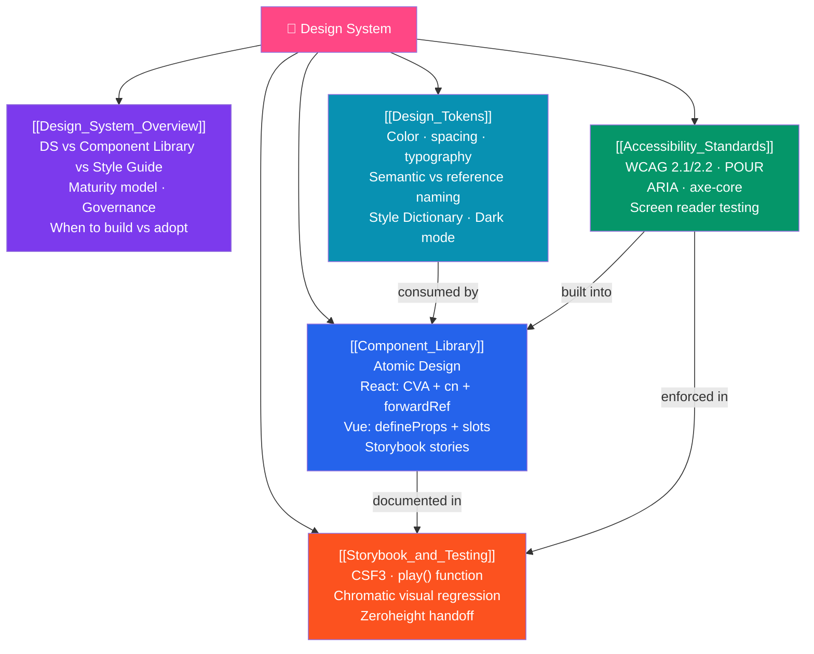

# Design System — Map of Content

> [!abstract] What This Section Covers
> A design system is the shared language between design and engineering — tokens, components, patterns, documentation, and governance working together as a living product. This section covers the full stack: what a design system is and when to build vs adopt, design tokens as the lowest-level primitive (with Style Dictionary for multi-platform output), building accessible component libraries in React and Vue, WCAG 2.1/2.2 accessibility standards, and Storybook for living documentation plus Chromatic for visual regression testing.

## Concept Map

## Learning Path

1. [[Design_System_Overview]] — Start here: what a design system is, DS vs component library vs style guide, maturity levels (0–4), governance models, famous examples (Material Design, Polaris, Carbon), when to build vs adopt.
2. [[Design_Tokens]] — The lowest-level primitive: global → alias → component token tiers, semantic naming conventions, W3C DTCG JSON format, Style Dictionary (transform to CSS/JS/iOS/Android), dark mode token switching.
3. [[Component_Library]] — Building coded components: Atomic Design (atoms/molecules/organisms), React with CVA + cn + forwardRef, Vue with defineProps + slots + emit, theming patterns (CSS overrides, asChild), Storybook basics.
4. [[Accessibility_Standards]] — WCAG 2.1/2.2 POUR principles, AA conformance targets, color contrast, ARIA (when to use, when not to), `axe-core` automated testing, `@testing-library` accessible queries, screen reader testing.
5. [[Storybook_and_Testing]] — Full Storybook setup (Vite builder), CSF3 stories, controls, decorators for providers, `play` function interaction testing, Chromatic visual regression, publishing as static site, Zeroheight handoff.

## All Notes at a Glance

| Note | Difficulty | What You'll Learn |
|------|------------|-------------------|
| [[Design_System_Overview]] | Beginner | DS vs style guide vs component library, maturity model 0–4, governance RFC, when to build vs adopt |
| [[Design_Tokens]] | Intermediate | Token tiers, semantic naming, W3C DTCG format, Style Dictionary transforms, CSS dark mode switching |
| [[Component_Library]] | Intermediate | Atomic Design, CVA variants, cn utility, forwardRef, asChild/Slot, compound components, Storybook basics |
| [[Accessibility_Standards]] | Intermediate | WCAG POUR, contrast ratios, ARIA rules, axe-core, Testing Library accessible queries, screen readers |
| [[Storybook_and_Testing]] | Intermediate | CSF3 Meta/Story, args/argTypes, play(), decorators, Chromatic, visual regression, Zeroheight |

## Key Questions This Section Answers

- What is the difference between a design system, a component library, and a style guide?
- Why should design tokens be named semantically (`--color-interactive-primary`) instead of literally (`--color-blue-500`)?
- How does dark mode work with CSS custom properties and alias token switching?
- What are the four levels of WCAG conformance and which should you target?
- How do you write a Storybook story that tests user interactions?
- What does Chromatic do and how does visual regression testing catch regressions in CI?

## Related Sections

- [[_MOC_WebDev_Master|↑ Web Dev Master MOC]]
- [[_MOC_React|← React]] — Components are typically React-based; hooks for component state
- [[_MOC_Vue|← Vue]] — Vue 3 component library patterns (defineProps, slots, emit)
- [[_MOC_HTML_CSS|← HTML & CSS]] — CSS custom properties that power token switching

#MOC #WebDevelopment #DesignSystem
