# 🌐 Web Development — Master Map of Content

> [!abstract] About This Vault
> A production-focused reference for engineers building browser UIs, single-page and full-stack applications, and cross-platform apps from a single codebase. **37 notes across 6 sections**, covering the full stack progression: markup and styling, the JavaScript runtime, TypeScript's type system, the Angular and React component ecosystems, and Flutter/Dart for native-quality mobile, web, and desktop. Every note pairs an intuition-first analogy with code examples, Mermaid diagrams, trade-off tables, common pitfalls, and review questions. Follow one of the four learning paths below, or jump directly to the section that matches your goal.

## Vault Architecture

```mermaid
graph TD
    Master["🌐 Web Dev Master"]

    Master --> S01["01 HTML & CSS Fundamentals"]
    Master --> S02["02 JavaScript Core"]
    Master --> S03["03 TypeScript"]
    Master --> S04["04 Angular"]
    Master --> S05["05 React"]
    Master --> S06["06 Flutter"]

    S01 --> H1["HTML5 Semantics"]
    S01 --> H2["CSS Box Model"]
    S01 --> H3["Flexbox & Grid"]
    S01 --> H4["CSS Variables"]
    S01 --> H5["Responsive Design"]

    S02 --> J1["JS Fundamentals"]
    S02 --> J2["DOM Manipulation"]
    S02 --> J3["Async JS & Promises"]
    S02 --> J4["ES6 Modern Features"]
    S02 --> J5["Modules & Bundling"]

    S03 --> T1["TS Fundamentals"]
    S03 --> T2["Type System Advanced"]
    S03 --> T3["Generics"]
    S03 --> T4["TS with React"]
    S03 --> T5["TS Tooling"]

    S04 --> A1["Angular Architecture"]
    S04 --> A2["Components & Templates"]
    S04 --> A3["Services & DI"]
    S04 --> A4["RxJS & Observables"]
    S04 --> A5["Routing & Forms"]

    S05 --> R1["React Fundamentals"]
    S05 --> R2["Hooks in React"]
    S05 --> R3["State Mgmt Redux"]
    S05 --> R4["React Performance"]
    S05 --> R5["Next.js"]

    S06 --> F1["Flutter Architecture"]
    S06 --> F2["Dart Language"]
    S06 --> F3["Widgets & Layout"]
    S06 --> F4["State Mgmt Flutter"]
    S06 --> F5["Flutter Navigation"]

    style Master fill:#7c3aed,color:#fff
    style S01 fill:#2563eb,color:#fff
    style S02 fill:#d97706,color:#fff
    style S03 fill:#059669,color:#fff
    style S04 fill:#dc2626,color:#fff
    style S05 fill:#0891b2,color:#fff
    style S06 fill:#7c3aed,color:#fff
```

## Sections at a Glance

| # | Section | Notes | Entry Point | Difficulty |
|---|---------|-------|-------------|------------|
| 01 | HTML & CSS Fundamentals | 5 | [[_MOC_HTML_CSS]] | Beginner |
| 02 | JavaScript Core | 5 | [[_MOC_JavaScript_Core]] | Beginner → Intermediate |
| 03 | TypeScript | 5 | [[_MOC_TypeScript]] | Intermediate |
| 04 | Angular | 5 | [[_MOC_Angular]] | Intermediate → Advanced |
| 05 | React | 5 | [[_MOC_React]] | Intermediate → Advanced |
| 06 | Flutter | 5 | [[_MOC_Flutter]] | Intermediate → Advanced |

---

## Learning Paths

### Path 1 — Frontend Developer

> Best for: engineers building browser UIs and want a systematic foundation.

**HTML/CSS → JavaScript → TypeScript → React**

[[_MOC_HTML_CSS]] → [[HTML5_Semantics]] → [[CSS_Box_Model]] → [[Flexbox_and_Grid]] → [[Responsive_Design]] → [[_MOC_JavaScript_Core]] → [[JS_Fundamentals]] → [[DOM_Manipulation]] → [[Async_JS_Promises]] → [[ES6_Modern_Features]] → [[_MOC_TypeScript]] → [[TypeScript_Fundamentals]] → [[_MOC_React]] → [[React_Fundamentals]] → [[Hooks_in_React]]

---

### Path 2 — Full-Stack Developer

> Best for: engineers building end-to-end applications with a JavaScript runtime.

**JavaScript → TypeScript → Next.js → Angular**

[[_MOC_JavaScript_Core]] → [[JS_Modules_Bundling]] → [[_MOC_TypeScript]] → [[Type_System_Advanced]] → [[Generics_in_TypeScript]] → [[_MOC_React]] → [[Next_js]] → [[State_Management_Redux]] → [[_MOC_Angular]] → [[Angular_Architecture]] → [[Services_and_DI]] → [[Angular_Routing_Forms]]

---

### Path 3 — Mobile Developer

> Best for: engineers targeting iOS, Android, and web from a single codebase.

**Dart → Flutter Architecture → Widgets → State → Navigation**

[[_MOC_Flutter]] → [[Dart_Language]] → [[Flutter_Architecture]] → [[Widgets_and_Layout]] → [[State_Management_Flutter]] → [[Flutter_Navigation]]

---

### Path 4 — UI/UX Engineer

> Best for: designers-turned-engineers focused on visual precision, animation, and accessibility.

**CSS Deep Dive → Responsive → CSS Variables → React**

[[_MOC_HTML_CSS]] → [[CSS_Box_Model]] → [[Flexbox_and_Grid]] → [[CSS_Variables_Custom_Properties]] → [[Responsive_Design]] → [[_MOC_React]] → [[React_Performance]] → [[_MOC_Flutter]] → [[Widgets_and_Layout]]

---

## Cross-Vault Links

- **AI/ML vault** — [[_MOC_AI_ML_Master]] for ML-powered features, LLM integration, and model deployment that complements frontend work.
- **System Design vault** — [[_MOC_SystemDesign_Master]] for API design, CDN architecture, and the backend systems that web apps consume.
- **Database vault** — [[_MOC_Database_Master]] for data persistence, SQL, and the storage layer behind full-stack applications.
- **DSA vault** — [[_MOC_DSA_Master]] for algorithmic thinking and interview preparation.

---

## Section MOC Index

- [[_MOC_HTML_CSS]] — The declarative foundation: semantic HTML5, the CSS box model, Flexbox, Grid, custom properties, and responsive design.
- [[_MOC_JavaScript_Core]] — The universal runtime: types/coercion, closures, the event loop, async/promises, and modules/bundling.
- [[_MOC_TypeScript]] — Structural typing over JavaScript: fundamentals, advanced types, generics, React integration, and tooling.
- [[_MOC_Angular]] — Google's complete framework: architecture, components, DI, RxJS observables, and routing/forms.
- [[_MOC_React]] — Meta's composable UI library: fundamentals, hooks, state management, performance, and Next.js.
- [[_MOC_Flutter]] — Google's cross-platform UI toolkit: architecture, Dart, widgets, state management, and navigation.

#MOC #WebDevelopment #MasterMOC
