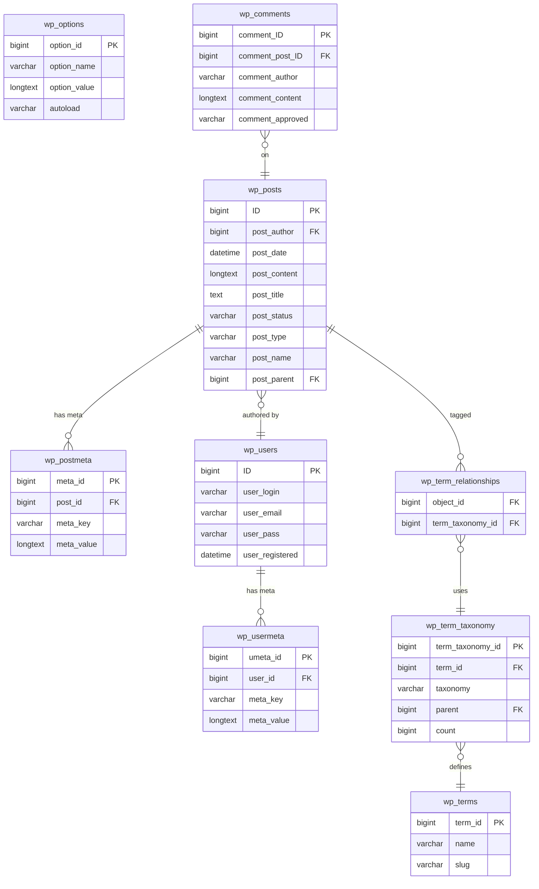

# WordPress Database and Queries

> [!abstract] TL;DR
> WordPress stores everything in MySQL using `wp_` prefixed tables. `WP_Query` is the primary way to retrieve posts — understand its arguments and the Loop. Use `$wpdb` with `prepare()` for custom SQL (never string-concatenate). Use transients and the object cache to avoid repeating expensive queries.

## WordPress Database Schema



### Key Table Descriptions

| Table | Purpose |
|---|---|
| `wp_posts` | Everything: posts, pages, CPTs, revisions, menu items, attachments |
| `wp_postmeta` | Key-value custom fields for any post |
| `wp_users` | User accounts |
| `wp_usermeta` | User capabilities, preferences, plugin data |
| `wp_options` | Site-wide settings (siteurl, blogname, active plugins, widget data) |
| `wp_terms` | Tag/category/taxonomy term names and slugs |
| `wp_term_taxonomy` | Associates terms with a taxonomy + stores count |
| `wp_term_relationships` | Many-to-many: posts ↔ term_taxonomy rows |
| `wp_comments` | Post comments (and pingbacks, trackbacks) |
| `wp_commentmeta` | Custom fields for comments |

## WP_Query — The Core Query Class

`WP_Query` is the central class for fetching posts from the database. WordPress's own main query (the one that powers The Loop) is a `WP_Query` instance stored in the global `$wp_query`.

### Basic Usage

```php
$args = array(
    'post_type'      => 'post',
    'posts_per_page' => 10,
    'post_status'    => 'publish',
    'orderby'        => 'date',
    'order'          => 'DESC',
);

$query = new WP_Query( $args );

if ( $query->have_posts() ) {
    while ( $query->have_posts() ) {
        $query->the_post(); // Sets up template tags for the current post
        the_title();
        the_excerpt();
    }
    wp_reset_postdata(); // IMPORTANT: restore global $post
}
```

### WP_Query Arguments Cheatsheet

| Argument | Type | Example | Notes |
|---|---|---|---|
| `post_type` | string/array | `'book'`, `array('post','page')` | Default: `'post'` |
| `posts_per_page` | int | `10`, `-1` (all) | Use `-1` sparingly |
| `paged` | int | `get_query_var('paged')` | For pagination |
| `post_status` | string/array | `'publish'`, `'draft'` | Default: `'publish'` |
| `orderby` | string | `'date'`, `'title'`, `'meta_value_num'`, `'rand'` | Can be array for multi-sort |
| `order` | string | `'ASC'`, `'DESC'` | Default: `'DESC'` |
| `meta_key` | string | `'_book_isbn'` | Needed when orderby is meta_value |
| `meta_query` | array | See below | Complex meta filtering |
| `tax_query` | array | See below | Taxonomy filtering |
| `author` | int | `get_current_user_id()` | Filter by author ID |
| `s` | string | `'search term'` | Keyword search |
| `post__in` | array | `array(1, 2, 3)` | Get specific post IDs |
| `post__not_in` | array | `array(4, 5)` | Exclude specific IDs |
| `date_query` | array | See WP docs | Date range filtering |
| `fields` | string | `'ids'` | Return only IDs (performance) |

### Meta Query (Custom Fields)

```php
$args = array(
    'post_type'  => 'book',
    'meta_query' => array(
        'relation' => 'AND',  // AND (default) or OR
        array(
            'key'     => '_book_pages',
            'value'   => 200,
            'compare' => '>=',          // =, !=, >, >=, <, <=, LIKE, IN, BETWEEN, EXISTS
            'type'    => 'NUMERIC',     // NUMERIC, CHAR, DATE, DATETIME, BINARY
        ),
        array(
            'key'     => '_book_genre',
            'value'   => 'fiction',
            'compare' => '=',
        ),
    ),
);
```

### Tax Query (Taxonomy Filtering)

```php
$args = array(
    'post_type' => 'book',
    'tax_query' => array(
        'relation' => 'OR',
        array(
            'taxonomy' => 'genre',
            'field'    => 'slug',      // 'term_id', 'slug', or 'name'
            'terms'    => array( 'fiction', 'thriller' ),
            'operator' => 'IN',        // IN (default), NOT IN, AND, EXISTS, NOT EXISTS
        ),
    ),
);
```

## get_posts() — Lightweight Alternative

For simple one-off queries where you don't need pagination or The Loop:

```php
$books = get_posts( array(
    'post_type'      => 'book',
    'posts_per_page' => 5,
    'meta_key'       => '_book_rating',
    'orderby'        => 'meta_value_num',
    'order'          => 'DESC',
) );

foreach ( $books as $book ) {
    echo esc_html( $book->post_title );
    $isbn = get_post_meta( $book->ID, '_book_isbn', true );
}
```

## WP_User_Query

```php
$user_query = new WP_User_Query( array(
    'role'    => 'subscriber',
    'orderby' => 'registered',
    'order'   => 'DESC',
    'number'  => 20,
    'meta_query' => array(
        array(
            'key'     => 'newsletter_opt_in',
            'value'   => '1',
            'compare' => '=',
        ),
    ),
) );

$users = $user_query->get_results();
foreach ( $users as $user ) {
    echo esc_html( $user->display_name );
}
```

## wpdb — Direct Database Access

The `$wpdb` global is a database abstraction class. Use it when `WP_Query` cannot express what you need.

```php
global $wpdb;

// Simple get_results (SELECT multiple rows)
$results = $wpdb->get_results(
    $wpdb->prepare(
        "SELECT * FROM {$wpdb->posts} WHERE post_status = %s AND post_type = %s LIMIT %d",
        'publish',
        'book',
        10
    )
);

// get_var (single value)
$count = $wpdb->get_var(
    $wpdb->prepare( "SELECT COUNT(*) FROM {$wpdb->posts} WHERE post_author = %d", $user_id )
);

// get_row (single row as object)
$post = $wpdb->get_row(
    $wpdb->prepare( "SELECT * FROM {$wpdb->posts} WHERE ID = %d", $post_id )
);

// INSERT
$wpdb->insert(
    $wpdb->prefix . 'my_plugin_data',  // table name
    array(                              // data
        'user_id' => $user_id,
        'data'    => wp_json_encode( $payload ),
    ),
    array( '%d', '%s' )                // format: %d=int, %s=string, %f=float
);
$inserted_id = $wpdb->insert_id;

// UPDATE
$wpdb->update(
    $wpdb->prefix . 'my_plugin_data',
    array( 'data' => wp_json_encode( $new_payload ) ),  // data
    array( 'id' => $row_id ),                           // where
    array( '%s' ),                                       // data format
    array( '%d' )                                        // where format
);

// DELETE
$wpdb->delete(
    $wpdb->prefix . 'my_plugin_data',
    array( 'user_id' => $user_id ),
    array( '%d' )
);
```

> [!warning] Always use `$wpdb->prepare()` with `%s`, `%d`, `%f` placeholders for any user-supplied data. Never concatenate strings into SQL.

## Transients API — Caching Expensive Queries

Transients store cached data in `wp_options` (or in Redis/Memcached if an object cache is installed):

```php
// Cache key based on query parameters
$cache_key = 'top_books_' . md5( serialize( $args ) );

$books = get_transient( $cache_key );

if ( false === $books ) {
    // Cache miss — run the expensive query
    $books = new WP_Query( $args );
    set_transient( $cache_key, $books, HOUR_IN_SECONDS ); // 3600 seconds
}

// Available time constants: MINUTE_IN_SECONDS, HOUR_IN_SECONDS,
// DAY_IN_SECONDS, WEEK_IN_SECONDS, MONTH_IN_SECONDS, YEAR_IN_SECONDS

// Invalidate when data changes
add_action( 'save_post_book', 'my_clear_book_cache' );
function my_clear_book_cache() {
    // For simplicity, delete all book transients
    // In production, use more targeted invalidation
    delete_transient( 'top_books_*' ); // Note: wildcards not supported natively
    // Better: use a transient group or cache key versioning
}
```

## Object Cache

When a persistent object cache backend (Redis via `wp-redis`, or Memcached via `wp-object-cache`) is active, WordPress's `wp_cache_*` functions store data in memory across requests:

```php
// Set a value in the object cache (group, expiry)
wp_cache_set( 'user_stats_' . $user_id, $stats_array, 'my_plugin', 300 );

// Get from cache
$stats = wp_cache_get( 'user_stats_' . $user_id, 'my_plugin' );
if ( false === $stats ) {
    $stats = compute_expensive_stats( $user_id );
    wp_cache_set( 'user_stats_' . $user_id, $stats, 'my_plugin', 300 );
}

// Delete from cache
wp_cache_delete( 'user_stats_' . $user_id, 'my_plugin' );

// Flush the entire cache group (plugin caches only)
wp_cache_flush_group( 'my_plugin' );
```

## Common Pitfalls

1. **Running WP_Query inside The Loop without `wp_reset_postdata()`** — Nested queries modify the global `$post` variable. Failing to call `wp_reset_postdata()` after a custom loop breaks all subsequent template tags (like `the_title()`, `get_the_ID()`).
2. **Using `meta_query` without a DB index** — Meta queries on `meta_value` without an index scan the entire `wp_postmeta` table. For high-traffic sites, add a DB index on `meta_value` for frequently queried meta keys.
3. **Using `posts_per_page => -1` in production** — Fetching all posts at once can return thousands of rows and exhaust PHP memory. Always paginate or use `posts_per_page` with a reasonable limit; cache results if needed.

## Review Questions

1. What is the difference between `WP_Query` and `get_posts()`? When would you choose one over the other?
2. Explain what `wp_reset_postdata()` does and when you must call it.
3. Why is `$wpdb->prepare()` necessary for security, and what are the three format placeholders it supports?

## See Also

- [[WordPress_Plugin_Development]]
- [[WordPress_Hooks_and_Filters]]
- [[WordPress_Performance_and_Security]]
- [[WooCommerce_Fundamentals]]
- [[_MOC_WordPress_Master]]
- [[_MOC_Database_Master]]
- [[_MOC_PHP_Master]]
