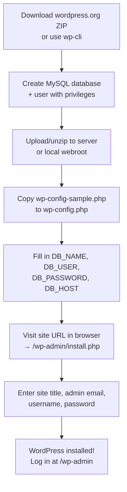

# WordPress Installation and Setup

> [!abstract] TL;DR
> WordPress installs in minutes: download from wordpress.org, create a MySQL database, fill in `wp-config.php`, and run the 5-minute installer. Use **LocalWP** for local development and managed hosts like **WP Engine or Kinsta** for production. Master **WP-CLI** to manage everything from the terminal without touching the admin UI.

## Local Development Options

### LocalWP (Recommended)

[LocalWP](https://localwp.com/) is the de facto standard for local WordPress development. It creates isolated environments with one click, supports multiple PHP versions, has a built-in mailhog, and can push/pull sites to Flywheel hosting.

```bash
# After installing LocalWP, sites are managed via GUI
# Sites live at ~/Local Sites/<site-name>/
```

### XAMPP / MAMP

Classic cross-platform LAMP/MAMP stacks. Install Apache + PHP + MySQL locally, then drop WordPress into `htdocs/` (XAMPP) or `htdocs/` (MAMP). Functional but more manual than LocalWP.

### Docker

For teams that need reproducible environments across machines:

```yaml
# docker-compose.yml
version: '3.8'
services:
  db:
    image: mysql:8.0
    environment:
      MYSQL_DATABASE: wordpress
      MYSQL_USER: wp
      MYSQL_PASSWORD: secret
      MYSQL_ROOT_PASSWORD: rootsecret
    volumes:
      - db_data:/var/lib/mysql

  wordpress:
    image: wordpress:php8.2-apache
    ports:
      - "8080:80"
    environment:
      WORDPRESS_DB_HOST: db
      WORDPRESS_DB_NAME: wordpress
      WORDPRESS_DB_USER: wp
      WORDPRESS_DB_PASSWORD: secret
    volumes:
      - ./wp-content:/var/www/html/wp-content
    depends_on:
      - db

volumes:
  db_data:
```

```bash
docker-compose up -d
# Visit http://localhost:8080 to run the installer
```

## Hosting Options

| Host Type | Examples | Best For | Monthly Cost |
|---|---|---|---|
| Managed WP | WP Engine, Kinsta, Flywheel | Agencies, high-traffic sites | $25–$200+ |
| Shared Hosting | Bluehost, SiteGround, Hostinger | Small sites, low budget | $3–$15 |
| VPS | DigitalOcean, Linode, Vultr | Full control, medium traffic | $6–$60 |
| Cloud Run / Containers | Render, Railway, AWS ECS | DevOps teams, scalable | Variable |

**Managed WP hosts** handle core/PHP updates, daily backups, staging environments, and often include a CDN and caching layer — worth the premium for client sites.

## The Famous 5-Minute Install



## wp-config.php Key Settings

`wp-config.php` is the most important WordPress configuration file. It lives in the WordPress root and must never be committed to public version control.

```php
<?php
// Database connection
define( 'DB_NAME',     'wordpress' );
define( 'DB_USER',     'wp_user' );
define( 'DB_PASSWORD', 'strong_password' );
define( 'DB_HOST',     'localhost' );       // or RDS endpoint
define( 'DB_CHARSET',  'utf8mb4' );

// Security Keys — generate at https://api.wordpress.org/secret-key/1.1/salt/
define( 'AUTH_KEY',         'unique phrase here' );
define( 'SECURE_AUTH_KEY',  'unique phrase here' );
define( 'LOGGED_IN_KEY',    'unique phrase here' );
define( 'NONCE_KEY',        'unique phrase here' );
// ... (8 keys total)

// Table prefix (change from wp_ for basic security)
$table_prefix = 'wp_';

// Environment-aware debugging
define( 'WP_DEBUG',         true );  // false in production
define( 'WP_DEBUG_LOG',     true );  // logs to wp-content/debug.log
define( 'WP_DEBUG_DISPLAY', false ); // never display errors to visitors

// Disable file editing from WP admin (security best practice)
define( 'DISALLOW_FILE_EDIT', true );

// Move wp-content outside webroot (optional advanced hardening)
// define( 'WP_CONTENT_DIR', '/path/to/wp-content' );

// Memory limit
define( 'WP_MEMORY_LIMIT', '256M' );

// Site URL constants (optional override)
// define( 'WP_HOME',    'https://example.com' );
// define( 'WP_SITEURL', 'https://example.com' );
```

## File Permissions

Correct permissions prevent both exploits and broken functionality:

| Path | Owner | Permissions | Notes |
|---|---|---|---|
| `wp-config.php` | www-data | `640` | Prevent world read |
| `wp-content/` | www-data | `755` | WP must be able to write |
| `wp-content/uploads/` | www-data | `755` | Must be writable |
| `wp-includes/` | www-data | `755` | Read only |
| `*.php` files | www-data | `644` | No execute bit needed |

```bash
# Set recommended permissions on a Linux server
find /var/www/html -type f -exec chmod 644 {} \;
find /var/www/html -type d -exec chmod 755 {} \;
chmod 640 /var/www/html/wp-config.php
```

## SSL Setup

All production WordPress sites should run on HTTPS. Most managed hosts handle SSL automatically. For self-managed servers, use Certbot:

```bash
# Ubuntu / Debian with Apache
sudo apt install certbot python3-certbot-apache
sudo certbot --apache -d example.com -d www.example.com

# After SSL, update WP URLs in Settings > General
# OR via wp-cli:
wp option update home 'https://example.com'
wp option update siteurl 'https://example.com'
wp search-replace 'http://example.com' 'https://example.com' --skip-columns=guid
```

## WP-CLI Cheatsheet

WP-CLI is the command-line interface for WordPress. Install it once; use it everywhere.

```bash
# Installation (Linux/macOS)
curl -O https://raw.githubusercontent.com/wp-cli/builds/gh-pages/phar/wp-cli.phar
chmod +x wp-cli.phar && sudo mv wp-cli.phar /usr/local/bin/wp
```

| Command | What It Does |
|---|---|
| `wp core download` | Download latest WordPress core |
| `wp core install --url=... --title=... --admin_user=... --admin_password=... --admin_email=...` | Run installer non-interactively |
| `wp core update` | Update WP core to latest |
| `wp plugin install <slug> --activate` | Install and activate a plugin |
| `wp plugin update --all` | Update all plugins |
| `wp theme install <slug> --activate` | Install and activate a theme |
| `wp db export backup.sql` | Export full database |
| `wp db import backup.sql` | Import database |
| `wp search-replace 'old.domain' 'new.domain'` | Safe serialization-aware find/replace |
| `wp cache flush` | Flush the object cache |
| `wp cron event run --due-now` | Run due WP-Cron events |
| `wp user create john john@example.com --role=editor` | Create a user |
| `wp eval-file script.php` | Execute arbitrary PHP in WP context |
| `wp option get siteurl` | Read a wp_options value |
| `wp post list --post_type=product --format=table` | List posts |

## Common Pitfalls

1. **Committing wp-config.php to version control** — This exposes database credentials. Add `wp-config.php` to `.gitignore` immediately and use environment variables or a local-only config pattern (`wp-config-local.php` included from `wp-config.php`).
2. **Using `http://` URLs stored in the database while the site runs on `https://`** — Mixed content errors and redirect loops result. Always run `wp search-replace` after a domain migration or SSL switch.
3. **Ignoring the `WP_MEMORY_LIMIT` setting** — PHP's default memory (often 128M) causes fatal errors during plugin-heavy operations. Set `WP_MEMORY_LIMIT` to at least `256M` in production.

## Review Questions

1. What is the difference between LocalWP and a Docker-based local setup? When would you prefer each?
2. Which `wp-config.php` constant disables the WordPress theme/plugin file editor, and why is enabling it a security risk?
3. How does `wp search-replace` handle serialised PHP data, and why is a raw SQL `REPLACE()` call dangerous on a WordPress database?

## See Also

- [[WordPress_Overview]]
- [[WordPress_Theme_Development]]
- [[WordPress_Database_and_Queries]]
- [[WordPress_Performance_and_Security]]
- [[WordPress_Deployment_and_Hosting]]
- [[_MOC_WordPress_Master]]
- [[_MOC_PHP_Master]]
- [[_MOC_Database_Master]]
