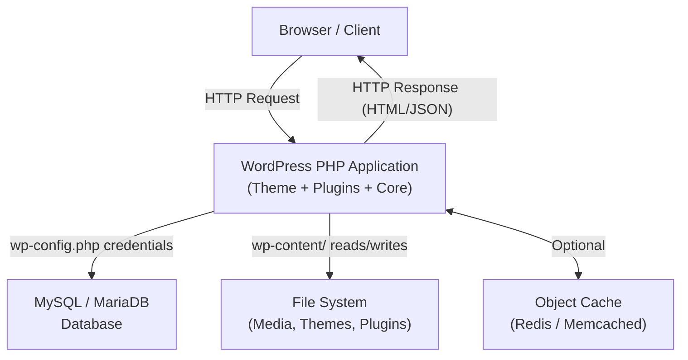

# WordPress Overview

> [!abstract] TL;DR
> WordPress is an open-source PHP/MySQL CMS powering ~43% of the web. It comes in two flavours — self-hosted (wordpress.org) and managed (wordpress.com) — and extends via 59,000+ plugins and thousands of themes. Choose WordPress when you need a content-managed site quickly; choose a custom stack when you need full architectural control or extreme performance at scale.

## What WordPress Is

WordPress is a **free, open-source content management system (CMS)** originally released in 2003 by Matt Mullenweg and Mike Little. It is written in **PHP** and uses **MySQL (or MariaDB)** as its database back-end.

| Property | Detail |
|---|---|
| License | GPLv2 or later |
| Language | PHP (server-side), JavaScript (editor/admin) |
| Database | MySQL 8.0+ / MariaDB 10.5+ |
| Market share | ~43% of all websites (W3Techs, 2025) |
| Plugins in repo | 59,000+ (wordpress.org/plugins) |
| Themes in repo | 11,000+ (wordpress.org/themes) |

### Self-hosted (wordpress.org) vs WordPress.com

| Aspect | wordpress.org (self-hosted) | wordpress.com (managed) |
|---|---|---|
| Hosting | You choose and pay | Automattic-managed |
| Custom plugins | Full freedom | Only on Business plan+ |
| Custom themes | Full freedom | Limited on lower tiers |
| Code access | Full SSH/FTP access | No server access |
| Cost model | Free software; you pay hosting | Free tier + paid plans |
| Best for | Developers, agencies, any serious site | Non-technical users, simple blogs |

**Verdict**: Almost all professional work targets **wordpress.org** (self-hosted).

## WordPress Architecture



### Core Folder Structure

```
wordpress/
├── wp-admin/          # Admin dashboard PHP files
├── wp-content/
│   ├── themes/        # Installed themes
│   ├── plugins/       # Installed plugins
│   └── uploads/       # Media library files
├── wp-includes/       # WordPress core library files
├── wp-config.php      # Database credentials + constants
└── index.php          # Entry point
```

## WordPress vs Headless WordPress vs Page Builders

| Mode | How It Works | Use Case |
|---|---|---|
| **Traditional WP** | PHP renders full HTML pages | Blogs, business sites, e-commerce |
| **Headless WP** | WP as CMS back-end only; JS framework (Next.js, Nuxt) renders the front-end via REST API or GraphQL | High-performance sites, omnichannel content |
| **Page Builders** (Elementor, Divi, Bricks) | Drag-and-drop visual editor on top of WP | Non-technical users, landing pages |
| **Block Editor (Gutenberg)** | React-based block editor baked into WP core | Modern content editing, FSE themes |

## The WordPress Ecosystem

- **WooCommerce** — Turns any WP install into a full e-commerce store; powers ~40% of online stores.
- **Advanced Custom Fields (ACF)** — Adds flexible custom field types to posts/pages; nearly ubiquitous.
- **Yoast SEO / Rank Math** — SEO analysis, sitemaps, schema markup.
- **Elementor / Divi / Bricks** — Visual page builders.
- **WP Rocket / W3 Total Cache** — Caching and performance.
- **Jetpack / UpdraftPlus** — Backups, security, CDN.
- **The Events Calendar, LearnDash, MemberPress** — Vertical add-ons.

## WordPress vs Alternative Stacks

| Criterion | WordPress | Webflow | Custom React + CMS |
|---|---|---|---|
| Setup speed | Fast (< 1 hr) | Fast | Slow (weeks) |
| Content editing UX | Good (Gutenberg) | Excellent | Depends on headless CMS |
| Developer flexibility | High (PHP hooks system) | Low (no custom code) | Very High |
| Hosting cost | Low ($5-$40/mo) | Medium ($23+/mo) | Medium-High |
| Performance ceiling | Good (with caching) | Good | Excellent |
| Plugin ecosystem | Massive (59k+) | Minimal | None built-in |
| Learning curve | Moderate | Low | High |
| Best for | Content-heavy sites, WooCommerce | Marketing/design-led teams | Bespoke apps |

## When to Use WordPress (and When Not To)

**Use WordPress when:**
- You need a content-managed site with non-technical editors
- E-commerce is part of the plan (WooCommerce)
- Time-to-launch matters and budget is constrained
- You need a large existing plugin ecosystem

**Avoid WordPress when:**
- You need real-time features (chat, live dashboards) at the core of the product
- The "site" is actually a complex web application requiring a proper framework
- You need extreme performance and cannot add a caching layer
- The team has no PHP knowledge and no budget for a WP developer

## Common Pitfalls

1. **Installing too many plugins** — Each plugin adds PHP execution overhead, potential security surface, and compatibility risk. Audit plugins ruthlessly; fewer is better.
2. **Editing theme files directly** — Edits to a parent theme are overwritten on theme update. Always use a **child theme** or `functions.php`-based customisation.
3. **Leaving WordPress/plugins outdated** — Outdated installs are the #1 vector for WordPress site compromises. Enable auto-updates or schedule manual update cycles.

## Review Questions

1. What is the difference between wordpress.org and wordpress.com, and which do professional developers use?
2. Explain the WordPress folder structure: what lives in `wp-content/` and why is that folder special?
3. In what scenarios would you choose a headless WordPress architecture over traditional server-rendered WordPress?

## See Also

- [[WordPress_Installation_and_Setup]]
- [[WordPress_Theme_Development]]
- [[WordPress_Plugin_Development]]
- [[WordPress_REST_API]]
- [[_MOC_WordPress_Master]]
- [[_MOC_PHP_Master]]
- [[_MOC_Database_Master]]
