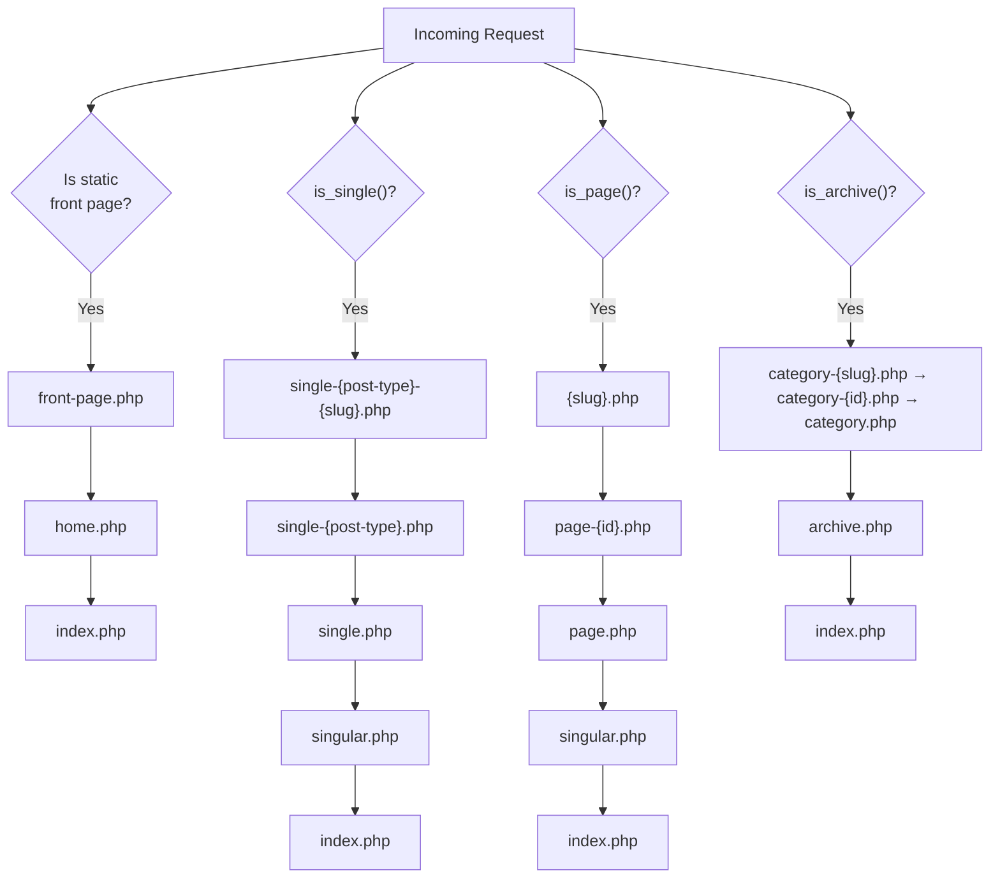

# WordPress Theme Development

> [!abstract] TL;DR
> A WordPress theme controls presentation. It lives in `wp-content/themes/<theme-name>/` and must have at minimum `style.css` (with a header comment) and `index.php`. WordPress uses a **template hierarchy** to decide which PHP file to load for each URL. Always build on a **child theme** to survive parent updates, and use `functions.php` with hooks — never edit core files.

## Theme Structure

A minimal classic theme requires two files; a full theme has many more:

```
wp-content/themes/my-theme/
├── style.css            # REQUIRED — theme header comment + CSS
├── functions.php        # Theme setup: enqueue, hooks, menus, features
├── index.php            # REQUIRED — fallback template
├── header.php           # get_header() loads this
├── footer.php           # get_footer() loads this
├── sidebar.php          # get_sidebar() loads this
├── single.php           # Single post template
├── page.php             # Static page template
├── archive.php          # Archive (category, date, author)
├── search.php           # Search results
├── 404.php              # Not-found page
├── home.php             # Blog posts index
├── front-page.php       # Static front page
├── category.php         # Category archive
├── tag.php              # Tag archive
├── taxonomy.php         # Custom taxonomy archive
├── attachment.php       # Media attachment page
├── screenshot.png       # 1200×900 admin screenshot
└── inc/                 # Optional: include files for organisation
    ├── template-tags.php
    └── customizer.php
```

### style.css Theme Header Comment

```css
/*
Theme Name:   My Custom Theme
Theme URI:    https://example.com/my-theme
Author:       Your Name
Author URI:   https://example.com
Description:  A custom WordPress theme.
Version:      1.0.0
License:      GNU General Public License v2 or later
License URI:  https://www.gnu.org/licenses/gpl-2.0.html
Text Domain:  my-theme
Tags:         blog, custom-background, custom-logo
*/
```

## WordPress Template Hierarchy

WordPress walks a decision tree for every request. The first matching file in the active theme wins.



**Key principle**: The more specific the file name, the higher its priority. WordPress falls through to `index.php` if nothing else matches.

## Template Files: Core Patterns

### The Loop

Every template that displays posts uses **The Loop**:

```php
<?php
// index.php or single.php
get_header(); // includes header.php
?>

<main id="primary">
<?php
if ( have_posts() ) :
    while ( have_posts() ) :
        the_post(); // Sets up global $post, $wp_query
        ?>
        <article id="post-<?php the_ID(); ?>" <?php post_class(); ?>>
            <h2><a href="<?php the_permalink(); ?>"><?php the_title(); ?></a></h2>
            <div class="entry-content">
                <?php the_content(); ?>
            </div>
        </article>
        <?php
    endwhile;
    the_posts_navigation(); // Prev/Next pagination
else :
    echo '<p>No posts found.</p>';
endif;
?>
</main>

<?php
get_sidebar(); // includes sidebar.php
get_footer();  // includes footer.php
```

### Template Parts

Break templates into reusable pieces with `get_template_part()`:

```php
// In archive.php — loads template-parts/content.php
// Falls back to template-parts/content-{$post_type}.php if it exists
get_template_part( 'template-parts/content', get_post_type() );
```

## Gutenberg Block Themes vs Classic Themes

| Feature | Classic Theme | Block Theme (FSE) |
|---|---|---|
| Template engine | PHP files | HTML block templates in `/templates/` |
| Site editor | No | Yes (`/wp-admin/site-editor.php`) |
| `theme.json` | Optional | Central config for styles, spacing, colours |
| Gutenberg required | Optional | Core dependency |
| Flexibility for non-devs | Low | High (visual editor) |
| PHP required | Yes | Minimal |
| `style.css` | Required | Required |

Block theme template files are HTML files containing HTML block markup:

```html
<!-- templates/index.html -->
<!-- wp:template-part {"slug":"header","tagName":"header"} /-->
<main>
    <!-- wp:query -->
    <ul><!-- wp:post-template -->
        <!-- wp:post-title /-->
        <!-- wp:post-excerpt /-->
    <!-- /wp:post-template --></ul>
    <!-- /wp:query -->
</main>
<!-- wp:template-part {"slug":"footer","tagName":"footer"} /-->
```

## Child Themes

A child theme inherits all templates and styles from a parent theme but lets you override individual files without touching the parent. This means parent theme updates do not overwrite your customisations.

```
wp-content/themes/my-child-theme/
├── style.css         # Must declare Template header
└── functions.php     # Enqueue parent stylesheet
```

```css
/* my-child-theme/style.css */
/*
Theme Name:   My Child Theme
Template:     twentytwentyfour   ← must match parent folder name
Version:      1.0.0
*/
```

```php
<?php
// my-child-theme/functions.php
// Enqueue parent styles FIRST, then child styles
add_action( 'wp_enqueue_scripts', 'mct_enqueue_styles' );
function mct_enqueue_styles() {
    $parent_style = 'parent-style';
    wp_enqueue_style( $parent_style,
        get_template_directory_uri() . '/style.css' );
    wp_enqueue_style( 'child-style',
        get_stylesheet_directory_uri() . '/style.css',
        array( $parent_style ),
        wp_get_theme()->get( 'Version' )
    );
}
```

To **override a template**, copy the file from the parent into the child theme with the same relative path. WordPress always loads the child theme's version first.

## functions.php: Theme Setup

```php
<?php
// functions.php
if ( ! defined( 'ABSPATH' ) ) exit; // Security: no direct access

add_action( 'after_setup_theme', 'my_theme_setup' );
function my_theme_setup() {
    // Make theme translation-ready
    load_theme_textdomain( 'my-theme', get_template_directory() . '/languages' );

    // Register navigation menus
    register_nav_menus( array(
        'primary' => __( 'Primary Menu', 'my-theme' ),
        'footer'  => __( 'Footer Menu', 'my-theme' ),
    ) );

    // Add theme support features
    add_theme_support( 'title-tag' );          // Let WP manage <title>
    add_theme_support( 'post-thumbnails' );    // Featured images
    add_theme_support( 'html5', array(
        'search-form', 'comment-form', 'comment-list', 'gallery', 'caption',
    ) );
    add_theme_support( 'custom-logo', array(
        'width'  => 250,
        'height' => 100,
    ) );
    add_theme_support( 'responsive-embeds' );
    add_theme_support( 'wp-block-styles' );    // Block editor CSS
    add_theme_support( 'align-wide' );          // Wide/full blocks
}

// Enqueue scripts and styles properly
add_action( 'wp_enqueue_scripts', 'my_theme_scripts' );
function my_theme_scripts() {
    wp_enqueue_style( 'my-theme-style',
        get_stylesheet_uri(), array(), '1.0.0' );

    wp_enqueue_script( 'my-theme-navigation',
        get_template_directory_uri() . '/js/navigation.js',
        array(),   // dependencies
        '1.0.0',
        true       // load in footer
    );

    // Pass PHP data to JS
    wp_localize_script( 'my-theme-navigation', 'myThemeData', array(
        'ajaxUrl' => admin_url( 'admin-ajax.php' ),
        'nonce'   => wp_create_nonce( 'my_nonce' ),
    ) );
}
```

## Common Pitfalls

1. **Enqueueing scripts with `<script>` tags in `header.php`** — Always use `wp_enqueue_scripts` hook and `wp_enqueue_script()`/`wp_enqueue_style()`. Direct HTML tags bypass the dependency system and cause duplicate loads.
2. **Editing the parent theme directly** — Any update to the parent theme wipes your changes. Create a child theme for all customisations.
3. **Not calling `wp_head()` and `wp_footer()`** — These are mandatory in `header.php` (before `</head>`) and `footer.php` (before `</body>`). Plugins inject their scripts/styles through these hooks; omitting them breaks most plugins.

## Review Questions

1. Explain the WordPress template hierarchy: if a user visits `example.com/category/news/`, which files does WordPress look for in order?
2. What are the two mandatory files for a WordPress theme, and what is each one's purpose?
3. Why should you never use `@import url(../parent-theme/style.css)` in a child theme's CSS to load the parent styles?

## See Also

- [[WordPress_Hooks_and_Filters]]
- [[WordPress_Plugin_Development]]
- [[WordPress_Database_and_Queries]]
- [[Gutenberg_Block_Development]]
- [[_MOC_WordPress_Master]]
- [[_MOC_PHP_Master]]
