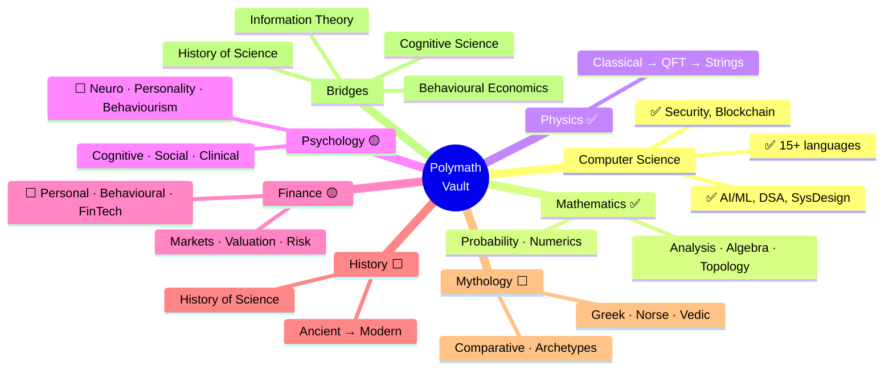

# 🧭 Vault Expansion Roadmap — The Polymath Backlog

> [!abstract] TL;DR
> A living catalogue of **topics worth adding** to turn this vault into a true polymath's second brain. Organised around the seven core interests — **Computer Science, Mathematics, Physics, Psychology, Finance, History, Mythology** — then broadened into the full liberal-arts + sciences spread, and finally into the **interdisciplinary bridges** that are the real payoff of being a jack of all trades.

> [!tip] The polymath principle
> Breadth is not a pile of unrelated facts — it is a **graph**. The value of the *n*-th field is the new *edges* it creates to the fields you already know. So this backlog prioritises topics that (a) fill an outright gap and (b) connect to what already exists. Add depth where you're curious; add *bridges* where you want leverage.

---

## Legend

| Mark | Meaning |
|------|---------|
| ✅ | **Deep** — already a mature vault, add only frontier/niche notes |
| 🟡 | **Partial** — a real vault exists but has obvious room to grow |
| ⬜ | **Proposed** — not in the vault yet; a candidate new vault |

---

## Coverage Snapshot

**Where the vault stands today (in your seven interests):**

| Pillar | Status | Existing hub | Notes |
|--------|:------:|--------------|-------|
| Computer Science | ✅ | [[_MOC_AI_ML_Master]], [[_MOC_DSA_Master]], [[_MOC_SystemDesign_Master]] | ~30 tech vaults; the vault's centre of mass |
| Mathematics | ✅ | [[_MOC_Mathematics_Master]] | 17 sections, pre-calc → stochastic processes |
| Physics | ✅ | [[_MOC_Physics_Master]] | 15 sections, classical → string theory |
| Psychology | ✅ | [[_MOC_Psychology_Master]] | **expanded 2026-07-30** to 13 sections, 65 notes (added neuro, personality, learning, evolutionary, psychometrics, cross-cultural, abnormal) |
| Finance | ✅ | [[_MOC_Finance_Master]], [[_MOC_QuantFinance_Master]] | **expanded 2026-07-30** to 13 sections, 65 notes (added personal, behavioral, accounting, fixed income, derivatives, fintech, international) |
| **History** | ✅ | [[_MOC_History_Master]] | **COMPLETE 2026-07-30** — 16 sections, 86 notes written |
| **Mythology** | ✅ | [[_MOC_Mythology_Master]] | **COMPLETE 2026-07-30** — 14 sections, 58 notes written |

---

## Part I — The Seven Pillars

### 1. Computer Science ✅ — frontier top-ups

Already the deepest part of the vault. Only worth adding niche/frontier notes:

- **Programming Language Theory** — type theory, lambda calculus, formal semantics, interpreters/compilers
- **Operating Systems** (dedicated vault) — processes, scheduling, virtual memory, filesystems, concurrency
- **Distributed Systems Theory** — consensus (Paxos/Raft deep-dive), CRDTs, vector clocks, FLP/CAP proofs
- **Quantum Computing** — qubits, gates, Shor/Grover, error correction *(bridges [[_MOC_Physics_Master]])*
- **Information Theory** — entropy, coding, channel capacity *(bridges Maths + ML + Physics)*
- **Theory of Computation** — automata, computability, complexity classes (P/NP, reductions)
- **Robotics & Control** — kinematics, SLAM, RL for control *(bridges Optimization + Signals)*

### 2. Mathematics ✅ — a few frontier corners

Genuinely comprehensive (17 sections). Only real gaps at the edges:

- **Category Theory** — objects, morphisms, functors, monads *(bridges PLT + Abstract Algebra)*
- **Combinatorics & Graph Theory** (as pure math, beyond DSA) — enumerative, extremal, Ramsey
- **Information Geometry & Optimization on Manifolds** *(bridges [[_MOC_Optimization_Master]] + ML)*
- **Mathematical Logic & Set Theory** — model theory, Gödel, forcing *(bridges Philosophy)*
- **Game Theory as pure math** — already have [[_MOC_Game_Theory_Master]]; add cooperative/mechanism design depth

### 3. Physics ✅ — the observational + applied edges

Theory is covered all the way to strings. Missing the *applied / observational* branches:

- **Astrophysics & Cosmology** — stellar evolution, black holes, ΛCDM, CMB, dark matter/energy
- **Astronomy & Planetary Science** — observational methods, exoplanets, the solar system
- **Biophysics** — protein folding, molecular motors, neural biophysics *(bridges Biology)*
- **Geophysics** — seismology, geodynamics *(bridges Earth Science)*
- **Computational Physics** — numerical relativity, lattice methods, Monte Carlo *(bridges Numerics)*
- **Plasma & Nuclear Engineering** — fusion, reactor physics

### 4. Psychology ✅ — **expanded 2026-07-30** to 13 sections (65 notes)

The original 6 sections (Foundations, Cognitive, Social, Developmental, Motivation/Emotion, Clinical) were joined by **7 new sections** under [[_MOC_Psychology_Master]]:

- `07_Biological_Psychology_and_Neuroscience` — neurons, the brain, plasticity, neurotransmitters, methods
- `08_Personality_Psychology` — Big Five, psychodynamic, humanistic, social-cognitive, assessment
- `09_Learning_and_Behaviorism` — classical/operant conditioning, reinforcement schedules, observational learning
- `10_Evolutionary_Psychology` — mate selection, kin selection, mismatch, and the field's critiques
- `11_Psychometrics_and_Assessment` — reliability/validity, IQ, factor analysis, IRT *(bridges [[_MOC_Econometrics_Master]])*
- `12_Cross_Cultural_Psychology` — WEIRD critique, Hofstede, culture & cognition
- `13_Abnormal_Psychology` — models, anxiety, mood, psychosis, personality/neurodevelopmental disorders

### 5. Finance ✅ — **expanded 2026-07-30** to 13 sections (65 notes)

The original 6 sections (Markets, Corporate Finance, Valuation, Investment Analysis, Risk/Return, Modeling) were joined by **7 new sections** under [[_MOC_Finance_Master]]:

- `07_Personal_Finance` — budgeting, compounding, debt/credit, retirement/FIRE, insurance
- `08_Behavioral_Finance` — prospect theory, investing biases, anomalies/bubbles, nudges *(bridges [[_MOC_Psychology_Master]])*
- `09_Financial_Accounting` — the three statements, accrual/GAAP/IFRS, ratio analysis
- `10_Fixed_Income_and_Bonds` — pricing/yields, duration/convexity, the yield curve, credit risk
- `11_Derivatives_and_Options` — forwards/futures, options, Black–Scholes, the Greeks, swaps *(bridges [[_MOC_QuantFinance_Master]])*
- `12_FinTech_and_Payments` — payment rails, neobanks, lending tech, DeFi, regtech *(bridges [[_MOC_Blockchain_Master]])*
- `13_International_Finance_and_FX` — FX markets, exchange-rate regimes, balance of payments, capital flows, currency risk *(bridges [[_MOC_Macroeconomics_Master]])*

*(A deep financial-history-&-crises treatment lives in the History vault's [[Financial_History_and_Crises]], cross-linked from Behavioral Finance and Fixed Income.)*

### 6. History ✅ — **complete** → see [[_MOC_History_Master]]

Your stated interest, now **fully built** (2026-07-30): master map, all 16 section maps, and **86 concept notes** — every note with a Mermaid diagram, key facts, examples, and cross-links. `History/` sections:

- `01_Historiography_and_Methods` — sources, bias, periodisation, cliodynamics
- `02_Prehistory_and_Human_Origins`
- `03_Mesopotamia_and_Ancient_Egypt`
- `04_Classical_Antiquity` — Greece & Rome
- `05_Ancient_India_and_China`
- `06_Africa_and_the_Pre_Columbian_Americas`
- `07_The_Medieval_World`
- `08_The_Islamic_Golden_Age`
- `09_Renaissance_and_Reformation`
- `10_Age_of_Exploration_and_Colonialism`
- `11_Enlightenment_and_Revolutions` — scientific, American, French
- `12_Industrial_Revolution`
- `13_The_World_Wars`
- `14_Cold_War_and_the_Modern_Era`
- `15_History_of_Science_and_Technology` *(bridges [[_MOC_Physics_Master]] + [[_MOC_Mathematics_Master]])*
- `16_Economic_and_Social_History` *(bridges Finance + Sociology)*

### 7. Mythology ✅ — **complete** → see [[_MOC_Mythology_Master]]

Your stated interest, now **fully built** (2026-07-30): master map, all 14 section maps, and **58 concept notes** — every note treated academically with a Mermaid diagram, key myths, comparative notes, and cross-links. `Mythology/` sections:

- `01_Comparative_Mythology_and_Theory` — Campbell's monomyth, Jungian archetypes, Dumézil's trifunctional hypothesis *(bridges Psychology)*
- `02_Mesopotamian` — Gilgamesh, Enuma Elish
- `03_Egyptian` — Osiris, the Ennead, afterlife
- `04_Greek` — Olympians, Titanomachy, heroic cycles
- `05_Roman` — adaptation of Greek, foundation myths
- `06_Norse_and_Germanic` — Æsir/Vanir, Ragnarök, the Eddas
- `07_Celtic` — Tuatha Dé Danann, the Mabinogion
- `08_Hindu_and_Vedic` — Trimurti, the epics (Mahabharata, Ramayana)
- `09_East_Asian` — Chinese, Japanese Shinto, Korean
- `10_Mesoamerican` — Aztec, Maya, Inca
- `11_African_Mythologies` — Yoruba, Egyptian crossover, oral traditions
- `12_Slavic_and_Baltic`
- `13_Abrahamic_Narratives_and_Folklore`
- `14_Modern_Myth_and_Archetype` — superheroes, sci-fi, urban legend *(bridges Literature)*

---

## Part II — Beyond the Pillars: the full polymath spread

New standalone vaults that round out a generalist. Grouped by cluster.

### Humanities & Letters ⬜
- **Philosophy** — metaphysics, epistemology, ethics, logic, philosophy of mind/science, Eastern schools *(the keystone that connects everything)*
- **Logic & Critical Thinking** — formal logic, fallacies, argumentation, Bayesian reasoning, mental models
- **Literature & Rhetoric** — world literature, literary theory, poetics, storytelling, creative & persuasive writing
- **Linguistics** — phonetics, syntax, semantics, sociolinguistics, historical linguistics *(bridges [[_MOC_NLP_Master]])*
- **Art & Aesthetics** — art history, visual composition, the philosophy of beauty
- **Music Theory** — harmony, rhythm, form, acoustics *(bridges [[_MOC_SS_Master]] + Physics)*

### Natural Sciences ⬜
- **Biology** ✅ **complete** 2026-07-30 — 13-section vault, 65 notes ([[_MOC_Biology_Master]]): chemistry of life, cells, metabolism, molecular biology, genetics, evolution, ecology, physiology, plants, microbiology/immunology, development, biotechnology
- **Chemistry** — general, organic, inorganic, physical, biochemistry
- **Earth & Space Science** — geology, meteorology, oceanography, astronomy, cosmology
- **Neuroscience** — neurons, systems, computational neuro *(bridges Psychology + [[_MOC_AI_ML_Master]])*

### Social Sciences ⬜
- **Political Science & Geopolitics** — political theory, comparative politics, international relations
- **Sociology** — social theory, institutions, networks, demography
- **Anthropology & Archaeology** — cultural + physical anthropology *(bridges History + Mythology)*
- **Law** — constitutional, contract, IP, international law *(bridges Ethics)*

### Meta-skills & Connective Tissue ⬜
- **Cognitive Science** — the umbrella over Psychology, AI, Linguistics, Neuroscience, Philosophy
- **Systems Thinking & Complexity** — feedback loops, emergence, networks, chaos *(bridges everything)*
- **Learning Science / Metacognition** — memory, spaced repetition, deliberate practice *(the meta-vault for how you use all the others)*
- **Rhetoric & Communication** — persuasion, negotiation, storytelling with data
- **Ethics & Applied Ethics** — bioethics, AI ethics *(bridges [[_MOC_AI_ML_Master]])*
- **Health, Nutrition & Longevity** — physiology of exercise, sleep, nutrition science

---

## Part III — Interdisciplinary Bridges (the real payoff)

Standalone "bridge" notes or mini-vaults that live *between* two existing areas. These are the highest-leverage additions for a polymath because they turn parallel silos into a connected graph.

| Bridge topic | Connects | Why it's worth it |
|--------------|----------|-------------------|
| **Behavioural Economics** | [[_MOC_Psychology_Master]] ↔ [[_MOC_Microeconomics_Master]] / [[_MOC_Finance_Master]] | Explains why real humans break the rational-agent models |
| **Cognitive Science** | Psychology ↔ [[_MOC_AI_ML_Master]] ↔ Linguistics ↔ Neuroscience ↔ Philosophy | The shared theory of *minds*, natural and artificial |
| **Information Theory** | [[_MOC_Mathematics_Master]] ↔ [[_MOC_Physics_Master]] ↔ [[_MOC_AI_ML_Master]] ↔ [[_MOC_SS_Master]] | Entropy is the same idea in comms, ML, and thermodynamics |
| **History of Science** | History ↔ Physics ↔ Maths ↔ Philosophy | How ideas actually got discovered — and were resisted |
| **Cryptography** | Number Theory ([[_MOC_Mathematics_Master]]) ↔ [[_MOC_Cybersecurity_Master]] ↔ [[_MOC_Blockchain_Master]] | Pure math with civilisation-scale stakes |
| **Evolutionary Game Theory** | [[_MOC_Game_Theory_Master]] ↔ Biology ↔ Economics ↔ Political Science | One math, four fields' worth of dynamics |
| **Statistical Mechanics ↔ ML** | Physics ↔ [[_MOC_AI_ML_Master]] | Energy-based models, diffusion, the free-energy principle |
| **Mythology ↔ Psychology** | Mythology ↔ Psychology (Jung) ↔ Literature ↔ Anthropology | Archetypes as a map of the mind |
| **Financial History & Crises** | Finance ↔ History ↔ Psychology | Manias and panics rhyme across centuries |
| **Music & Signals** | Music Theory ↔ [[_MOC_SS_Master]] ↔ Maths (Fourier) ↔ Physics (acoustics) | Harmony *is* the frequency domain |
| **Computational X** | Any science ↔ [[_MOC_AI_ML_Master]] / Numerics | Comp-bio, comp-physics, digital humanities, cliodynamics |

---

## Part IV — Suggested Build Order

> [!note] Prioritised so your stated gaps come first
> Ordered by *gap size × your stated interest*, not by difficulty.

**Phase 1 — fill the outright gaps in your interests**
1. ~~**History**~~ — ✅ **complete** 2026-07-30 (16 sections, 86 notes)
2. ~~**Mythology**~~ — ✅ **complete** 2026-07-30 (14 sections, 58 notes)
3. ~~**Philosophy**~~ — ✅ **complete** 2026-07-30: 13-section vault, 67 notes ([[_MOC_Philosophy_Master]])

**Phase 1 is done.** All three Phase-1 gaps (History, Mythology, Philosophy) are now full vaults. Next: **Phase 2** below.

**Phase 2 — deepen the partial pillars**
4. ~~Psychology expansion (Neuroscience, Personality, Behaviourism)~~ — ✅ **done** 2026-07-30 (7 new sections, 35 notes → 13 sections total)
5. ~~Finance expansion (Personal Finance, Behavioural Finance)~~ — ✅ **done** 2026-07-30 (7 new sections, 35 notes → 13 sections total)
6. Biology ✅ **complete** 2026-07-30 (13-section vault, 65 notes) + Chemistry (next) — the natural-science base

**Phase 3 — broaden the social sciences & letters**
7. Political Science, Sociology, Anthropology
8. Linguistics, Literature & Rhetoric, Logic & Critical Thinking

**Phase 4 — build the connective tissue**
9. Cognitive Science, Systems Thinking, Learning Science
10. Earth & Space Science, Music Theory, Art & Aesthetics
11. Dedicated **bridge notes** from Part III (highest long-term leverage)

---

## Part V — Conventions for Adding a New Vault

So every new topic matches what's already here:

1. **Folder** — create `TopicName/` at the vault root, with numbered section subfolders (`01_Section/`, `02_Section/`, …), mirroring how [[_MOC_Physics_Master]] and [[_MOC_Mathematics_Master]] are laid out.
2. **Master hub** — add `_MOC_TopicName_Master.md` (with a Mermaid map, a learning path, and a linked TOC). The `moc-builder` agent does this automatically for any folder with 3+ notes.
3. **Section hubs** — one `_MOC_Section.md` per subfolder.
4. **Notes** — write each note from `Templates/Technical_Concept.md` (TL;DR, intuition, Mermaid, code/example, trade-offs, pitfalls, review questions). The `tech-note-writer` agent scaffolds these.
5. **Wire the graph** — run the `vault-linker` agent to add missing `[[wikilinks]]`, then link the new master hub back here and to any bridge topics in Part III.
6. **README** — drop a short `TopicName/README.md` pointing at the master hub (see `AI-ML/README.md` for the pattern).
7. **Register it** — add a one-line pointer in the vault memory index so future sessions know it exists.

---

## Related

- [[Templates/Technical_Concept|📝 The note template]]
- Existing master hubs: [[_MOC_AI_ML_Master]] · [[_MOC_Mathematics_Master]] · [[_MOC_Physics_Master]] · [[_MOC_Psychology_Master]] · [[_MOC_Finance_Master]]
- Reference for career/tech tracks: the `Roadmaps/` folder (topic outlines pulled from roadmap.sh)

---

#meta #roadmap #polymath #index
