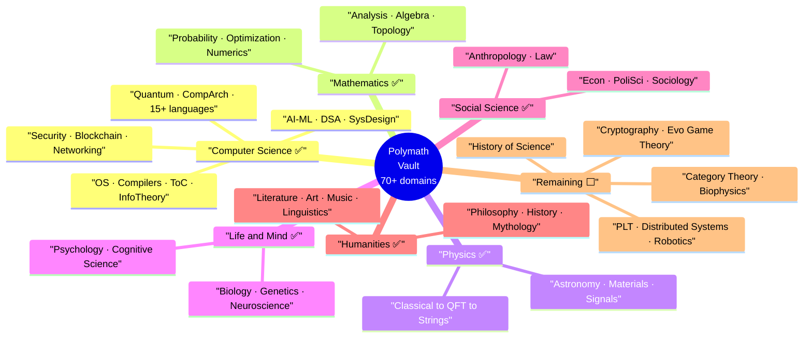

# 🧭 Polymath — Remaining Topics Backlog

> [!abstract] TL;DR
> The vault now spans **70+ knowledge domains** across all seven core interests (CS, Maths, Physics, Psychology, Finance, History, Mythology) plus the full liberal-arts + sciences spread and most of the interdisciplinary bridges. This file is the **live successor** to [[_Vault_Expansion_Roadmap]] (which is dated 2026-07-30 and now stale): it lists only what is **genuinely still missing** — the frontier corners, whole adjacent disciplines (engineering, medicine, more social sciences & humanities), applied branches, practical meta-skills, and dedicated bridge vaults that would complete the graph.

> [!tip] The polymath principle
> Breadth is a **graph**, not a pile. The value of the *n*-th field is the new **edges** it creates to fields you already know. What remains below is prioritised for exactly that: each item either fills an outright gap **or** wires together silos that are currently only implicitly connected.

---

## Legend

| Mark | Meaning |
|------|---------|
| ✅ | **Built** — a mature vault already exists |
| 🟡 | **Partial** — covered inside another vault, but no dedicated deep-dive |
| ⬜ | **Remaining** — not yet built; a candidate new vault |

---

## Where the vault stands today

**Effectively complete pillars & clusters** — only frontier/niche notes remain:

- **CS** ✅ — AI-ML, DSA, System Design, Databases, Networking, Cybersecurity, DevOps/DevSecOps, Blockchain, Computer Architecture, **Operating Systems**, **Compilers**, **Theory of Computation**, **Information Theory**, **Quantum Computing**, Computer Graphics/Vision, NLP, Audio/Speech, Data Eng/Analytics, QA, 15+ language vaults.
- **Maths** ✅ — Mathematics (17 sections), Optimization, Game Theory, Econometrics, Time Series, Quant Finance, Signals & Systems.
- **Physics** ✅ — Physics (classical → strings), Astronomy & Astrophysics, Materials Science.
- **Life & Mind** ✅ — Biology, Chemistry, Genetics, Neuroscience, Psychology, Cognitive Science, Health/Nutrition/Longevity.
- **Earth & Space** ✅ — Earth Science, Meteorology & Climatology, Oceanography, Astronomy.
- **Social Sciences** ✅ — Micro/Macroeconomics, Political Science, Sociology, Anthropology, Law.
- **Humanities** ✅ — Philosophy, History, Mythology, Literature & Rhetoric, Art & Aesthetics, Music Theory, Linguistics, Logic & Critical Thinking.
- **Meta / connective** ✅ — Cognitive Science, Systems Thinking & Complexity, Learning Science & Metacognition, Ethics & Applied Ethics.

---

## Part I — Frontier top-ups (deep pillars, thin edges)

### CS frontier ⬜

The deepest cluster in the vault; only a few dedicated deep-dives remain.

| Topic | Connects | Why it's worth it |
|-------|----------|-------------------|
| ✅ **Programming Language Theory** | Theory of Computation ↔ Compilers ↔ Maths/Logic ↔ FP language vaults | **Built 2026-08-01** — 36-note vault in `Programming_Language_Theory/`: lambda calculus, operational/denotational/axiomatic semantics, type systems (STLC → System F → dependent types), Curry-Howard & logic, paradigms, language design & verification. The theory companion to the Compilers vault. |
| ✅ **Distributed Systems Theory** | System Design ↔ Operating Systems ↔ Databases | **Built 2026-08-01** — 36-note vault in `Distributed_Systems_Theory/` (6 sections: Foundations & Models, Communication & Global State, Consensus & Agreement, Consistency & Replication, Distributed Data, Advanced Topics & Frontiers). Logical/vector clocks, FLP & CAP, Paxos/Raft/PBFT, consistency spectrum, CRDTs, quorums, consistent hashing, DHTs, gossip, Nakamoto consensus, TLA+, self-stabilization, USL. The THEORY beneath the practical System Design vault. |
| ⬜ **Robotics & Control** | Optimization ↔ Signals & Systems ↔ AI-ML ↔ Physics | Kinematics/dynamics, control theory (PID → LQR → MPC), state estimation (Kalman/particle filters), SLAM, RL for control. |
| ✅ **Cryptography (deep-dive)** | Number Theory ([[_MOC_Mathematics_Master]]) ↔ Cybersecurity ↔ Blockchain ↔ Information Theory | **Built 2026-08-01** — 36-note theory/math vault in `Cryptography/` (6 sections: Mathematical Foundations, Symmetric, Public-Key, Protocols & Applications, Advanced, Cryptanalysis & Frontiers). Number theory/groups/hardness/provable security, AES/modes/hashes/MACs, RSA/DH/ECC/signatures/PKI, TLS/Signal/KDFs/RNG, ZK/FHE/MPC/PQC/secret-sharing, cryptanalysis/side-channels/misuse/blockchain-crypto. Complements the applied `Cybersecurity/04` section. |
| 🟡 **Formal Methods & Verification** | Compilers ↔ Logic ↔ ToC ↔ OS (seL4) | Model checking, Hoare logic, proof assistants (Coq/Lean/Isabelle), TLA+. Seeded in `Compilers/06`. |
| ⬜ **Embedded Systems & IoT** | Operating Systems ↔ Computer Architecture ↔ Networking ↔ Signals | Firmware, RTOS, microcontrollers, device drivers, edge computing, sensor fusion — the software/hardware boundary. |
| ⬜ **Concurrency & Parallel Programming** | Operating Systems ↔ Computer Architecture ↔ language vaults | A dedicated deep-dive: memory models, lock-free structures, actor/CSP models, GPU/SIMD, distributed concurrency — currently scattered across OS + CompArch + language vaults. |
| ⬜ **Software Architecture & Design Patterns** | System Design ↔ language vaults ↔ Engineering Leadership | GoF & enterprise patterns, DDD, hexagonal/clean architecture, architecture decision records — the discipline between code and system design. |
| ⬜ **Human-Computer Interaction (HCI)** | Cognitive Science ↔ Psychology ↔ Product Design ↔ Computer Graphics | Interaction design, usability, perception/attention in UI, accessibility — the human side of software. |
| ⬜ **Bioinformatics & Computational Biology** | Biology ↔ Genetics ↔ AI-ML ↔ DSA | Sequence alignment, phylogenetics, genomics pipelines, structural prediction — CS applied to life science. |
| 🟡 **Operations Research** | Optimization ↔ Economics ↔ System Design | LP/IP applications, queueing theory, scheduling, supply-chain & logistics optimization. Foundations exist in the Optimization vault. |

### Mathematics frontier ⬜

Mathematics is comprehensive (17 sections); only the edges remain.

| Topic | Connects | Why it's worth it |
|-------|----------|-------------------|
| ✅ **Category Theory** (own vault) | PLT ↔ Abstract Algebra ↔ FP (Haskell/Scala) ↔ Logic | **Built 2026-08-01** — 36-note vault in `Category_Theory/` (6 sections: Foundations, Functors & Natural Transformations, Universal Constructions, Monads & Algebras, Advanced Structures, Applications & Frontiers). Objects/morphisms, functors, Yoneda, adjunctions, monads, topos theory, Kan extensions, Curry-Howard-Lambek, applied CT. Expands the single `Mathematics/14` note into a full deep-dive. |
| ⬜ **Combinatorics & Graph Theory** (pure) | DSA ↔ Probability ↔ CS Theory | Enumerative, extremal, Ramsey theory, probabilistic method, algebraic/spectral graph theory — the pure-math layer beneath DSA. |
| ⬜ **Information Geometry & Optimization on Manifolds** | Optimization ↔ AI-ML ↔ Differential Geometry | Fisher metric, natural gradient, Riemannian optimization — the geometric view of learning. |
| 🟡 **Mathematical Logic & Set Theory** (deep) | Philosophy ↔ ToC ↔ PLT | Model theory, Gödel's theorems, forcing, large cardinals. A note exists in `Mathematics/14`; a deep-dive would anchor the logic ↔ computation ↔ philosophy triangle. |
| ⬜ **Differential Geometry** | Physics (GR) ↔ Information Geometry ↔ Robotics ↔ ML | Manifolds, curvature, tensors, Lie groups — the geometry underneath general relativity, control, and manifold learning. |
| ⬜ **Numerical Methods & Scientific Computing** | Computational Physics ↔ Optimization ↔ ML ↔ Engineering | Floating-point, linear-solver stability, quadrature, ODE/PDE solvers, spectral methods — how continuous math is actually computed. |
| 🟡 **Partial Differential Equations** | Physics ↔ Fluid Dynamics ↔ Finance (Black-Scholes) ↔ Engineering | Heat/wave/Laplace equations, characteristics, Green's functions, weak solutions. Some coverage in Mathematics; deserves a focused treatment. |
| 🟡 **Stochastic Processes & Stochastic Calculus** | Probability ↔ Quant Finance ↔ Physics ↔ ML | Brownian motion, Itô calculus, SDEs, martingales, Markov processes. Threads through Math + Quant Finance; a dedicated vault would centralize it. |
| 🟡 **Number Theory (deep-dive)** | Mathematics ↔ Cryptography ↔ CS Theory | Modular arithmetic, primes, elliptic curves, analytic number theory — pure math with civilisation-scale stakes via crypto. |
| 🟡 **Topology (deep-dive)** | Analysis ↔ Category Theory ↔ Data (TDA) ↔ Physics | Point-set & algebraic topology, homology, knot theory, topological data analysis. A section exists in Mathematics; the frontier remains. |

### Physics — applied & observational edges ⬜

Theory reaches strings; the applied/observational branches are the gap.

| Topic | Connects | Why it's worth it |
|-------|----------|-------------------|
| ⬜ **Biophysics** | Physics ↔ Biology ↔ Genetics ↔ Neuroscience | Protein folding, molecular motors, membrane biophysics, neural biophysics (Hodgkin-Huxley depth), single-molecule methods. |
| ⬜ **Computational Physics** | Physics ↔ Numerics ↔ AI-ML | Monte Carlo, molecular dynamics, lattice methods, numerical relativity, finite-element/spectral solvers. |
| ⬜ **Fluid Dynamics & Continuum Mechanics** | Physics ↔ Maths (PDEs) ↔ Meteorology/Oceanography ↔ Engineering | Navier-Stokes, turbulence, CFD — the missing continuum-mechanics core that Earth-science vaults lean on implicitly. |
| ⬜ **Geophysics** | Physics ↔ Earth Science | Seismology, geodynamics, mantle convection, planetary interiors. |
| ⬜ **Plasma & Nuclear / Fusion Engineering** | Physics ↔ Materials Science ↔ Energy | Plasma physics, reactor physics, magnetic confinement — the "energy future" applied branch. |

### Engineering & Applied Sciences ⬜

Whole engineering disciplines the vault touches only through their physics/CS neighbours — each is a large applied field in its own right.

| Topic | Connects | Why it's worth it |
|-------|----------|-------------------|
| ✅ **Electrical & Electronics Engineering** | Physics (E&M) ↔ Signals & Systems ↔ Computer Architecture ↔ Materials | Circuit analysis, analog/digital electronics, power systems, semiconductors, RF — the hardware substrate beneath computing. **DONE (36 notes, Electrical_Engineering/).** |
| ✅ **Mechanical Engineering** | Physics (mechanics) ↔ Materials Science ↔ Robotics ↔ Maths | Statics/dynamics, applied thermodynamics, machine design, vibrations, manufacturing. **DONE (36 notes, Mechanical_Engineering/).** |
| ✅ **Aerospace & Orbital Mechanics** | Physics ↔ Astronomy ↔ Fluid Dynamics ↔ Control | Aerodynamics, propulsion, astrodynamics/orbital mechanics, spacecraft design, guidance. **DONE (36 notes, Aerospace_Engineering/).** |
| ✅ **Chemical & Process Engineering** | Chemistry ↔ Materials Science ↔ Thermodynamics ↔ Energy | Reaction engineering, transport phenomena, separations, process control, scale-up. **DONE (36 notes, Chemical_Engineering/).** |
| ✅ **Civil & Structural Engineering** | Physics (statics) ↔ Materials ↔ Maths ↔ Earth Science | Structural analysis, mechanics of materials, geotechnics, infrastructure. **DONE (36 notes, Civil_Engineering/).** |
| ✅ **Optics & Photonics** | Physics (waves) ↔ Materials ↔ Quantum Computing ↔ Signals | Geometric/wave/quantum optics, lasers, fiber optics, imaging, photonic computing. **DONE (36 notes, Optics_and_Photonics/).** |
| ✅ **Energy Systems & Power** | Physics ↔ Chemistry ↔ Earth Science ↔ Economics | Generation/storage/grid, renewables, batteries, nuclear — the cross-cutting energy-transition domain. **DONE (36 notes, Energy_Systems/). COMPLETES the Engineering & Applied Sciences table.** |

---

## Part II — New standalone vaults (beyond the current spread)

Whole disciplines that round out a generalist beyond the current 70+. Grouped by cluster; 🟡 marks fields partly covered inside a neighbour that still warrant a dedicated deep-dive.

### Medicine & Applied Life Sciences ⬜

The descriptive life-science vaults (Biology, Genetics, Neuroscience) and the applied-wellness Health vault leave a clinical/medical gap.

| Topic | Connects | Why it's worth it |
|-------|----------|-------------------|
| ✅ **Clinical Medicine & Pathophysiology** | Biology ↔ Health ↔ Neuroscience ↔ Genetics | Organ systems in disease, diagnosis, the mechanisms behind illness — the clinical layer above descriptive biology. **DONE (36 notes, Clinical_Medicine/).** |
| ✅ **Pharmacology & Drug Discovery** | Chemistry ↔ Biology ↔ Genetics ↔ AI-ML | Pharmacokinetics/dynamics, drug targets, the discovery pipeline, computational drug design. **DONE (36 notes, Pharmacology/).** |
| ✅ **Immunology (deep-dive)** | Biology ↔ Health ↔ Medicine | Innate/adaptive immunity, vaccines, autoimmunity, immunotherapy. Covered lightly in Biology/Health. → BUILT 2026-08-02 as `Immunology/` (36 notes, 6 sections). **COMPLETES the Medicine & Applied Life Sciences table (all 6 rows ✅).** |
| ✅ **Epidemiology & Public Health** | Health ↔ Statistics ↔ Sociology ↔ Political Science | Study design, causal inference, disease surveillance, health policy. **DONE (36 notes, Epidemiology_and_Public_Health/).** |
| ✅ **Ecology & Conservation Science** | Biology ↔ Earth Science ↔ Systems Thinking ↔ Economics | Population/community/ecosystem ecology, biodiversity, conservation, environmental management. → BUILT 2026-08-02 as `Ecology_and_Conservation/` (36 notes, 6 sections). |
| ✅ **Paleontology & Deep-Time Life** | Biology ↔ Earth Science ↔ History ↔ Evolution | Fossil record, mass extinctions, macroevolution — life across geological time. → BUILT 2026-08-02 as `Paleontology_and_Deep_Time/` (36 notes, 6 sections). |

### More Social Sciences ⬜

| Topic | Connects | Why it's worth it |
|-------|----------|-------------------|
| 🟡 **International Relations (deep-dive)** | Political Science ↔ History ↔ Economics ↔ Game Theory | IR theory (realism/liberalism/constructivism), security studies, global governance. Partly in Political Science. |
| ✅ **Public Policy & Governance** | Political Science ↔ Economics ↔ Law ↔ Ethics | Policy analysis, cost-benefit, regulation, institutional design, implementation. → BUILT 2026-08-02 as `Public_Policy_and_Governance/` (36 notes, 6 sections). |
| 🟡 **Criminology & Justice** | Sociology ↔ Law ↔ Psychology ↔ Statistics | Theories of crime, deterrence, penology, criminal-justice systems. Touched in Sociology + Law. |
| 🟡 **Human Geography & Geopolitics** | Political Science ↔ Earth Science ↔ Economics ↔ History | Spatial analysis, urbanization, migration, resource geopolitics. |
| 🟡 **Education & Pedagogy** | Learning Science ↔ Psychology ↔ Cognitive Science | Instructional design, curriculum theory, assessment — the science of teaching (vs Learning Science's how-to-learn focus). |
| ✅ **Media & Communication Studies** | Literature & Rhetoric ↔ Sociology ↔ Linguistics ↔ Psychology | Mass-communication theory, propaganda/persuasion, network media effects, journalism. |
| 🟡 **Demography & Population Studies** | Sociology ↔ Economics ↔ Statistics ↔ History | Fertility/mortality/migration, population pyramids, aging societies. |

### More Humanities & Arts ⬜

| Topic | Connects | Why it's worth it |
|-------|----------|-------------------|
| ✅ **Religious Studies & Comparative Religion** | Mythology ↔ Philosophy ↔ History ↔ Anthropology | Comparative religion, theology, ritual, sacred texts — the academic study of religion, distinct from mythology's narrative focus. → BUILT 2026-08-02 as `Religious_Studies_and_Comparative_Religion/` (36 notes, 6 sections). |
| ⬜ **Film & Media Aesthetics** | Art & Aesthetics ↔ Literature ↔ Music ↔ Computer Graphics | Cinematography, montage theory, sound design, narrative structure in moving images. |
| ✅ **Architecture** | Art & Aesthetics ↔ Civil Engineering ↔ History ↔ Materials | Architectural theory/history, space and form, sustainable/parametric design — art meets engineering. → BUILT 2026-08-02 as `Architecture/` (36 notes, 6 sections). |
| 🟡 **Classical Studies & Philology** | History ↔ Literature ↔ Linguistics ↔ Mythology | Greek/Latin languages and texts, textual criticism, the classical inheritance. |
| ⬜ **Performing Arts** | Music Theory ↔ Art ↔ Literature ↔ Psychology | Theatre, dance, and performance theory, dramaturgy, embodiment. |

### Practical & Applied Meta-skills ⬜

| Topic | Connects | Why it's worth it |
|-------|----------|-------------------|
| ⬜ **Decision Theory & Rationality** | Logic ↔ Game Theory ↔ Probability ↔ Psychology | Expected utility, Bayesian decision-making, biases, rational-choice foundations — how to decide well under uncertainty. |
| ⬜ **Forecasting & Judgment** | Statistics ↔ Psychology ↔ Decision Theory ↔ Time Series | Superforecasting, calibration, prediction markets, scenario planning. |
| ⬜ **Negotiation & Conflict Resolution** | Game Theory ↔ Psychology ↔ Communication ↔ Law | Principled negotiation, mediation, bargaining, de-escalation. |
| ⬜ **Entrepreneurship & Innovation** | Finance ↔ Engineering Leadership ↔ Economics ↔ Product Design | Venture creation, lean/agile validation, business models, the economics of innovation. |
| 🟡 **Project & Product Management** | Engineering Leadership ↔ Product Design ↔ Systems Thinking | Roadmapping, agile/scrum, prioritization, stakeholder management. Partly in Engineering Leadership. |
| 🟡 **Rhetoric & Communication (applied)** | Literature & Rhetoric ↔ Cognitive Science ↔ Data Viz | Persuasion, storytelling with data, public speaking, technical communication. Largely in Literature & Rhetoric + Technical Writing. |

---

## Part III — Dedicated bridge vaults (the highest leverage)

Several Part-III bridges from the old roadmap already became full vaults (**Information Theory ✅**, **Cognitive Science ✅**). These remain — each turns two existing silos into one connected sub-graph:

| Bridge vault | Connects | Why it's worth it |
|--------------|----------|-------------------|
| ✅ **History of Science** | History ↔ Physics ↔ Maths ↔ Philosophy | **Built 2026-08-01** — 36-note vault in `History_of_Science/` (6 sections: Foundations & Ancient/Medieval, The Scientific Revolution, Modern Physics Revolutions, Life/Mind/Earth Sciences, Philosophy & Sociology of Science, Science/Society & Frontiers). Ancient→Islamic→Copernican→Newton→chemical/Darwinian/EM→relativity/quantum/atomic/cosmology→molecular-bio/germ-theory/tectonics/computing→Popper/Kuhn/Lakatos/SSK/realism→ethics/gender/religion/pseudoscience. Deep-dive expanding the `History/15` section; demos re-derive each era's pivotal computation. |
| ✅ **Evolutionary Game Theory** | Game Theory ↔ Biology ↔ Economics ↔ Political Science | **Built 2026-08-01** — 36-note vault in `Evolutionary_Game_Theory/` (6 sections: Foundations, Dynamics & Stability, Evolution of Cooperation, Applications in Biology, Applications in Economics & Society, Advanced Topics & Frontiers). Replicator dynamics/ESS/Hawk-Dove → Moran/RPS/adaptive-dynamics → cooperation's five rules → sex-ratio/signaling/Red-Queen/microbial/bet-hedging → bounded-rationality/culture/conventions/ultimatum/markets/politics → fixation/graphs/ML/eco-evo/cancer-medicine/capstone. Deep-dive complementing `Game_Theory/06`; numpy+matplotlib demos. |
| ✅ **Behavioral Economics** | Psychology ↔ Microeconomics ↔ Finance | Why real humans break rational-agent models: prospect theory, heuristics/biases, nudges, market anomalies. **BUILT 2026-08-01 — 36 notes in `Behavioral_Economics/` (6 sections): foundations-rationality · prospect-theory-risk · biases-judgment · intertemporal-social · behavioral-finance · applications-policy-frontiers.** Centralizes material scattered across Psychology/Finance/Cognitive Science; opens into neuroeconomics + behavioral-ML. |
| ✅ **Statistical Mechanics ↔ ML** | Physics ↔ AI-ML ↔ Information Theory | Energy-based models, diffusion, Boltzmann machines, the free-energy principle. **BUILT 2026-08-01 — 36 notes in `Statistical_Mechanics_and_Machine_Learning/` (6 sections): foundations-correspondence · energy-based-models · sampling-MCMC · diffusion-nonequilibrium · phase-transitions-learning · inference-frontiers.** The dictionary energy↔loss, temperature↔noise, free-energy↔ELBO; deep-dive expanding the `Information_Theory/05` seed. |
| ✅ **Computational Social Science / Cliodynamics** | History ↔ Sociology ↔ AI-ML ↔ Complexity | Agent-based models, network analysis of societies, quantitative history — "Computational X" applied to the humanities. **BUILT 2026-08-02 — 36 notes in `Computational_Social_Science/` (6 sections): foundations · social-network-analysis · agent-based-social-simulation · text-as-data · cliodynamics-&-quantitative-history · prediction-causality-&-frontiers.** The "telescope for humanity" methods-portfolio (networks · ABM · text/NLP/LLMs · ML/prediction · causal inference/experiments · cliodynamics) bridging AI-ML/Sociology/Complexity Economics/Systems Thinking/History/Political Science; honest throughline on big-data-≠-good-data, prediction limits (Fragile Families), ethics, and the data divide. |
| ✅ **Complexity Economics** | Economics ↔ Systems Thinking ↔ Game Theory ↔ Physics | Agent-based markets, power laws, non-equilibrium economics — the Santa Fe alternative to neoclassical models. **BUILT 2026-08-01 — 36 notes in `Complexity_Economics/` (6 sections): foundations-beyond-equilibrium · agent-based-computational · networks-contagion · power-laws-scaling · evolution-innovation-growth · dynamics-policy-frontiers.** The economy as a complex adaptive system; deep-dive complementing Systems Thinking + EGT + Macro/Micro. |
| ⬜ **Network Science** | Systems Thinking ↔ Sociology ↔ Biology ↔ CS ↔ Physics | Graph structure of real systems — small-world/scale-free networks, contagion, community detection. One math across a dozen fields. |
| 🟡 **Cybernetics & Control Theory** | Systems Thinking ↔ Signals ↔ Robotics ↔ Biology | Feedback, homeostasis, the science of goal-directed systems. Touched in Systems Thinking; a focused bridge would anchor it. |
| ⬜ **Neuroeconomics** | Neuroscience ↔ Economics ↔ Psychology ↔ Behavioral Econ | The neural basis of value, reward, and decision — where the brain meets the market. |
| ⬜ **Astrobiology** | Astronomy ↔ Biology ↔ Chemistry ↔ Earth Science | Origins of life, habitability, biosignatures, the search for life — biology at cosmic scale. |
| ⬜ **Quantum Biology** | Quantum Computing/Physics ↔ Biology ↔ Chemistry | Coherence in photosynthesis, avian magnetoreception, enzyme tunnelling — QM in living systems. |
| 🟡 **Philosophy of Science** | Philosophy ↔ History of Science ↔ all sciences | Falsification, paradigms, realism/anti-realism, the demarcation problem. Some coverage in Philosophy; pairs with the proposed History of Science vault. |
| ⬜ **Environmental Economics & Sustainability** | Economics ↔ Meteorology/Climate ↔ Ethics ↔ Systems Thinking | Externalities, carbon pricing, natural-capital accounting, the economics of the climate transition. |
| 🟡 **Political Economy** | Economics ↔ Political Science ↔ History ↔ Philosophy | How politics and markets co-produce outcomes — institutions, power, distribution. |
| ⬜ **Semiotics** | Linguistics ↔ Philosophy ↔ Media Studies ↔ Anthropology | Signs, meaning, and interpretation across language, culture, and media. |

---

## Part IV — Suggested build order

> [!note] Ordered by gap-size × leverage, not difficulty.

**Next up — close the CS-theory frontier (natural continuation of this session's OS + Compilers + ToC + Quantum arc):**
1. ✅ **Programming Language Theory** — *Built 2026-08-01* (36-note vault). Pairs directly with the Compilers & ToC vaults; type theory is the keystone.
2. ✅ **Category Theory** — *Built 2026-08-01* (36-note vault). Unlocks PLT, FP, and the "mathematics of structure"; high-connectivity.
3. ✅ **Distributed Systems Theory** — *Built 2026-08-01* (36-note vault). Completes the systems story beneath System Design.

**Then — the highest-leverage bridge vaults:**
4. ✅ **Cryptography (deep-dive)** — *Built 2026-08-01* (36-note vault). Number theory ↔ security ↔ blockchain, civilisation-scale stakes.
5. ✅ **History of Science** — *Built 2026-08-01* (36-note vault). Ties History ↔ Physics ↔ Maths ↔ Philosophy.
6. ✅ **Evolutionary Game Theory** — *Built 2026-08-01* (36-note vault). One math across biology, econ, and politics; **last named build-order item — the numbered list is now COMPLETE.**

**Then — the applied-physics branches (round out the natural sciences):**
7. ✅ **Applied-physics triad — COMPLETE (all 3 built 2026-08-01):** **Biophysics** ✅ (36-note vault in `Biophysics/` — the densest physics↔life-sciences bridge) · **Computational Physics** ✅ (36-note vault in `Computational_Physics/` — numerical foundations/ODEs/PDEs/Monte-Carlo/many-body-quantum/HPC; the "third pillar" simulation vault) · **Fluid Dynamics** ✅ (36-note vault in `Fluid_Dynamics/` — foundations/governing-eqns/viscous-boundary-layers/turbulence/compressible-rotating-geophysical/computation-apps; deep-dive complementing Physics/10, bridging Meteorology/Oceanography/Aerospace/Astrophysics). Bridged Physics into Biology, Numerics, and the Earth-science vaults.

**Finally — remaining bridges & niche math:**
8. ✅ **Behavioral Economics ✅** · **Statistical Mechanics↔ML ✅** · **Complexity Economics ✅** · **Computational Social Science ✅** (`Computational_Social_Science/`) — ALL FOUR bridge vaults DONE (built 2026-08-01/02, 36 notes each). #8 COMPLETE.
9. ✅ **Robotics & Control ✅** (`Robotics_and_Control/`, 36 notes) · **Combinatorics (pure) ✅** (`Combinatorics/`, 36 notes) · **Information Geometry ✅** (`Information_Geometry/`, 36 notes) · **Mathematical Logic (deep) ✅** (`Mathematical_Logic/`, 36 notes) · **Geophysics ✅** (`Geophysics/`, 36 notes) · **Plasma/Fusion ✅** (`Plasma_and_Fusion/`, 36 notes) · **Formal Methods ✅** (`Formal_Methods/`, built 2026-08-02, 36 notes: foundations-specification · logic-proof-solvers · deductive-verification · model-checking-temporal · static-analysis-abstraction · applications-frontiers) — ALL SEVEN standalones DONE (36 notes each). #9 COMPLETE.

**Broader spread — build as curiosity strikes (each still adds real edges):**
10. The **engineering** disciplines (EE, Mechanical, Aerospace, Chemical, Civil, Optics, Energy Systems), **Medicine & Applied Life Sciences** (Clinical Medicine, Pharmacology, Epidemiology, Ecology, Paleontology), the additional **social sciences & humanities** (Public Policy, Media Studies, Religious Studies, Architecture, Performing Arts, Criminology), the **practical meta-skills** (Decision Theory, Forecasting, Negotiation, Entrepreneurship), and the remaining **bridges** (Network Science, Neuroeconomics, Astrobiology, Quantum Biology, Philosophy of Science, Environmental Economics, Semiotics). Lower-priority only because the core CS/maths/science graph is already dense — not because they lack value.

---

## Conventions for adding a new vault

Follow the established pattern (full detail in [[_Vault_Expansion_Roadmap#Part V — Conventions for Adding a New Vault]]):

1. **Folder** — `TopicName/` at the vault root with numbered section subfolders (`01_Section/`, …), 6 sections × 6 notes is the current standard.
2. **Content notes only** — write each from the science-note template (TL;DR → analogy-first Intuition → How It Works + one Mermaid → tiered Key Concepts → runnable demo → applications → pitfalls → related → review questions → sources). The `tech-note-writer` agent scaffolds these; **no MOC files** per current working convention.
3. **Wire the graph** — Glob-verify cross-links to existing vaults; run `vault-linker` afterward to normalize forward-links and add reverse backlinks.
4. **Register it** — add a one-line pointer in the vault memory index and update this backlog (move the item from ⬜ to ✅).

---

## Related

- [[_Vault_Expansion_Roadmap]] — the original (2026-07-30) roadmap this file supersedes; see it for the full pillar-by-pillar history and conventions
- [[Templates/Technical_Concept|📝 The note template]]
- Recently completed frontier vaults: [[_MOC_Theory_of_Computation_Master]] · Information Theory · Quantum Computing · Operating Systems · Compilers
- Deferred maintenance: a **vault-linker pass** over the newest vaults (Quantum Computing, Operating Systems, Compilers) to normalize parallel-build forward-links

---

#meta #roadmap #polymath #index
